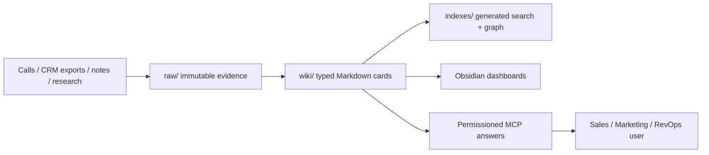
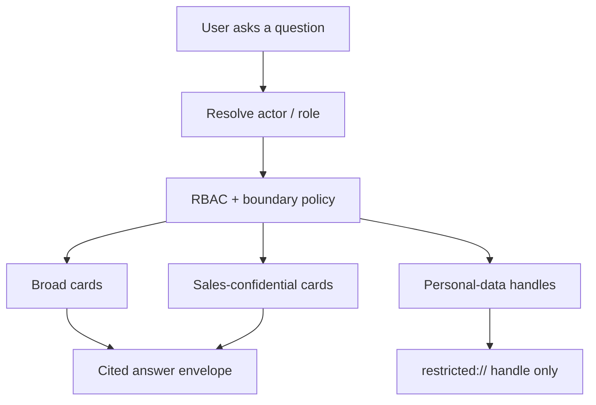
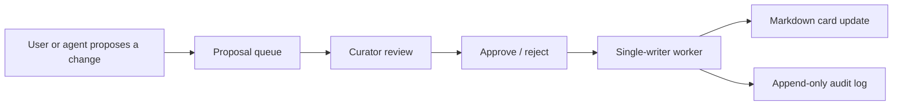

# SalesWiki

SalesWiki is an Obsidian-first, Markdown-based GTM knowledge starter kit for
small B2B sales, marketing and RevOps teams.

Its central idea is one shared, navigable knowledge model instead of separate
copies of account context in sales notes, marketing documents and private
spreadsheets. Companies, people, deals, calls, campaigns, sources and decisions
become linked cards. Each role receives a permitted view of that shared model.

It is not a CRM and not a hosted SaaS. It is a reference implementation for a
specific operating model: keep sales knowledge portable, cited, role-aware and
governed before it becomes another opaque AI search box.

Open this folder directly as an Obsidian vault: Markdown, `[[wikilinks]]`,
backlinks, graph view, YAML properties and `.base` dashboards work without a
separate database.

> [!important]
> This repository is public-preview software. Demo data is synthetic. Real
> customer data, contact details, transcripts, CRM exports and personal-data
> bodies must stay in a private out-of-repo vault; see
> [SECURITY.md](SECURITY.md) and [Deployment](docs/DEPLOYMENT.en.md).

## Try It In 3 Minutes

From a fresh clone:

```bash
git clone https://github.com/artemrudenko/SalesWiki-public.git SalesWiki
cd SalesWiki
python3 scripts/first_run.py
```

Expected result:

```text
SalesWiki public release review
Errors: 0
Warnings: 0
SalesWiki health check
Errors: 0
Warnings: 0
DEMO DRY RUN: ALL CHECKS PASSED — ready to demo.
SalesWiki first run completed.
```

Then open the repository root in Obsidian and start with:

- [docs/DEMO.en.md](docs/DEMO.en.md) — the shortest guided demo.
- [demo/reports/dashboard-snapshots/sales-today.md](demo/reports/dashboard-snapshots/sales-today.md)
  — a populated sales "what to do today" view.
- [demo/reports/digests/my-day-ae.md](demo/reports/digests/my-day-ae.md) —
  an account-executive daily digest.

Docker path:

```bash
docker compose run --rm first-run
```

MCP client path after `first_run.py`:

```bash
.venv/bin/python scripts/generate_mcp_demo_config.py --personas ae,marketing,curator
```

Paste the generated `mcpServers` block into Claude Desktop, Claude Code, Cowork
or another MCP client, restart the client and ask:

1. "What should I do today?"
2. "Brief me on BluePeak Energy."
3. "Which deals are at risk?"

Optional Rocket.Chat demo instructions live in
[integrations/rocketchat/README.md](integrations/rocketchat/README.md). That
track needs an external Rocket.Chat server, user and channel; it is not required
for the local demo.

An optional interactive Entity Explorer prototype lives in
[prototypes/knowledge-workbench/README.md](prototypes/knowledge-workbench/README.md).
It demonstrates a data-driven account graph, evidence trace, contextual Q&A and
the governed proposal flow without connecting to real data.

## Positioning

Use SalesWiki when a small team needs a governed GTM knowledge base, not a
generic chatbot over company docs.

The project is built around four differentiators:

1. **One linked knowledge model.** Sales, marketing and RevOps navigate the
   same canonical cards and relationships instead of maintaining separate
   summaries of the same account.
2. **Deterministic extract-only answers.** Answers are assembled from cited
   Markdown cards and explicit fields/sections instead of generated guesses.
3. **Governed transactional changes.** Sensitive changes move through
   proposal, review, approval and a single-writer worker instead of direct
   uncontrolled edits.
4. **Owned portable data plane.** The durable source of truth is Markdown,
   JSONL/CSV indexes and explicit ledgers that can live outside any vendor.

Good fit:

- founder-led B2B teams that want a sales knowledge brain before buying heavier
  RevOps infrastructure;
- RevOps / sales ops operators who already curate lead, deal, call and account
  context manually;
- agencies or consultants who need repeatable GTM research and account context;
- teams that value portability, auditability and explicit privacy boundaries.

Poor fit:

- teams looking for a polished CRM replacement;
- teams without a technical owner/operator;
- teams already satisfied with HubSpot/Notion/Glean-style search;
- enterprise deployments that need production SSO, hosted operations,
  connector governance and compliance workflows immediately.

## Benefits

- Plain files first: inspect, diff, back up and move the vault without a
  proprietary database.
- Obsidian-native workflow for non-technical operators.
- Typed cards for companies, people, leads, deals, calls, campaigns, sources,
  private cases and reusable sales/marketing knowledge.
- Health checks, generated indexes and dashboard snapshots.
- Synthetic demo data that can be regenerated safely.
- Permissioned MCP demo service with role-aware read/propose/govern tools.
- Clear boundary between broad knowledge, sales-confidential data and
  personal-data handles.

## Limitations

- No real customer data is included.
- Fixture identity is demo-only; shared production use needs per-request SSO.
- HubSpot, Drive/Meet and chat connectors are contracts/examples, not a
  production sync service.
- Personal-data bodies must not be stored in git; use handles until an external
  erasable store exists.
- Docker runs checks and demos; it is not a production hosting recipe.
- The product hypothesis still needs a real-data pilot.

## How It Works







## System Requirements

Required for local use:

- Git.
- Python 3.11+; Docker uses Python 3.12.
- A POSIX-like shell for the documented commands.

Recommended:

- Obsidian, to browse the vault, properties, graph and `.base` dashboards.
- Docker Desktop or Docker Engine with Compose V2, for repeatable isolated
  checks.
- Python virtual environment support (`python3 -m venv`) for the MCP gateway
  and full test suite.

Optional:

- Claude Desktop / Claude Code / Cowork or another MCP client.
- Codex or another agent runtime that can follow `AGENTS.md`.
- Node.js/npm only if you want to run the optional Knowledge Workbench prototype
  or install external Obsidian skills.

## Manual Commands

The recommended path is `python3 scripts/first_run.py`. If you want to run the
checks manually:

```bash
python3 -m venv .venv
.venv/bin/pip install -r requirements.txt
.venv/bin/python scripts/public_release_review.py
.venv/bin/python scripts/health_check.py
.venv/bin/python scripts/demo_dryrun.py --quiet
```

Expected result includes:

```text
SalesWiki public release review
Errors: 0
Warnings: 0
SalesWiki health check
Errors: 0
Warnings: 0
DEMO DRY RUN: ALL CHECKS PASSED — ready to demo.
```

Docker commands can also be run individually:

```bash
docker compose run --rm check
docker compose run --rm health
docker compose run --rm test
docker compose run --rm demo
```

Open the repository root in Obsidian after cloning. Start with this README,
[Demo](docs/DEMO.en.md), [Quickstart](docs/QUICKSTART.en.md),
[User Guide](docs/USER_GUIDE.en.md) and [Rationale](docs/RATIONALE.en.md).

## Документация

Основные документы:

- [Быстрый старт за 5 минут RU](docs/QUICKSTART.ru.md)
- [Quickstart in 5 minutes EN](docs/QUICKSTART.en.md)
- [Demo guide](docs/DEMO.en.md)
- [Setup from scratch](docs/SETUP.en.md)
- [Deployment](docs/DEPLOYMENT.en.md)
- [Vercel static demo deployment](docs/VERCEL.en.md)
- [Rationale](docs/RATIONALE.en.md)
- [Public repository boundary](docs/REPOSITORY_CONTENTS.en.md)
- [Roadmap](docs/ROADMAP.en.md)
- [Security policy](SECURITY.md)
- [Contributing](CONTRIBUTING.md)
- [Agent Portability](docs/AGENT_PORTABILITY.en.md)
- [Architecture](docs/ARCHITECTURE.en.md)
- [User Guide](docs/USER_GUIDE.en.md)
- [Правила для агентов](AGENTS.md)
- [Claude project memory](CLAUDE.md)
- [Индекс wiki](wiki/index.md)
- [Журнал изменений](wiki/log.md)

## Принятые решения

> Полные ADR (контекст, последствия, отвергнутые альтернативы) — в [`docs/adr/`](docs/adr/README.md). Список ниже — краткая выжимка.

- Obsidian-first: Markdown vault, YAML properties, `[[wikilinks]]`, backlinks, graph view.
- Raw-источники не переписываются: исходники живут в `raw/`.
- Карточки типизированы и имеют обязательные секции.
- `Controlled Profile` отделен от `Live Intelligence`.
- Evidence хранится в source-like карточках; сводные выводы - в Company/Person/Deal/Event/Topic.
- Каждый просмотренный источник фиксируется в tracking.
- Дубли не всегда мусор: независимые подтверждения усиливают confidence.
- HubSpot остается CRM source of truth; SalesWiki enriches/proposes, но не перезаписывает без правил.
- Ближайший фокус: lead monitoring, scoring, Google Meet calls, HubSpot enrichment, private cases, HoS reports.
- Допустимые значения свойств и пороги свежести/decay/SLA централизованы в `property-vocabularies.md` и `freshness-and-decay.md`.
- Scoring weights, bands, penalties and default actions are configurable in `schemas/scoring-models.json`, but changes require explicit user approval.
- Connector contracts and agent routing are configurable in `schemas/connector-contracts.json` and `schemas/agent-routing.json`.
- Event research is configurable in `schemas/event-research-profile.json`; the default mode is supervised staged report before production cards or outreach tasks.
- Full Webwright harness requires an external LLM backend key; HubSpot card fill/writeback requires staged proposal and approval unless an explicit system-writeback rule exists.
- Структура и согласованность модели данных проверяются health-check скриптом-линтером.
- Стабильные `entity_id`, `template_version`, ingest-run ledger и derived indexes задают data-engineering contract для автоматизаций.
- Machine-readable enum schema находится в `schemas/property-vocabularies.json`; health-check использует ее как источник validation rules.
- Sensitive ingest требует physical permission boundary blueprint до загрузки реальных transcript/CRM/contact данных.
- Dashboard contract задает рабочие Obsidian Bases и generated Markdown snapshots для sales/marketing/RevOps.
- Demo-vault отделен от production, помечается как synthetic и может пересоздаваться/удаляться без approval.
- Реальные pilot-данные живут вне этого репозитория (см. Pilot Data Contract в разделе ссылок ниже); health-check падает, если pilot-данные попадают в repo.
- Импорт существующих vault/folders идет интерактивно: read-only audit, выбор scope, mapping, import plan, approval.
- `AGENTS.md` следует открытому формату [agents.md](https://agents.md) (README для агентов): overview, setup, build/test, conventions, security.
- Agent setup переносимый: `AGENTS.md` для Codex-like агентов, `CLAUDE.md`, `.claude/skills/` и `.claude/agents/` для Claude Code.

## Быстрый старт

1. For first value with synthetic data, use [Quickstart EN](docs/QUICKSTART.en.md)
   or [RU](docs/QUICKSTART.ru.md).
2. For full local setup, use [Setup from scratch](docs/SETUP.en.md).
3. For Docker and MCP runtime details, use [Deployment](docs/DEPLOYMENT.en.md).
4. Open the repository root as an Obsidian vault.
5. Before publishing or sharing a fork, run `python3 scripts/public_release_review.py`.
6. Before changing templates, dashboards or cards, run `python3 scripts/health_check.py`.
7. After creating, renaming or materially relinking cards, rebuild derived indexes.
8. To refresh health, indexes and snapshots together: `python3 scripts/refresh.py`
   for the production contour or `python3 scripts/refresh.py --demo` for the demo
   contour.

## Проверка здоровья

```bash
python3 scripts/health_check.py
```

Проверка валидирует:

- ключевые документы
- raw-папки
- Obsidian Bases dashboards
- YAML properties
- enum values, IDs, template versions, dates and score ranges
- обязательные секции entity templates
- дубли `type`
- ссылки из `wiki/index.md` на process-документы
- согласованность свойств dashboard↔шаблон (каждое свойство в `.base` есть хотя бы в одном шаблоне)
- покрытие `freshness` во всех шаблонах
- дубли ссылок на process-доки
- висячие `[[wikilinks]]` в реальных карточках
- соответствие каждого `SKILL.md` формату Agent Skills (agentskills.io)

## Перестройка индексов

```bash
python3 scripts/build_indexes.py
```

Скрипт строит machine-readable артефакты в `indexes/` и обновляет `state/index-status.md`. Индексы производные: если они устарели или удалены, их нужно перестроить из Markdown, а не редактировать вручную.

Production build требует стабильные `entity_id`; fallback IDs разрешаются только явным `--allow-generated-ids` для fixtures/migrations. Synthetic fixtures проверяются через `tests/fixtures/expected-index-counts.json`.

## Dashboard Snapshots

```bash
python3 scripts/build_dashboard_snapshots.py
```

Markdown snapshots создаются в `reports/dashboard-snapshots/` и дают простые отчеты без необходимости открывать Obsidian Bases.

## Demo и импорт

- Demo-показы отделу проводятся через отдельный synthetic vault по отдельному process contract.
- Если у отдела уже есть Obsidian/Markdown vault, сначала запускается read-only audit, затем пользователь выбирает scope и mapping до любых production-изменений.
- Текущий demo-vault уже сгенерирован в `demo/demo-vault`; его snapshots лежат в `demo/reports/dashboard-snapshots/`.
- External import executor делает approved staging package в `raw/imports/<run-id>/` и import plan в `state/import-plans/` (директория создается при первом импорте), не перезаписывая production-карточки вслепую.

Текущий ожидаемый результат:

```text
SalesWiki health check
Errors: 0
Warnings: 0
```

## Структура

## `raw/`

Первичные источники:

- `raw/companies/`
- `raw/people/`
- `raw/leads/`
- `raw/deals/`
- `raw/calls/`
- `raw/meetings/`
- `raw/crm/`
- `raw/news/`
- `raw/events/`
- `raw/campaigns/`
- `raw/private-cases/`
- `raw/assets/`
- `raw/kb/`
- `raw/research/`
- `raw/imports/`

## `wiki/entities/`

Шаблоны карточек:

- commercial: Company, Person, Lead, Deal, Account Plan, Call, Event, Campaign, Report
- evidence: News, Article, Event Participation, Source, Claim
- sales/marketing knowledge: ICP, Buyer Persona, Topic, Pain Point, Objection, Use Case, Competitor Intel, Case Study, Private Case, Asset, Outreach Sequence, Experiment, Scoring Model, Enrichment Record, Task

## `wiki/processes/`

Полный перечень процессов — в [wiki/index.md](wiki/index.md). Ключевые процессы:

- [Sales/Marketing Research Framework](wiki/processes/sales-marketing-research-framework.md)
- [Sales Team Feedback Requirements](wiki/processes/sales-team-feedback-requirements.md)
- [Card Taxonomy](wiki/processes/card-taxonomy.md)
- [Relationship Model](wiki/processes/relationship-model.md)
- [Entity Card Governance](wiki/processes/entity-card-governance.md)
- [Access And Redaction Policy](wiki/processes/access-and-redaction-policy.md)
- [Global Property Dictionary](wiki/processes/global-property-dictionary.md)
- [Tracking, Dedupe And Corroboration](wiki/processes/tracking-dedupe-corroboration.md)
- [Source Governance](wiki/processes/source-governance.md)
- [Lead Monitoring And Scoring](wiki/processes/lead-monitoring-and-scoring.md)
- [Marketing Attribution And Content Workflow](wiki/processes/marketing-attribution-and-content-workflow.md)
- [Reminder And Task Workflow](wiki/processes/reminder-and-task-workflow.md)
- [Scoring Models V1](wiki/processes/scoring-models-v1.md)
- [Scoring Configuration](wiki/processes/scoring-configuration.md)
- [Score Calibration](wiki/processes/score-calibration.md)
- [HubSpot Field Matrix](wiki/processes/hubspot-field-matrix.md)
- [HubSpot Lifecycle Mapping](wiki/processes/hubspot-lifecycle-mapping.md)
- [HubSpot Enrichment](wiki/processes/hubspot-enrichment.md)
- [Google Meet Call Import](wiki/processes/google-meet-call-import.md)
- [Google Meet Participant Matching](wiki/processes/google-meet-participant-matching.md)
- [Private Case Capture](wiki/processes/private-case-capture.md)
- [Private Case Promotion Pipeline](wiki/processes/private-case-promotion-pipeline.md)
- [Event Monitoring](wiki/processes/event-monitoring.md)
- [Event Research Profile](wiki/processes/event-research-profile.md)
- [Event ROI And Action Loop](wiki/processes/event-roi-action-loop.md)
- [KB Cleanup And Drive Ingest](wiki/processes/kb-cleanup-and-drive-ingest.md)
- [Scheduled Monitoring](wiki/processes/scheduled-monitoring.md)
- [Report Templates](wiki/processes/report-templates.md)
- [Index And Graph Maintenance](wiki/processes/index-and-graph-maintenance.md)
- [Property Vocabularies](wiki/processes/property-vocabularies.md)
- [Freshness And Decay](wiki/processes/freshness-and-decay.md)
- [Obsidian Skills Usage](wiki/processes/obsidian-skills.md)
- [Dashboard Contract](wiki/processes/dashboard-contract.md)
- [Demo Vault](wiki/processes/demo-vault.md)
- [Pilot Data Contract](wiki/processes/pilot-data-contract.md)
- [External Vault Import](wiki/processes/external-vault-import.md)
- [Connector Contracts](wiki/processes/connector-contracts.md)
- [Agent Orchestration](wiki/processes/agent-orchestration.md)
- [Browser Research Method Comparison](wiki/processes/browser-research-method-comparison.md)
- [Data Engineering Contract](wiki/processes/data-engineering-contract.md)
- [Identifier Strategy](wiki/processes/identifier-strategy.md)
- [Permission Boundary Blueprint](wiki/processes/permission-boundary-blueprint.md)
- [Deletion And Archiving](wiki/processes/deletion-and-archiving.md)
- [Ingest](wiki/processes/ingest.md) · [Manual Intake](wiki/processes/manual-intake.md) · [File-Drop Ingest Contract](wiki/processes/file-drop-ingest-contract.md)
- [System Health](wiki/processes/system-health.md)
- [Research And Audit](wiki/processes/research-and-audit.md) · [Stage Assistant](wiki/processes/stage-assistant.md)

Permissioned Knowledge (governed MCP service): start at [Overview & Doc Map](docs/engineering/permissioned-knowledge-overview.md). For product rationale and future work, see [Rationale](docs/RATIONALE.en.md) and [Roadmap](docs/ROADMAP.en.md).

Основной интерактивный доступ к permissioned-vault — из Claude Code / Claude Desktop / Cowork через MCP gateway (настройка за 2 минуты: `docs/QUICKSTART.en.md`, раздел "Ask It Questions"). Опциональное чат-демо в Rocket.Chat (показать vault аудитории без Claude-клиента): [integrations/rocketchat/README.md](integrations/rocketchat/README.md).

## `dashboards/`

Obsidian Bases dashboards для сотрудников:

- [Lead priority](dashboards/lead-priority.base)
- [Deal risk](dashboards/deal-risk.base)
- [Review queue](dashboards/review-queue.base)
- [Monitoring](dashboards/monitoring.base)
- [Sales today](dashboards/sales-today.base)
- [Marketing insights](dashboards/marketing-insights.base)
- [Data quality](dashboards/data-quality.base)

## `sources/`

Управляемые источники:

- [News resources](sources/news-resources.md)
- [Event resources](sources/event-resources.md)
- [Topic monitors](sources/topic-monitors.md)

## `tracking/`

Операционная память ресерча:

- [Processed sources](tracking/processed-sources.md)
- [Dedupe register](tracking/dedupe-register.md)
- [Corroboration register](tracking/corroboration-register.md)
- [Coverage gaps](tracking/coverage-gaps.md)

## `state/`

Очереди и статус:

- [Manual intake](state/manual-intake.md)
- [Monitoring runs](state/monitoring-runs.md)
- [Access review](state/access-review.md)
- [Deletion requests](state/deletion-requests.md)
- [Index status](state/index-status.md)
- [System health](state/system-health.md)
- [Queues](state/queues.md)
- [Incidents](state/incidents.md)

## Навыки и агенты

Исполняемый слой для Claude Code (концепты переносимы на другие runtime). Все навыки следуют открытому формату [Agent Skills](https://agentskills.io/specification); соответствие проверяет health-check.

- Навыки `.claude/skills/`: `saleswiki-obsidian` (конвенции vault), `saleswiki-lead-scoring` (исполняемый скоринг V1), `saleswiki-scoring-configurator` (изменение конфигурации скоринга только по approval).
- Субагенты `.claude/agents/`: `research-orchestrator`, `lead-monitor`, `call-analyst`, `deal-risk`, `vault-linter`, `external-vault-import-assistant`, `connector-sync-planner`, `privacy-redaction-reviewer`, `event-research`.
- Контракт оркестрации: [`.claude/agents/README.md`](.claude/agents/README.md).
- Концептуальные роли (любой runtime): [`agents/README.md`](agents/README.md).
- Будущие хуки автоматизации: [`hooks/README.md`](hooks/README.md).

## Пользовательские запросы

Примеры:

- `Дай свежий бриф по компании <name>`
- `Дай бриф по <person>`
- `Оцени лида <lead/company/person>`
- `Проверь MQL/qualification лиды`
- `Кого из перспективных лидов вне пайплайна стоит тронуть?`
- `Разбери Google Meet звонок <link>`
- `Обогати HubSpot карточку <company/person/deal>`
- `Подготовь proposal для заполнения HubSpot AI summary/score по <company/deal>`
- `Запиши приватный кейс по <project/client/challenge>`
- `Сделай отчет для HoS за неделю`

Подробно: [User Guide](docs/USER_GUIDE.en.md).

## Где хранятся выводы

- Company: `Strategic Conclusions`
- Person: `Relationship And Messaging Conclusions`
- Deal: `Deal Readout`
- Event: `Event Intelligence`
- Topic: `Topic Conclusions`
- Reusable knowledge: Pain Point, Objection, Use Case, Buyer Persona, Case Study, Competitor Intel

## Приоритет внедрения

1. Lead monitoring and scoring.
2. Google Meet call analysis.
3. HubSpot enrichment.
4. Private case capture.
5. HoS weekly reports.
6. Scheduled monitoring.
7. Event parsing and conference intelligence.
8. Advanced graph/vector indexes.
