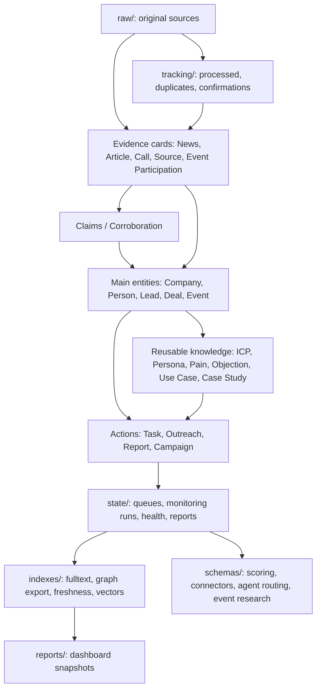
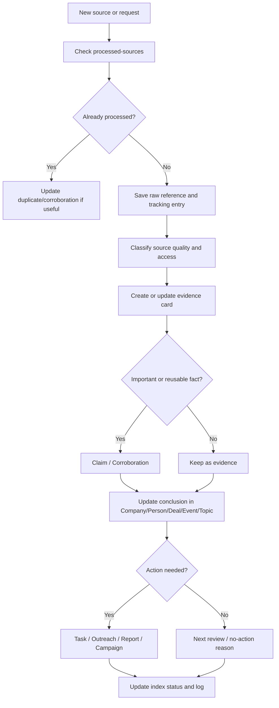

# SalesWiki Architecture

SalesWiki is an Obsidian-first wiki-brain for marketing and sales. It stores raw sources, structured knowledge cards, entity relationships, processed-source tracking, scoring, monitoring and reports.

## Decisions

1. **Obsidian-first.** The primary format is a Markdown vault with `[[wikilinks]]`, YAML properties, backlinks and Obsidian graph.
2. **Raw stays raw.** Source material lives in `raw/` and is not silently rewritten.
3. **Typed cards.** Every card type has a fixed template.
4. **Controlled Profile and Live Intelligence are separated.** Stable fields are protected; current intelligence is updated regularly.
5. **Evidence is separate from conclusions.** Calls, articles, news and event participation keep details; company/person/deal cards keep concise current conclusions.
6. **Tracking is mandatory.** Every reviewed source is logged as accepted/rejected/duplicate/etc.
7. **Duplicates can strengthen evidence.** Exact duplicates reduce noise; independent confirmations increase confidence.
8. **HubSpot remains the CRM source of truth.** SalesWiki enriches and proposes updates, but does not overwrite CRM without rules or approval.
9. **Sales priorities first.** Near-term focus is lead monitoring, scoring, Google Meet calls, HubSpot enrichment, private cases and HoS reports.
10. **Health checks are required.** Structural and data-model issues are caught by `scripts/health_check.py`.
11. **Derived indexes are rebuildable.** Machine-readable indexes in `indexes/` are generated from Markdown by `scripts/build_indexes.py`.
12. **Stable IDs outlive page names.** Entity cards carry `entity_id` and `template_version`; source-like cards also carry source lineage fields when applicable.
13. **Validation rules have a machine-readable schema.** Property enums live in `schemas/property-vocabularies.json` and are documented for humans in `property-vocabularies.md`.
14. **Dashboards have a contract.** Obsidian Bases and Markdown snapshots answer sales/marketing operating questions without forcing users to inspect the vault structure.
15. **Demo data is isolated from production.** The demo vault is separate, marked `dataset: demo` / `synthetic: true`, and can be deleted without approval.
16. **External vault import is always interactive.** Start with a read-only audit, then scope selection, mapping, an import plan and only then approved execution.
17. **Scoring config is separate from scoring execution.** Weights, bands, penalties and default actions live in `schemas/scoring-models.json`; agents apply the model but do not change it without user approval.
18. **Connectors and agent routing are configurable.** MCP/plugins/connectors are described in `schemas/connector-contracts.json`, and skill/subagent routing lives in `schemas/agent-routing.json`.
19. **Event research runs through a profile.** Collection scope, source priorities, Playwright/Webwright rules and action thresholds live in `schemas/event-research-profile.json`.
20. **Credentials do not live in the repo.** Full Webwright harness and HubSpot API use external keys/secrets; without them, only staged artifacts/proposals are allowed, not autonomous writeback.

## System Layers



## 1. Raw Sources

Folder: `raw/`

Purpose: store original source material.

Important subfolders:

- `raw/companies/`
- `raw/people/`
- `raw/leads/`
- `raw/deals/`
- `raw/calls/`
- `raw/meetings/`
- `raw/crm/`
- `raw/news/`
- `raw/events/`
- `raw/campaigns/`
- `raw/private-cases/`
- `raw/assets/`
- `raw/kb/`
- `raw/research/`
- `raw/imports/`

## 2. Wiki Entities

Folder: `wiki/entities/`

Purpose: structured knowledge cards.

Commercial entities:

- Company
- Person
- Lead
- Deal
- Account Plan
- Call
- Event
- Campaign
- Report

Evidence/source entities:

- News
- Article
- Event Participation
- Source
- Claim

Marketing/sales knowledge:

- ICP
- Buyer Persona
- Topic
- Pain Point
- Objection
- Use Case
- Competitor Intel
- Case Study
- Private Case
- Asset
- Outreach Sequence
- Experiment
- Scoring Model
- Enrichment Record
- Task

## 3. Processes

Folder: `wiki/processes/`

Core documents:

- `sales-marketing-research-framework.md` - user decision moments and research products.
- `card-taxonomy.md` - card types and required sections.
- `relationship-model.md` - card relationship rules.
- `entity-card-governance.md` - Controlled Profile / Live Intelligence.
- `access-and-redaction-policy.md` - access labels, redaction and sanitized summaries.
- `data-engineering-contract.md` - stable IDs, ingest runs, derived indexes and synthetic fixture rules.
- `permission-boundary-blueprint.md` - physical permission boundaries required before sensitive ingest.
- `file-drop-ingest-contract.md` - first file-drop ingest contract for `raw/imports/` workflows.
- `global-property-dictionary.md` - shared YAML properties.
- `property-vocabularies.md` - single source of truth for allowed property values per card type.
- `freshness-and-decay.md` - canonical review-staleness, score-decay and reminder-SLA thresholds.
- `tracking-dedupe-corroboration.md` - tracking, dedupe and corroboration.
- `source-governance.md` - source classes, reliability, access/licensing and usage rules.
- `lead-monitoring-and-scoring.md` - lead monitoring and scoring.
- `marketing-attribution-and-content-workflow.md` - attribution, channel, content and performance loop.
- `reminder-and-task-workflow.md` - reminders, tasks, SLA and overdue rules.
- `scoring-models-v1.md` - starter scoring models.
- `scoring-configuration.md` - user-approved scoring config changes.
- `score-calibration.md` - outcome feedback, score decay and recalibration workflow.
- `hubspot-field-matrix.md` - HubSpot read/propose/writeback boundaries.
- `hubspot-lifecycle-mapping.md` - maps HubSpot lifecycle/stages to SalesWiki segments/cadence/actions.
- `state/hubspot-writeback-proposals.md` - queue for staged HubSpot card-fill/writeback proposals (a `state/` ledger, not a `wiki/processes/` doc).
- `google-meet-call-import.md` - Google Meet call import.
- `google-meet-participant-matching.md` - matches call participants to Person/Lead/Company.
- `private-case-capture.md` - private case intake.
- `private-case-promotion-pipeline.md` - path from private case to sanitized/internal/public asset.
- `kb-cleanup-and-drive-ingest.md` - Google Drive KB cleanup/ingest.
- `scheduled-monitoring.md` - recurring collection and analysis runs.
- `report-templates.md` - role-specific reports for HoS, marketing, lead monitoring, campaign performance and data quality.
- `index-and-graph-maintenance.md` - index and graph export maintenance.
- `event-roi-action-loop.md` - event outcomes and pipeline impact.
- `event-research-profile.md` - event-research source priorities, pilot limits, Playwright rules and action thresholds.
- `dashboard-contract.md` - required dashboards, fields and snapshot rules.
- `demo-vault.md` - isolated synthetic demo-vault rules for presentations.
- `external-vault-import.md` - interactive import of existing vaults/folders through audit, scope, mapping and approved execution.
- `connector-contracts.md` - MCP/plugin/connector scopes, write modes, approvals and audit logs.
- `agent-orchestration.md` - skill/subagent routing, shared output schema, handoffs and verification.
- `browser-research-method-comparison.md` - staged-only comparison for `web-fetch`, `playwright-cli` and `webwright`.

## 4. Sources

Folder: `sources/`

- `news-resources.md` - news sources.
- `event-resources.md` - event/conference watchlist and page types.
- `event-roi-action-loop.md` - event outreach, meetings, pipeline impact and post-event review.
- `event-research-profile.md` - supervised event brief, company mapping and topic-signal collection profile.
- `browser-research-method-comparison.md` - collection-method choice for dynamic event pages.
- `topic-monitors.md` - recurring topic monitoring.

## 5. Tracking

Folder: `tracking/`

- `processed-sources.md` - reviewed sources.
- `dedupe-register.md` - duplicates and near-duplicates.
- `corroboration-register.md` - claims confirmed by multiple sources.
- `coverage-gaps.md` - what still needs checking.

## 6. State

Folder: `state/`

- `manual-intake.md` - user requests.
- `monitoring-runs.md` - monitoring run log.
- `ingest-runs.md` - ingest, research, CRM/export and synthetic fixture run ledger.
- `access-review.md` - access-label changes, redaction approvals and personal-data sharing decisions.
- `deletion-requests.md` - archive/delete/merge/redact requests.
- `index-status.md` - derived index status.
- `system-health.md` - current system status.
- `queues.md` - queues.
- `incidents.md` - incidents.

## 7. Indexes

Folder: `indexes/`

Generated/rebuildable indexes:

- `entities/entity-registry.csv`
- `entities/entities.jsonl`
- `fulltext/documents.jsonl`
- `freshness/freshness.jsonl`
- `graph/edges.jsonl`
- `temporal/events.jsonl`
- `vectors/` (optional)

Obsidian graph is updated by Obsidian from Markdown links. `indexes/` is a rebuildable acceleration layer; do not edit generated files by hand.

## 8. Dashboards And Obsidian Skills

Folder: `dashboards/`

Required Obsidian Bases:

- `sales-today.base` - "what should we do today?" operating list.
- `lead-priority.base` - lead prioritization.
- `deal-risk.base` - risky deals.
- `review-queue.base` - cards that need review.
- `monitoring.base` - monitoring for companies, people, events, topics and sources.
- `marketing-insights.base` - topics, pains, objections, briefs and campaign opportunities.
- `data-quality.base` - missing sources, low confidence and access-review items.

Markdown snapshots in `reports/dashboard-snapshots/` are generated from indexes by `scripts/build_dashboard_snapshots.py`. They support presentations, weekly reviews and users without Obsidian Bases. Details: `wiki/processes/dashboard-contract.md`.

Agent skills from `kepano/obsidian-skills` are used as an Obsidian compatibility layer:

- `obsidian-markdown` - Markdown, properties, wikilinks and Mermaid.
- `obsidian-bases` - `.base` dashboards.
- `json-canvas` - visual relationship maps.
- `defuddle` - web page cleanup into Markdown.
- `obsidian-cli` - optional integration with an open Obsidian app.

These skills do not replace governance, tracking, access rules or health checks. Details: `wiki/processes/obsidian-skills.md`.

## 9. Scripts

Folder: `scripts/`

- `health_check.py` - vault health check and data-model linter (standard library only).
- `build_indexes.py` - derived index builder for entity registry, freshness, temporal, semantic graph and full-text inventories.
- `build_dashboard_snapshots.py` - Markdown snapshots for Sales Today, Deal Risk, Monitoring, Marketing Insights and Data Quality.
- `audit_external_vault.py` - read-only audit of an external Markdown/Obsidian vault before import.
- `import_external_vault.py` - dry-run planner and approved staging executor for an external vault.
- `generate_demo_vault.py` - generator for the isolated synthetic demo vault.
- `new_entity.py` - the entity-creation chokepoint that mints stable ids via the id ledger.
- `demo_dryrun.py` - one-command end-to-end smoke test for the permissioned-knowledge demo.

Permissioned MCP service: the role-aware read/propose gateway and single-writer worker live in `saleswiki_mcp/`; see `docs/engineering/permissioned-knowledge-overview.md` for the architecture and doc map.

Run:

```bash
python3 scripts/health_check.py
```

It validates required files, raw dirs and dashboards; template frontmatter keys and required sections; duplicate `type`; enum values; real-card IDs, template versions, dates and score ranges; index references to core docs; dashboard↔template property coherence (every property a `.base` references must exist in some template); `freshness` coverage; duplicate doc links; Agent Skills `SKILL.md` conformance; and dangling `[[wikilinks]]` in real entity cards. `ERROR` must be fixed; `WARN` should be resolved or explained.

Rebuild indexes after real entity-card changes:

```bash
python3 scripts/build_indexes.py
```

Synthetic fixtures under `tests/fixtures/` validate non-empty index output without touching production cards.

Rebuild dashboard snapshots:

```bash
python3 scripts/build_dashboard_snapshots.py
```

Read-only audit of an external vault:

```bash
python3 scripts/audit_external_vault.py --source /path/to/external-vault --output /tmp/saleswiki-import-audit.md
```

Generate the demo vault:

```bash
python3 scripts/generate_demo_vault.py --reset
```

## 10. Skills And Agents

The repository ships an executable agent layer (Claude Code; portable concepts elsewhere):

- Skills (`.claude/skills/`): `saleswiki-obsidian` (vault conventions), `saleswiki-lead-scoring` (executable V1 scoring procedure) and `saleswiki-scoring-configurator` (user-approved scoring-config changes).
- Subagents (`.claude/agents/`): `research-orchestrator`, `lead-monitor`, `call-analyst`, `deal-risk`, `vault-linter`, `external-vault-import-assistant`, `connector-sync-planner`, `privacy-redaction-reviewer`, `event-research`.
- Orchestration contract (shared output schema, hand-offs, dedupe, conflict resolution): `.claude/agents/README.md`.
- Conceptual, runtime-agnostic roles: `agents/README.md`.

Skills are reusable procedures; subagents are roles that invoke them. Every `SKILL.md` follows the open [Agent Skills](https://agentskills.io/specification) format (validated by the health check). All follow `AGENTS.md` governance and run the health check after edits. Automation hooks remain specified in `hooks/README.md`.

## Data Flow



1. A user or automation adds a source to `raw/` or a request to `state/manual-intake.md`.
2. The agent checks `tracking/processed-sources.md`.
3. The source is classified as accepted/rejected/duplicate/needs-review.
4. An evidence card is created or updated.
5. If a fact is important, a Claim or corroboration entry is created/updated.
6. The consolidated conclusion goes to Company/Person/Deal/Event/Topic.
7. If the insight is reusable, it becomes a Pain Point, Objection, Use Case, Persona, Case Study or Competitor Intel card.
8. Links, `state/index-status.md`, derived indexes and `wiki/log.md` are updated.

## Where Conclusions Live

- Company: `Strategic Conclusions`.
- Person: `Relationship And Messaging Conclusions`.
- Deal: `Deal Readout`.
- Event: `Event Intelligence`.
- Topic: `Topic Conclusions`.
- Reusable knowledge: Pain Point, Objection, Use Case, Buyer Persona, Case Study, Competitor Intel.

## Implementation Priority

1. Lead monitoring and scoring.
2. Google Meet call analysis.
3. HubSpot enrichment.
4. Private case capture.
5. HoS weekly reports.
6. Scheduled monitoring.
7. Event parsing and conference intelligence.
8. Advanced graph/vector search beyond the generated baseline indexes.
