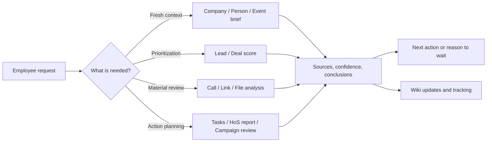
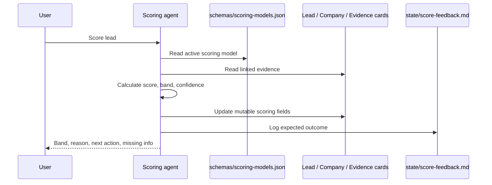
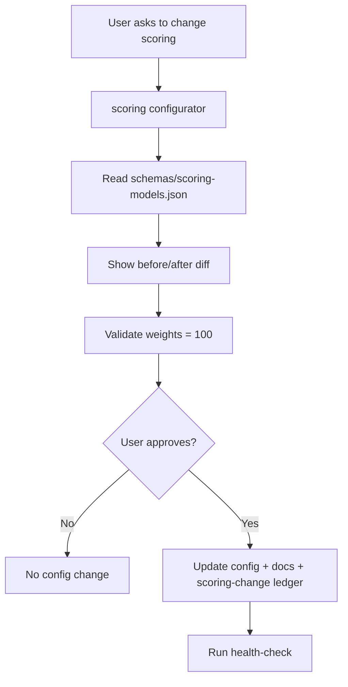
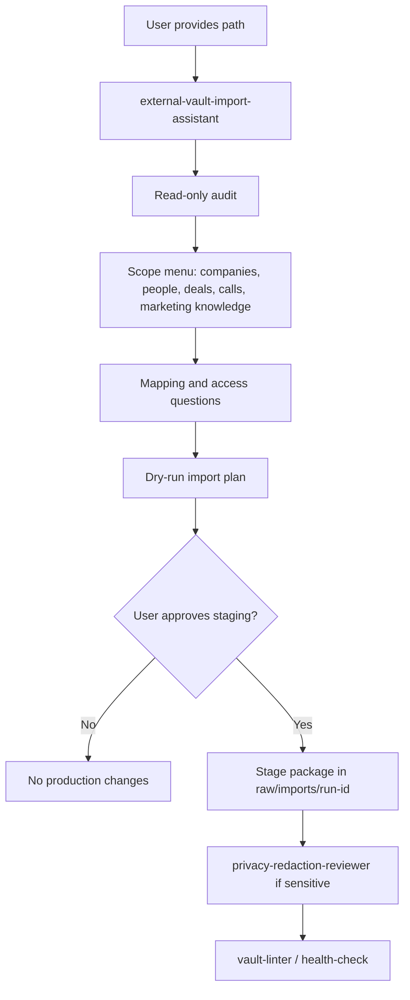
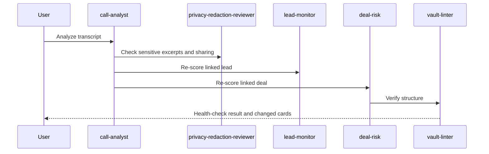
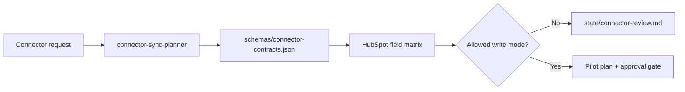
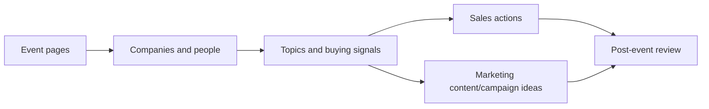

# SalesWiki User Guide

SalesWiki helps sales and marketing quickly get fresh, evidence-backed information about companies, people, leads, deals, calls, events, campaigns and market signals.

## How To Use

Open the project folder as an Obsidian vault. Most employees should use plain-language requests and should not need to know the file structure.



## How AI Is Used (and how to tell facts from generation)

Answers contain two kinds of content, always distinguishable:

- **Extracted facts** — the answer body: card values with sources
  (`📎 Sources`), confidence and freshness. Nothing here is generated: the
  gateway extracts cited values and never invents.
- **Generated helpers** — always labeled: the
  `🤖 Summary (from card data): …` line on top (a rephrase of the already-cited
  facts) and the `🧠 Recommendations (AI-generated from the cited data above)`
  block at the end of digests (a "do this first" prioritization). The model
  only ever sees the answer already filtered for your role and adds no new
  facts.

If a labeled block is absent, the system is running in deterministic mode (no
external model); answers stay complete — just without the rephrase and the
prioritization. Rules and boundaries:
`docs/engineering/llm-usage-architecture.md` and ADR-0017.

## Common Requests

## End-To-End Examples

### Lead Scoring

Request:

`Score inbound lead Orion Foods and tell me what to do next`

What happens:



### Changing Scoring Weights

Request:

`For outbound, reduce trigger strength by 5 and add those 5 points to account priority`

What should happen:



The ordinary scoring agent must not change weights by itself; it may only propose calibration changes.

### Importing An Old Vault

Request:

`I want to import an old Obsidian vault from /path/to/vault`

What happens:



### Call → Deal → Scoring

Request:

`Analyze this call and update the deal`



### HubSpot Connector Planning

Request:

`Can we connect HubSpot and write scores back?`



## Company

`Give me a fresh brief on <company>`

Expected answer:

- what the company does
- recent news and website signals
- key people
- leads/deals/calls
- pains, risks and opportunities
- next action
- sources and confidence

## Person

`Give me a brief on <person>`

Expected answer:

- role and company
- likely priorities
- articles/interviews/talks
- relationship status
- messaging angle
- next action

## Lead

`Score lead <lead/company/person>`

Expected answer:

- score and band
- why the score is what it is
- triggers
- risks/noise
- next action
- next review date

## Leads Outside Pipeline

`Which promising leads outside pipeline should we touch?`

Expected answer:

- who is worth touching
- whether there is a real trigger
- reminder if trigger is weak
- light-touch message angle

## MQL / Qualification

`Review MQL/qualification leads`

Expected answer:

- score
- stale/active status
- missing information
- next best action
- owner

## Call

`Analyze Google Meet call <link>`

Expected answer:

- transcript status
- summary
- pains
- buying signals
- objections
- commitments
- follow-up draft
- cards to update

## Deal

`Which deals are at risk?`

Expected answer:

- deal
- risk
- evidence
- missing next step
- recommended action

## HubSpot Enrichment

`Enrich HubSpot record <company/person/deal>`

Expected answer:

- current CRM data
- enriched fields
- sources
- proposed updates
- conflicts
- fields requiring approval

## Private Case

`Capture a private case for <client/project/challenge>`

Expected answer:

- context
- challenge
- approach
- outcome
- reusable lesson
- privacy/sanitization notes

## HoS Report

`Create weekly HoS report`

Expected answer:

- pipeline risks
- stale deals
- promising leads without action
- MQL/qualification movement
- score distribution
- recommended actions

## Marketing Content And Campaigns

`Create content brief for <topic/pain/persona>`

Expected answer:

- audience
- insight/trigger
- messaging angle
- proof
- CTA
- related campaign/asset

`Review campaign performance <campaign>`

Expected answer:

- channel/source/medium
- MQL/SQL/opportunity impact
- asset performance
- sales feedback
- next experiment

## Event ROI

`What did event <event> produce?`

Expected answer:

- outreach sent/replies
- meetings booked/completed
- leads/opportunities created
- pipeline influenced
- content/campaign ideas
- competitor/topic insights

`Create a pilot sales/marketing brief for conference <event>`

Expected answer:

- short event brief
- represented companies and why they matter
- speakers/employees and session topics
- repeated themes for campaigns and content
- target-account / partner / competitor candidates
- sales actions with reason, owner and due date
- coverage gaps and sources



## Tasks And Reminders

`What should I do today?`

Expected answer:

- overdue tasks
- due today
- hot leads to touch
- deals missing next step
- research gaps blocking action

The same view is available as a dashboard: `dashboards/sales-today.base` in Obsidian or the Markdown snapshot `reports/dashboard-snapshots/sales-today.md`.

## Manual Intake

If you have a link, person, company, file or topic:

- `Review this link <url>`
- `Here is company <name>, website <url>, start monitoring`
- `Here is person <name>, find everything important`
- `Add topic <topic> to monitoring`

The request goes to `state/manual-intake.md`, then an agent processes the source and updates the wiki.

## What Not To Do

- Do not delete cards manually without the archive/delete workflow.
- Do not overwrite Controlled Profile without explicit request or approval.
- Do not put sensitive data into broad summary pages.
- Do not create new card types unless needed.
- Do not copy raw materials into multiple places.

## HubSpot And Webwright

- HubSpot currently works as a governed integration contract: SalesWiki can prepare enrichment/card-fill proposals, but real writeback requires approval or an explicit system-writeback rule.
- HubSpot AI summary/score/task fill proposals are tracked in `state/hubspot-writeback-proposals.md`.
- Full Webwright harness requires an external backend key (`OPENAI_API_KEY`, `ANTHROPIC_API_KEY` or `OPENROUTER_API_KEY`). The user decides whether to enable that mode.
- Without a backend key, Webwright is used only as an artifact workflow: script, screenshots, logs and staged report.
- Do not use a low-confidence source as the only reason for outreach.
- Do not share personal data without redaction/approval.

## Where To Find Things

- Cards: `wiki/entities/`
- Processes: `wiki/processes/`
- Obsidian Bases dashboards: `dashboards/`
- Monitoring sources: `sources/`
- Queues and status: `state/`
- Processed-source tracking: `tracking/`
- Raw materials: `raw/`

## Dashboards

If you work in Obsidian, start with:

- `dashboards/sales-today.base` - what to do today.
- `dashboards/lead-priority.base` - who to touch now or soon.
- `dashboards/deal-risk.base` - which deals need attention.
- `dashboards/review-queue.base` - where review, a source or clarification is needed.
- `dashboards/monitoring.base` - what to check across companies, people, events and topics.
- `dashboards/marketing-insights.base` - which topics, pains, objections and campaign ideas to use.
- `dashboards/data-quality.base` - where sources, confidence or access review are missing.

For presentations and quick review, use Markdown snapshots under `reports/dashboard-snapshots/`.

## Demo

For a team demo, use the demo vault instead of real cards. Demo data is marked synthetic, stays separate and can be deleted without approval. Rules: `wiki/processes/demo-vault.md`.

## Permissioned Knowledge Assistant

SalesWiki ships an optional role-aware assistant that answers the **same question differently by role** and never leaks private data. The primary way to use it is a Claude MCP client — **Claude Code, Claude Desktop or Cowork** — connected to the permissioned **MCP gateway** (two-minute config: `docs/QUICKSTART.en.md`, "Ask It Questions"). There is also an optional **Rocket.Chat chat demo bridge** for showing the vault to an audience without a Claude client: ask in a chat channel and switch demo roles with a command (`integrations/rocketchat/README.md`; type `demo` in the channel for the cheat-sheet). In a real deployment your role is resolved by the server (SSO), not chosen by you; the chat bridge's role switch is a demo convenience.

What each role can ask (read tools): everyone gets a role-filtered `company_brief`, a one-hop `entity_graph`, ranked `lead_priority`, an `event_brief` and a personal `my_day`; sales owners, HoS and RevOps additionally get `deal_risk`, `call_prep` and the `pipeline_risk_digest` for the deals they are allowed to see; marketing gets the lead/event/graph views, a `campaign_brief` and `content_opportunities` without private deal detail; an SDR sees only leads and the deals assigned to them. Personal data (contacts, raw transcripts) is always an opaque handle unless you are an admin.

What you can change (governed write path): anyone can `flag_stale_or_wrong` or `request_redaction_review`; reviewers (curator/HoS/RevOps/admin) inspect the queue with `review_queue`/`get_proposal`; an approver (curator/HoS/admin) then `approve_proposal` or `reject_proposal` (RevOps inspects but does not decide); a separate single-writer worker applies approved proposals to the card's Review Needed section, with rollback if needed. Nothing is written until approved and applied. What happens after — who turns the applied note into an actual card edit, and which card zones may change directly vs only via proposal — is canonical in `wiki/processes/entity-card-governance.md` (Fix Workflow).

How answers are shaped and why you can trust them: every read answer follows one Answer Contract - a conclusion first, then cited sections (a readable table when it is a list of deals/leads/pains), confidence and freshness, a next action and an access label. The assistant **does not invent**: every value is copied from a cited card, and when the knowledge base has no answer it says so honestly (`not-found` with what is missing) instead of guessing.

## Knowledge Workbench help

The optional Knowledge Workbench is a visual, synthetic demo of the same
permissioned system. Its role views are projections of the same linked card
model; they are not separate sales and marketing copies. Raw evidence remains
attached while proposals and review preserve the route by which shared
knowledge changes. Select **Tour** in its top bar to choose a full product
walkthrough or a walkthrough for one synthetic role. The six-step quick tour
shows how shared evidence produces a sales priority and a different marketing
action. The 12-step full tour also covers decision signals, safe search, graph
controls, dated evidence, the guided assistant, local-only monitoring,
controlled import and governed Review. A role tour includes only the workflows
that role can use. It is presentational only: it never creates a proposal,
changes a card or connects to customer data. **Help** remains the short
reference guide.

1. Start with **Today** for role-visible priorities, then open an account.
2. Use **Explore** to inspect the graph and dated evidence. Search returns only
   companies you may access.
3. Select **Ask assistant** for a focused question shaped around the current
   role. Sales can ask about calls and deal risk; marketing sees permitted
   context and next-action questions. This is a guided, cited flow — not a
   free-form AI chat.
4. Use **Import** and **Propose an update** to create review proposals. They do
   not write cards directly.
5. **Review** appears only to roles that can inspect the shared proposal queue.
   An approval is still only a recorded decision; the single-writer worker
   performs any later governed apply.

Small information icons explain the risk trend, readiness coverage, evidence
timeline, guided assistant and monitoring. In the current demo, monitoring is
only a browser-local preference: it does not collect data, send notifications
or connect to a vendor. The demo persona selector also exists only for showing
role contrast; real deployments resolve identity through SSO.

Full step-by-step walkthrough with diagrams and commands: `docs/engineering/permissioned-knowledge-demo.md`.

## Import An Old Vault

If a department already has an Obsidian/Markdown folder, start an interactive import. The user provides a path, the agent first runs a read-only audit, shows what data types it found and asks what to import. It then asks mapping/access questions only where a safe default cannot be inferred, and prepares an import plan before any production changes.

For full workspace setup, see `docs/SETUP.en.md`.

## Health Check

Run:

```bash
python3 scripts/health_check.py
```

If the check fails, fix card structure or missing files first.

## Derived Indexes

Most employees do not need this. Curators/admins should run this after real entity-card creation, renames, archive/merge operations or major relinking:

```bash
python3 scripts/build_indexes.py
```

The generated `indexes/` files are rebuilt from Markdown and are not the source of truth.
