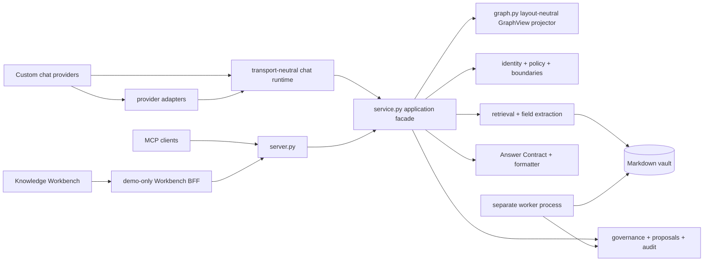

# Code Structure And Extension Boundaries

This note records the architecture quality baseline for the public preview. It
is a map for contributors, not a claim that every future deployment should keep
the exact same module layout.

## Dependency Direction

Dependencies point inward. The core does not import the Rocket.Chat integration,
and the MCP gateway does not import the writer. The worker is a separate process
and is the only component allowed to apply approved changes.

## Runtime Modules

| Area | Responsibility |
| --- | --- |
| `saleswiki_mcp/server.py` | MCP tool registration and transport adapter |
| `saleswiki_mcp/service.py` | stable application facade for read products and governance commands |
| `saleswiki_mcp/read_support.py` | pure answer-composition and pipeline-rollup helpers with no policy, vault or transport dependency |
| `identity.py`, `policy.py`, `boundaries.py` | actor resolution and pre-retrieval access decisions |
| `retrieval.py`, `formatter.py` | deterministic card lookup and field extraction |
| `answer.py`, `formatter.py` | one cited Answer Contract and its Markdown rendering |
| `graph.py` | role-filtered, cited, layout-neutral GraphView projection for exploration clients |
| `governance.py`, `proposals.py`, `audit.py` | proposal lifecycle, audit chain and signed checkpoint verification |
| `worker.py` | transactional validate-then-write and rollback |
| `saleswiki_runtime/config.py` | typed deployment profile, legacy environment compatibility and redacted diagnostics |
| `integrations/chat/models.py` | normalized messages, provider capabilities and typed application actions |
| `integrations/chat/runtime.py` | session isolation, bounded message dedupe and capability-aware dispatch |
| `integrations/chat/rendering.py` | provider-neutral Markdown chunking |
| `integrations/chat/adapters/base.py` | narrow protocol for custom chat providers |
| `integrations/rocketchat/_bridge_client.py` | Rocket.Chat HTTP transport |
| `integrations/rocketchat/_bridge_transport.py` | Rocket.Chat normalization and adapter capabilities |
| `integrations/rocketchat/_bridge_answers.py` | intent routing and answer presentation |
| `integrations/rocketchat/_bridge_workflows.py` | ingest, card inspection and governance demo flows |
| `integrations/rocketchat/_bridge_app.py` | Rocket.Chat demo commands and runtime composition |
| `integrations/workbench/server.py` | demo-only browser-to-MCP stdio BFF; HTTP routes, validated contracts and allowlisted proposal decisions; synthetic vault only |
| `integrations/workbench/sessions.py` | opaque, memory-only synthetic-session lifecycle; no production authentication responsibility |
| `prototypes/knowledge-workbench/src/components/Sidebar.jsx` | independently testable navigation component; page state remains in `App.jsx` |
| `prototypes/knowledge-workbench/src/clientFactory.js` | selects the fixture or BFF client set so `App.jsx` does not own transport wiring |

`integrations/rocketchat/bridge.py` remains a deliberately small public facade,
so the documented entry point and existing imports do not change.

## Large Files That Are Intentional

`scripts/generate_demo_vault.py` is a fixture catalog, and
`scripts/health_check.py` is a registry of independent structural validators.
Their size is visible, but neither owns unrelated runtime responsibilities or
shared mutable application state. Split them by card family only when changes
begin to collide or individual groups need separate test lifecycles.

`saleswiki_mcp/service.py` is a stable application facade. Its dependencies are
already separated. If the tool catalog grows materially, extract read-product
families behind the facade rather than exposing storage or policy modules to
transport adapters.

`integrations/workbench/server.py` and `prototypes/knowledge-workbench/src/App.jsx`
are intentionally orchestration points for the demo BFF and browser shell. They
are not policy or storage owners. Split them by HTTP route family and page/dialog
family when a new workflow changes independently; keep contract validation and
role checks at the BFF boundary.

## Static quality gates

Install development-only Python checks with `pip install -r requirements-dev.txt`,
then run `ruff check saleswiki_mcp integrations/workbench scripts`. The Workbench
uses `npm run lint` for ESLint and `npm test` for its browser-side contract tests.
These checks complement the full Python unit suite.

## Rules For New Work

1. Keep authorization before retrieval; do not fetch a closed card and redact it later.
2. Keep the gateway read/propose-only; all durable writes go through the worker.
3. Return the shared Answer Contract for answer products, or the versioned GraphView contract for graph exploration; do not invent ad-hoc response shapes.
4. Add a card type through all documented taxonomy, template, dashboard and validation touch-points.
5. Keep integration transports outside `saleswiki_mcp/`; they may call the core, never the reverse.
6. Prefer a small application facade over clients importing low-level storage modules.
7. Add a module when a file gains a second independently changing responsibility, not merely because it crosses an arbitrary line count.
8. Put normalized messages, sessions and typed actions in `integrations/chat/`; a provider adapter must not become a second application core.
9. Key chat state by provider, tenant, conversation, thread and user, and deduplicate provider retries by message ID.
10. Keep graph semantics in the core contract and pixel layout in the client; never return React Flow coordinates from the MCP service.
