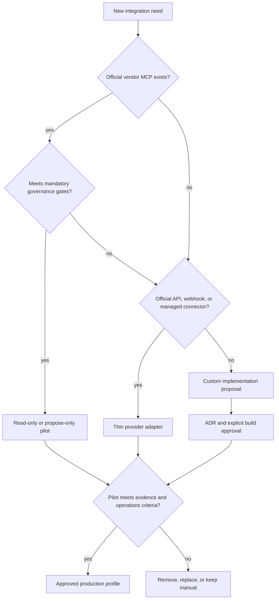
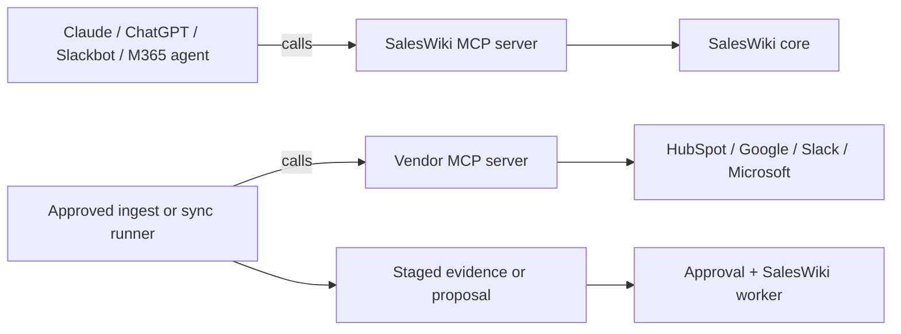

# Integration Platform Plan

Status: active implementation plan
Owner: SalesWiki maintainers
Started: 2026-08-29

## Current status

| Phase | State | Evidence / next condition |
| --- | --- | --- |
| 0. Contracts and baseline | complete | ADR-0020, connector strategy and architecture checks are tracked |
| 1. Typed configuration | complete | `saleswiki_runtime`, example TOML, redacted output and read-only doctor |
| 2. Shared chat runtime | complete | Rocket.Chat runs through normalized messages, isolated sessions, typed actions and bounded dedupe |
| 3. Remote SalesWiki MCP | local readiness slice complete; remote not deployed | Workbench BFF verifies browser → real stdio MCP with fixed demo identity; hosted use still needs a test IdP/tenant, HTTPS and per-request OAuth |
| 4. Vendor MCP read pilot | waiting on value gate | start with HubSpot only after the `lead_priority` pilot proves that the workflow is worth automating |
| 5. Native collaboration clients | waiting on phase 3 | try Slackbot or a Microsoft 365 agent before building another bot |
| 6. External actions | deferred | start only after read flows work and an exact approved action has an owner |

This table is intentionally conservative. An official server being available
does not mean SalesWiki has connected or approved it.

## Goal

Build a configuration-first integration layer that keeps the SalesWiki core
independent of chat products and external data vendors. Prefer an official
vendor MCP server or managed connector when it meets the security and workflow
contract. Build a custom adapter only for a documented gap.

Success means:

- the existing Rocket.Chat demo runs through a transport-neutral chat runtime;
- runtime configuration is typed, validated and explainable without exposing secrets;
- Slack and Microsoft 365 can use SalesWiki through its remote MCP surface before
  custom Slack or Teams bots are considered;
- at least one official vendor MCP is evaluated in a read-only pilot;
- no external write can bypass proposal, approval, worker apply and audit;
- fixture identity remains limited to synthetic demos;
- every provider can be removed without changing the vault or core service.

## Integration taxonomy

Do not place every external system behind one generic `ConnectorAdapter`.
SalesWiki has four different integration directions:

| Type | Examples | Responsibility |
| --- | --- | --- |
| Client surface | Claude, ChatGPT, Slackbot, Microsoft 365 agents | invokes SalesWiki MCP tools |
| Chat adapter | Rocket.Chat, Telegram, a fallback custom Slack bot | transports normalized messages and artifacts |
| Source connector | HubSpot, Drive, Meet, Slack history | stages external evidence or structured records |
| Notification sink | Slack digest, Teams digest, email | sends approved reports and alerts |

Identity providers are a fifth, separate concern. A transport user ID is an
input to identity resolution; it is never a SalesWiki role by itself.

## Default decision path



### Mandatory vendor gates

A provider is rejected for the requested production use if any applicable gate
fails:

1. no least-privilege scope for the operation;
2. caller identity cannot be bound to the operation or audit event;
3. write tools cannot be disabled or isolated from ordinary users;
4. output lacks stable record IDs or source references needed for dedupe and citations;
5. authentication requires tokens to pass through an untrusted intermediary;
6. data retention, residency or training terms conflict with the data boundary;
7. the product is preview-only and the use case requires production reliability;
8. the provider cannot expose a failure, retry or reconciliation path.

After the mandatory gates pass, compare implementation effort, operating cost,
rate limits, schema stability, pagination/delta support, idempotency, audit
coverage, client compatibility and exit cost. Record the evidence and decision
in the provider profile instead of treating marketplace availability as approval.

## Current vendor-first matrix

The matrix is a starting position, not permanent vendor approval. Vendor
capabilities must be rechecked before each pilot because they change quickly.

| Need | Preferred path | Fallback | Current decision |
| --- | --- | --- | --- |
| HubSpot interactive CRM read | official HubSpot remote MCP with a user-level auth app and read scopes | official REST API or controlled CSV | pilot candidate after the lead-priority value gate |
| HubSpot scheduled/delta ingest | official API/webhooks or a managed connector with checkpoints | scheduled export/file drop | do not assume conversational MCP is a sync engine |
| HubSpot writeback | worker-owned restricted provider action after approval | REST API with exact field matrix | no direct client write; choose MCP vs API only after idempotency/audit spike |
| Google Drive/Docs read | official Google Workspace MCP | controlled export/file-drop ingest | read-only experiment; official service is currently Developer Preview |
| Google Meet transcript intake | Drive/Docs MCP when the transcript is a file | Meet/Drive API or export | verify coverage; the current Workspace MCP catalog does not expose a dedicated Meet server |
| Slack as SalesWiki UI | register the SalesWiki remote MCP server for Slackbot | custom Slack adapter | native MCP-client path first |
| Microsoft 365/Teams as SalesWiki UI | Microsoft 365 agent connector to SalesWiki remote MCP | Bot Framework adapter | native MCP-client path first |
| Rocket.Chat as SalesWiki UI | existing custom adapter | none | keep as reference adapter and synthetic demo |
| Telegram as SalesWiki UI | custom adapter | none | demand-driven demo surface; never an identity authority |
| Slack content intake | official Slack MCP with narrow read scopes | export/API | only for a named workflow and selected channels, never broad default ingestion |
| Gmail/Calendar action | official Google Workspace MCP | API | drafts/read first; sending or scheduling requires an approved action contract |

## Two MCP directions

SalesWiki must distinguish these flows:



The first flow exposes SalesWiki. The second consumes external MCP tools. A user
having both SalesWiki and HubSpot write tools in one general-purpose client must
not become a bypass around SalesWiki governance. Production write credentials
belong only to the controlled worker/action runner.

## Target runtime configuration

The optional Knowledge Workbench consumes SalesWiki through the layout-neutral
GraphView contract described in [MCP Graph Adapter](mcp-graph-adapter.md). It is
a SalesWiki client surface, not a new source connector: vendor MCP results enter
the durable graph only after staged ingest or a governed proposal.

Use four layers:

| Layer | Storage | Content |
| --- | --- | --- |
| Product contracts | tracked `schemas/*.json` | policy, provider capabilities, allowed operations and failure modes |
| Deployment profile | external TOML selected by `SALESWIKI_CONFIG` | enabled instances, vault/runtime paths, modes and secret references |
| Secrets | environment or secret manager | OAuth secrets, tokens and signing keys |
| Runtime state | configured runtime store | cursors, sessions, idempotency keys, retries and audit events |

Example public profile:

```toml
version = 1
profile = "demo"

[vault]
root = "demo/permissioned"
runtime = "demo/runtime"

[chat]
session_store = "memory"
default_trigger = "?"

[chat.adapters.rocket-demo]
provider = "rocketchat"
enabled = true
mode = "poll"
identity_provider = "fixture"
url_env = "ROCKETCHAT_URL"
user_env = "ROCKETCHAT_USER"
password_env = "ROCKETCHAT_PASSWORD"
conversation = "saleswiki-demo"
```

The tracked example is `config/runtime.example.toml`. Copy it to the ignored
`config/runtime.toml`, export `SALESWIKI_CONFIG=config/runtime.toml`, and keep
all referenced secret values in the environment or a secret manager.

The loader expands only typed secret-reference fields. It must not perform
arbitrary environment substitution throughout the file.

Required operator commands:

```bash
python -m saleswiki_runtime config validate
python -m saleswiki_runtime config show --redacted
python -m saleswiki_runtime doctor
```

`doctor` checks the vault guard, policy contracts, secrets, provider endpoint,
required scopes, declared capabilities, writable runtime paths and identity mode.
It never prints tokens or performs writes.

## Target chat runtime

The common runtime owns normalized messages, typed responses, session keys,
dedupe, retry and capability-aware rendering. Provider adapters own API and
webhook details.

```text
integrations/chat/
  models.py
  runtime.py
  sessions.py
  rendering.py
  adapters/
    base.py
integrations/rocketchat/
  _bridge_transport.py
```

Minimum normalized message identity:

```text
provider + tenant + conversation + thread + external_user + message_id
```

The application returns typed actions such as `TextResponse`, `FileResponse`,
`StartDemo`, `ClearConversation` and `NoReply`. It does not return provider-shaped
dictionaries. Each adapter declares capabilities such as message size, files,
threads, buttons and deletion. The renderer degrades honestly rather than
pretending every platform supports the same UI.

## Implementation phases

### Phase 0: contracts and baseline

Deliverables:

- accept ADR-0020 and this plan;
- extend connector contracts with provider type, maturity, auth mode and
  implementation strategy;
- add architecture tests for core-to-integration dependency direction;
- preserve the current 488-test and demo baseline.

Exit gate: no runtime behavior changes and all checks remain clean.

### Phase 1: typed configuration foundation

Deliverables:

- `saleswiki_runtime` settings model using Python 3.11+ `tomllib` and dataclasses;
- `runtime.example.toml` with demo and disabled provider examples;
- `config validate`, redacted `config show`, and read-only `doctor`;
- temporary compatibility mapping for existing `RC_*` variables with a
  deprecation notice and explicit `SALESWIKI_ALLOW_LEGACY_RC=1` bridge opt-in;
- tests for precedence, missing secrets, redaction, invalid combinations and
  fixture-identity production-vault rejection.

Exit gate: one config file can start the current Rocket.Chat demo, and no secret
appears in output, logs or tracked files.

### Phase 2: transport-neutral chat runtime

Deliverables:

- normalized inbound/outbound models and `ChatAdapter` protocol;
- conversation state keyed by provider, tenant, conversation, thread and user;
- typed actions and capability-aware rendering;
- Rocket.Chat migrated as the reference adapter;
- polling cursor, idempotency and retry tests;
- existing bridge entry point retained as a compatibility facade.

Exit gate: all current Rocket.Chat tests pass through the new runtime and the
core still has no import dependency on integrations.

### Phase 3: remote SalesWiki MCP readiness

Completed local readiness sub-slice: the demo-only Workbench BFF invokes
`saleswiki.entity_graph` through the official MCP stdio client, keeps its fixed
fixture actor server-side and rejects non-demo vaults. This proves the UI
contract and transport seam; it is not the remote phase exit gate.

Deliverables:

- Streamable HTTP deployment surface in addition to local stdio;
- OAuth 2.1 protected-resource metadata, PKCE-compatible clients, audience-bound
  tokens and per-request actor resolution;
- tool allowlists by deployment profile;
- hosted health, rate-limit and audit hooks;
- test tenant runbooks for Slackbot and Microsoft 365 agent connectors.

Exit gate: two test identities receive correctly different answers over remote
MCP, and fixture identity cannot reach a non-demo vault.

### Phase 4: vendor MCP read pilot

Start only after the real `lead_priority` pilot validates product value.

Preferred first spike: official HubSpot remote MCP with read-only CRM scopes.

Deliverables:

- provider profile and approved scope list;
- capability snapshot and contract tests against recorded synthetic responses;
- natural-key/HubSpot-ID dedupe mapping;
- staged import or proposal output with citations and freshness;
- retry, rate-limit and reconciliation behavior;
- comparison against CSV/manual import cost and accuracy.

Exit gate: the connector improves one validated workflow without increasing
unaudited access or curator cost beyond the pilot threshold.

### Phase 5: native collaboration clients

Deliverables:

- Slack internal app that exposes the SalesWiki remote MCP server to Slackbot,
  if the target plan and admin policy permit it;
- Microsoft 365 agent-connector manifest for a test tenant, if Teams demand exists;
- user/tenant identity mapping and access tests;
- documented fallback decision for a custom adapter only when native MCP cannot
  provide the required UX or deployment model.

Exit gate: a user can ask the same cited SalesWiki question from one native
collaboration client without adding a second policy implementation.

### Phase 6: controlled external actions

Deliverables:

- separate worker-owned credentials and provider action interface;
- exact payload hash, idempotency key, previous value and external result in the
  proposal/audit chain;
- MCP-vs-API decision for each action based on tool stability and reconciliation;
- dead-letter and manual recovery path.

Exit gate: a failed or repeated external action cannot create an untracked or
duplicate business change.

## What we deliberately defer

- a dynamic plugin marketplace or arbitrary third-party code loading;
- custom Slack and Teams bots before native MCP-client paths are tested;
- broad multi-provider sync before one workflow proves value;
- production dependence on preview vendor services;
- autonomous CRM, email, calendar or chat writes;
- a lowest-common-denominator renderer that hides provider limitations.

## Verification for every phase

1. unit and contract tests;
2. no-leak and prompt-injection tests;
3. fixture-vs-production vault guard tests;
4. public release review and secret scan;
5. `scripts/health_check.py` with zero errors and warnings;
6. demo dry run;
7. updated provider capability snapshot and reassessment date;
8. ADR update when a proposed provider becomes accepted or rejected.

## Official references checked for this plan

- [HubSpot remote MCP server](https://developers.hubspot.com/docs/apps/developer-platform/build-apps/integrate-with-the-remote-hubspot-mcp-server)
- [Google Workspace MCP servers](https://developers.google.com/workspace/guides/configure-mcp-servers)
- [Slack MCP server](https://docs.slack.dev/ai/slack-mcp-server/)
- [Slackbot as an MCP client](https://slack.com/help/articles/52414744085139-Connect-Slackbot-to-other-apps-with-MCP/)
- [Microsoft 365 MCP agent connectors](https://learn.microsoft.com/en-us/microsoftteams/platform/m365-apps/agent-connectors)
- [Microsoft MCP Server for Enterprise](https://learn.microsoft.com/en-us/graph/mcp-server/get-started)
- [MCP authorization specification](https://modelcontextprotocol.io/specification/2025-06-18/basic/authorization)
- [MCP Registry remote-server metadata](https://modelcontextprotocol.io/registry/remote-servers)
