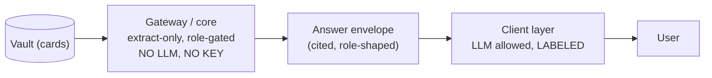

# LLM Usage Architecture — Where Models Run And When A Key Is Needed

The single place that answers: **where do LLMs run in SalesWiki, when is an
`ANTHROPIC_API_KEY` required, and why**. The governing decision is
[ADR-0017](../adr/0017-llm-client-side-labeled-layer.md): every generative step
lives in the client layer, outside the trust boundary, and is labeled; the
core/gateway/worker never generate.

> **Кратко (RU).** Ядро, MCP-шлюз и worker **никогда** не вызывают LLM и не
> требуют ключа — их ответ собран из процитированных значений карточек. Модель
> появляется только в клиентском слое: в Cowork/Claude Desktop моделью является
> сам клиент (ключ не нужен), а headless Rocket.Chat мост может опционально
> вызвать Haiku для сводки/рекомендаций (нужен ключ). Все сгенерированные куски
> явно помечены и строятся только из уже отфильтрованного по роли ответа.

## The one rule

The LLM only ever sees an envelope that the policy engine already shaped for
that role. It may rephrase or rank; it may not add facts (prompt-enforced,
label-mitigated). Access control never depends on model behavior.

## Track-by-track: when a key is needed

| Track | Where the LLM is | Key needed? | Why |
| --- | --- | --- | --- |
| **MCP in Cowork / Claude Desktop** | The client itself (Claude) | **No** | The user's Claude client is the model; our server only serves extracted envelopes over MCP. Nothing in our stack calls a model. |
| **Rocket.Chat bridge — default** | Nowhere (deterministic) | **No** | Summary is composed from the envelope's conclusion + top table row; recommendations block is absent. Fully offline, reproducible. |
| **Rocket.Chat bridge — LLM mode** | Bridge process calls Haiku | **Yes** (`ANTHROPIC_API_KEY` + `RC_LLM_SUMMARY=1` / `RC_LLM_RECS=1`) | The bridge is headless — no client model exists, so our code makes the call. Grounded on the envelope, labeled (`🤖 Summary`, `🧠 Recommendations`), fail-silent. |
| **Core / gateway / worker** | Never | Never | Accuracy by construction ([ADR-0012](../adr/0012-answer-contract-extract-only.md)): extraction, not generation. |
| **Webwright browser research** | External harness backend | Yes (backend key) | Separate research tooling; see `docs/SETUP.*.md` and `wiki/processes/browser-research-method-comparison.md`. |

Key handling: keys live **outside the repository** (shell profile + macOS
Keychain; the repo root is an Obsidian vault that plugins and sync tools can
read — never put secrets inside it). See AGENTS.md and
`wiki/processes/connector-contracts.md`.

## Labeling contract

Generated content is always distinguishable from extracted content:

- `🤖 Summary (from card data): …` — one line on top; deterministic by default,
  model-written in LLM mode. Same marker either way (`SUMMARY_MARKER`).
- `🧠 Recommendations (AI-generated from the cited data above): …` — closing
  block on digests only (`my_day`, `pipeline_risk_digest`, all-deals
  `deal_risk`); exists only in LLM mode.
- Everything between the summary line and the recommendations block is
  extracted, cited card data with sources listed.

Failure behavior is part of the contract: any model error falls back to the
deterministic summary / drops the block. A demo or pilot never breaks because
an API call failed.

## Planned LLM uses (same rule applies)

- **Guided assistant (implemented, no LLM):** a menu of account brief, what
  changed, next step, deal risk and call preparation routes server-side to
  existing policy-filtered reads. It is the default browser assistant until a
  free-form option passes the pilot gates below.
- **Intent routing** (post-demo, first in line): free-form questions → tool +
  argument chosen by a model. The model picks *which* tool to call; the gateway
  still decides *what that role may read* — routing is not authorization, so
  the trust boundary is unchanged.
- **Ingest enrichment**: summarizing connector resources into proposal
  payloads — rides the existing proposal → review → apply loop, so a human
  approves anything the model drafted before it touches a card.

Anything that would put generation *inside* the gateway is rejected by
[ADR-0017](../adr/0017-llm-client-side-labeled-layer.md).

## Future chat options

| Option | Cost | Data boundary | When to choose it |
| --- | --- | --- | --- |
| Guided assistant | Free | No model; existing cited answer envelopes only | Default now and first pilot |
| Local model (for example, a user-managed Ollama runtime) | Software-free; local compute/model download | Only an already-authorized envelope may enter the local model | A privacy-first single-user experiment |
| Cloud model in the client layer | Usage-based | Provider receives only an authorized envelope; keys remain outside the repo | Shared pilot after consent, vendor and retention review |
| Free-form intent router | Usage-based or local | Model chooses an allowlisted intent; server still authorizes the read | After guided questions show the real missing intents |

None of these options lets a model decide access, mutate cards directly or
assert uncited facts. A model failure must fall back to the deterministic
guided flow.

## Related docs

- [permissioned-knowledge-sso-design](permissioned-knowledge-sso-design.md) —
  identity per request (OIDC), independent of the LLM layer
- [DEPLOYMENT.en](../DEPLOYMENT.en.md) — local and Docker starter path
- `integrations/rocketchat/README.md` — flag-level bridge documentation
