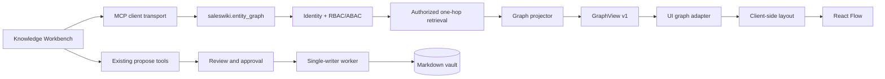
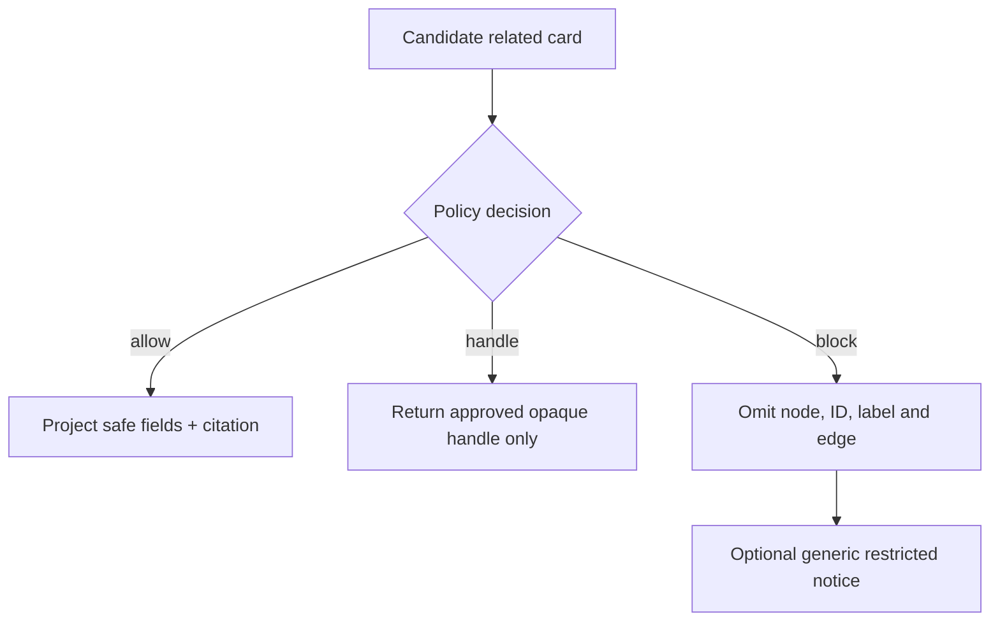
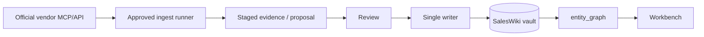

# MCP Graph Adapter

Status: GraphView v1, the role-aware core projector, stdio MCP tool, UI client
boundary and demo-only Workbench BFF are implemented. A hosted browser-to-MCP
transport with real SSO remains future work.

## The short version

The Knowledge Workbench is not a picture that must be redrawn for every
company. It is one reusable interface over a small, typed graph.

For production, SalesWiki should expose a dedicated read tool:

```text
saleswiki.entity_graph(entity_type="company", entity="BluePeak Energy", depth=1)
```

The tool returns a role-filtered `GraphView` object. The browser validates the
object, calculates node positions and renders it. It does not parse Markdown,
guess relationships or fetch restricted cards and hide them afterward.

## Why not build the graph from `company_brief`?

`company_brief` is a good answer for humans, but it is not a graph protocol.
Turning its headings and prose back into nodes would be fragile:

- wording changes could break the UI;
- stable entity IDs and edge types would be lost;
- citations could no longer be attached to an exact node or relationship;
- the client might accidentally infer a relationship that policy did not allow;
- every new screen would need another text parser.

The existing Answer Contract remains the default envelope for answer-style MCP
tools. `GraphView` is a sibling read model for exploration-style clients. Both
use the same identity, policy, retrieval, field extraction, citations and audit
components.

## Architecture



The dependency direction stays inward:

```text
UI -> MCP gateway -> service facade -> policy/retrieval -> vault
                                  -> graph projector -> GraphView

worker -> approved proposals -> vault
```

The graph projector belongs in `saleswiki_mcp/graph.py`. It may use authorized
`Card` objects and configured field extraction. It must not import React, React
Flow, the prototype, chat adapters or vendor connectors.

The UI adapter belongs with the client. It owns display labels, colors, icons,
filters and layout. The server never returns `x`/`y` coordinates.

## The GraphView v1 contract

The machine-readable contract is
[`schemas/graph-view.schema.json`](../../schemas/graph-view.schema.json).

At the top level it contains:

| Field | Meaning |
| --- | --- |
| `contract`, `version` | explicit compatibility boundary |
| `root_id` | stable root entity ID, or `null` for safe empty states |
| `access` | the same access states as the Answer Contract |
| `summary` | conclusion, confidence, freshness, date and next action |
| `nodes` | authorized typed entities only |
| `edges` | authorized typed relationships only |
| `evidence` | dated citations referenced by node/edge IDs |
| `restricted` | safe, generic notices; never hidden entity names or paths |
| `missing` | honest gaps and incomplete relationship data |

Small example:

```json
{
  "contract": "saleswiki.graph-view",
  "version": 1,
  "root_id": "company_01J...",
  "access": "allowed",
  "summary": {
    "title": "BluePeak Energy",
    "conclusion": "Confirm the next step and engage the economic buyer.",
    "confidence": "medium",
    "freshness": "fresh",
    "as_of": "2026-08-29",
    "next_action": "Book the finance review.",
    "score": 74
  },
  "nodes": [
    {
      "id": "company_01J...",
      "type": "company",
      "label": "BluePeak Energy",
      "subtitle": "Target account",
      "detail": "ROI-focused pilot evaluation.",
      "metadata": {"owner": "Ivan Petrov"},
      "evidence_ids": ["evidence_01"]
    }
  ],
  "edges": [],
  "evidence": [
    {
      "id": "evidence_01",
      "title": "Discovery Call",
      "status": "verified",
      "as_of": "2026-07-03",
      "summary": "Finance buy-in is still needed.",
      "citation": {
        "boundary": "sales-confidential",
        "path": "wiki/entities/calls/Call - BluePeak Discovery.md"
      }
    }
  ],
  "restricted": [],
  "missing": ["economic buyer is not linked"]
}
```

## Request contract

The first tool should stay deliberately small:

```text
saleswiki.entity_graph(
  entity_type: "company",
  entity: "BluePeak Energy" or stable entity_id,
  depth: 1,
  include: ["person", "deal", "call", "competitor", "source"]
)
```

Rules for v1:

- `entity_type` supports `company` first; additional roots come later.
- `depth` is fixed to `1`. A global multi-hop graph is deferred.
- `include` is an allowlisted display filter, not a way to bypass policy.
- maximum response: 40 nodes, 80 edges and 12 evidence records;
- stable ID wins over name; ambiguous names return `access: ambiguous`;
- `blocked` and `not-found` return no fabricated nodes or edges;
- every conclusion, claim-like node and non-obvious edge references evidence;
- duplicate IDs, dangling edges and missing evidence references fail closed.

## Authorization and no-leak behavior

Authorization happens before a card becomes a node.



Important details:

- A blocked deal must not leave a named company-to-deal edge behind.
- A blocked person must not be represented by initials, a count that identifies
  them, or a stable ID.
- Personal-data content stays behind an opaque `restricted://` handle.
- Citation paths are returned only when the actor may see that boundary.
- The response cache is scoped by actor, role/attributes, root entity, include
  set, policy version and data version. A shared cross-role graph cache is unsafe.
- Retrieval, decision and response-size events enter the normal read audit.

## Layout: what the browser owns

The server returns meaning, not pixels. The client uses deterministic lanes:

- root company in the center;
- people above;
- deals and leads to the left;
- competitors to the right;
- calls and tasks below-left;
- sources and claims along the evidence lane below.

Within a lane, nodes are spread by count. This means a new company needs only
data. It does not need a generated screenshot or custom layout file. Users may
drag nodes during a session, but those temporary coordinates are not written to
the knowledge vault.

For large accounts, the UI should show the highest-value one-hop slice first and
offer filters or pagination. It should not shrink forty cards into unreadable
boxes.

## Writes remain separate

`entity_graph` is read-only. The `Propose an update` button calls an existing or
extended proposal tool with:

- target entity ID;
- proposed fact or correction;
- source/citation reference;
- optional evidence ID from the current graph;
- idempotency key supplied by the client.

The browser never writes a graph, card or edge directly. Review, approval,
single-writer apply, validation and audit remain unchanged.

## Vendor MCP and connector rule

The Workbench should normally call one MCP server: SalesWiki.

### Company search

The fixed Workbench top bar uses the companion
`saleswiki.company_search(query)` tool before opening a graph. It is a small,
deterministic company resolver, not a graph filter or an LLM feature: it emits
only the stable IDs and labels the current actor may discover. The browser then
passes the selected ID into `entity_graph`. Hidden matches, their names and
their count never cross the policy boundary. See
[`ADR-0027`](../adr/0027-role-aware-company-search.md).

Official HubSpot, Google, Slack or Microsoft MCP servers are useful upstream,
but their results should enter SalesWiki through a controlled ingest or proposal
flow before they appear as durable graph knowledge.



Why not merge several vendor MCP responses directly in the browser?

- each provider has different identity and scopes;
- dedupe and stable IDs would be inconsistent;
- citations and freshness would have different meanings;
- a client-side join could leak data across boundaries;
- the UI would become an integration engine.

A temporary provider preview may be added later, but it must be visibly marked
`external / unverified`, must not be mixed into conclusions, and must use a
separate adapter contract.

## Failure behavior

| Condition | UI behavior |
| --- | --- |
| exact entity not found | honest empty state and smallest ingest/create action |
| ambiguous name | selection list; no guessed company |
| root blocked | locked state and request-access action |
| related node blocked | omit it; show only a safe generic notice |
| stale graph | show `as_of` and freshness warning; do not silently refresh from vendors |
| schema version unsupported | stop rendering and show upgrade-required state |
| dangling edge/evidence reference | reject payload, log contract error, show safe retry state |
| response exceeds limits | server truncates by declared ranking and reports the missing slice |

## Pros and cons

### Benefits

- one UI works for every company and later for deals, events and campaigns;
- policy is enforced once in the core, not reimplemented in JavaScript;
- node/edge meaning is stable and testable;
- citations remain attached to exact facts and relationships;
- UI technology and layout algorithms can change independently;
- vendor MCP adoption stays compatible with SalesWiki governance.

### Costs and trade-offs

- `GraphView` is a second read model that must evolve alongside Answer Contract;
- schema versioning and compatibility tests become mandatory;
- graph projection adds server work and cache complexity;
- one-hop limits intentionally hide some relationships;
- deterministic layout is less visually perfect than hand-designed screenshots;
- a production remote MCP still needs OAuth identity and deployment work.

## Implementation status and next slices

### Slice 1 — contract and UI adapter (implemented)

- accept ADR-0021;
- validate `GraphView v1` in the client;
- calculate all positions client-side;
- keep the three synthetic companies as contract fixtures;
- test a fourth differently-shaped account without adding layout code.

Exit gate: no account-specific positions or components remain.

### Slice 2 — core projector (implemented)

- add `saleswiki_mcp/graph.py` with typed dataclasses and validation;
- build a company one-hop view from already authorized `Card` objects;
- add no-leak, dangling-reference, limit and ambiguous/not-found tests;
- reuse field extraction and citation primitives.

Exit gate: AE and Marketing receive structurally valid but correctly different
graphs for the same company.

### Slice 3 — MCP tool (implemented for local stdio)

- register `saleswiki.entity_graph` in the stdio gateway;
- return readable summary text plus `GraphView` in `structuredContent`;
- add a real MCP round-trip test;
- record policy decisions through the existing audit sink.

Exit gate reached at the contract/client seam and MCP protocol level. The local
prototype still defaults to synthetic fixtures because a browser-safe remote MCP
transport and production identity are deliberately not embedded in Vite.

### Slice 4 — remote client and identity

Local readiness sub-slice implemented: a loopback demo BFF calls the real MCP
stdio tool with a server-resolved synthetic fixture actor. When enabled in the
demo configuration, an opaque BFF session can switch among allowlisted
synthetic people to demonstrate role-shaped views. The UI labels this as demo
mode; it is not shared-user authentication.

- add the remote MCP surface described in the integration platform plan;
- use OAuth/OIDC actor resolution per request;
- add actor-scoped cache and rate limits;
- connect the Workbench without exposing provider credentials to the browser.

Exit gate: two test identities see role-correct graphs over the hosted path.

## Decisions still open

- whether the browser talks to remote MCP through a thin backend-for-frontend or
  through a future browser-safe MCP transport;
- which ranking selects nodes when an account exceeds the v1 limits;
- whether session layout preferences live only in browser storage or in a
  separate user-preference service;
- which real-data pilot account validates the one-minute understanding goal.

These questions do not block the contract or local UI adapter.

## Related decisions and contracts

- [ADR-0011](../adr/0011-read-propose-gateway-single-writer-worker.md)
- [ADR-0012](../adr/0012-answer-contract-extract-only.md)
- [ADR-0020](../adr/0020-vendor-first-mcp-and-channel-adapters.md)
- [ADR-0021](../adr/0021-layout-neutral-mcp-graph-read-model.md)
- [Integration platform plan](integration-platform-plan.md)
- [Code structure](code-structure.md)
- [Graph and index design](../../wiki/processes/graph-index.md)
