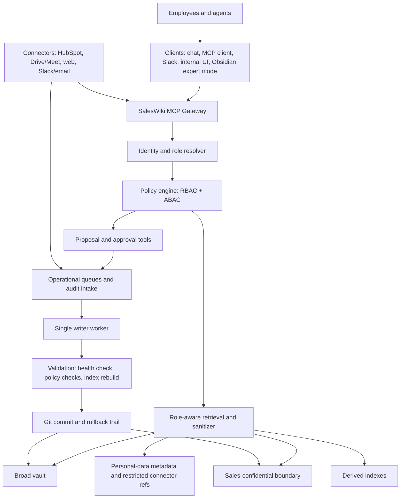

# Permissioned Knowledge Architecture

This document defines the target architecture for SalesWiki as a permissioned knowledge system for a 100-150 person company with a 10-15 person sales and marketing operating group.

It extends [[permission-boundary-blueprint]], [[access-and-redaction-policy]], [[data-engineering-contract]], [[connector-contracts]], [[entity-card-governance]], [[dashboard-contract]] and [[report-templates]].

## Executive Decision

SalesWiki should not become a generic chatbot over a shared Obsidian folder. The right target is a small governed knowledge service:

1. Markdown remains the durable, human-readable source of truth for curated knowledge.
2. Sensitive data is separated by physical storage boundary, not only by YAML labels.
3. MCP is the main controlled access layer for employees and agents.
4. User-facing MCP tools are read/propose only.
5. A single worker applies approved changes, validates the vault, rebuilds indexes and records git history.
6. Users interact with role-shaped business products, not folders, vault paths or low-level tools.

The design should be strong enough for real sales, marketing, CRM and call data, but small enough that a 10-15 person go-to-market team can operate it without enterprise GRC overhead.

## Architect Review Synthesis

| Role | Main conclusion | Architecture implication |
| --- | --- | --- |
| Data architect | SalesWiki is a governed Markdown knowledge base, not yet a permissioned data platform. | Add physical data boundaries, entity/ref/overlay model, lineage and proposal contracts. |
| System architect | A compact gateway-worker runtime is enough. | Use SSO -> MCP gateway -> role-aware retrieval -> proposal queue -> single writer worker. |
| Security architect | Labels and Obsidian are not enforcement. | Enforce through SSO-aware gateway, storage permissions, sanitizers, signed approvals and audit logs. |
| Knowledge/UX architect | Employees should see business workbench outputs, not vault structure. | Build role homes, answer products, review inboxes and dashboards. |
| Implementation architect | Avoid premature infrastructure. | Start with read/propose MVP, JSONL indexes, Docker Compose or local services, no Kubernetes or vectors at first. |

## Assumptions

- Company size: 100-150 employees.
- Sales and marketing users: 10-15.
- Data volume: small to moderate, mostly company/person/deal/call/source cards, not millions of documents.
- Existing systems: CRM such as HubSpot, Google Drive/Meet or equivalent, chat/email, public web research.
- Most employees are non-technical and should not edit Markdown manually.
- Curators and operators can use Obsidian directly when needed.
- Raw personal data and call recordings are sensitive and should not live in the broad vault by default.

## Reality Check

Security depends on what is actually enforced at runtime, not on what a label or document asserts. The two lists below separate controls that genuinely reduce risk from practices that look protective but enforce nothing on their own.

### Real Controls

These controls actually reduce risk:

- Physical split between broad, sales-confidential, personal-data and legal-review storage.
- SSO/OIDC identity propagated into every MCP tool/resource call.
- Central authorization middleware in the MCP gateway.
- Role and attribute checks before retrieval, summarization, proposal creation and approval. *(Export and writeback checks are part of this target model but not yet enforced in code — the `operations` / `export_requires_approval` / `writeback_requires_approval` keys in `schemas/access-policy.json` are declared for a future operation dimension and are read by no runtime path today; there is no export or writeback surface yet.)*
- Sanitization before output reaches a broad user, Slack digest, email draft, model context or dashboard.
- Read/propose-only user-facing gateway.
- Single production writer for approved mutations.
- Structured proposals with source evidence, risk tier, before/after values and base commit.
- Identity-bound approvals for protected changes.
- Health check, index rebuild and git commit before promotion.
- Connector contracts with least-privilege scopes and staged write modes.
- Audit events for sensitive reads, proposals, approvals, writes and connector calls.
- Treating retrieved source text as untrusted content, never as instructions.

### False Security

These are useful metadata or operating practices, but they do not enforce security by themselves:

- `access: personal-data` or `access: sales-confidential` in YAML.
- A single shared Obsidian vault opened by everyone.
- A folder named `restricted` without filesystem, repo, Drive or app-layer permissions.
- Markdown approval tables with free-text reviewer names.
- Git history as an audit of reads. Git audits changes, not who viewed data.
- Health checks that validate allowed enum values. They catch schema mistakes, not data leakage.
- Docker containers without read-only mounts, secrets isolation and network/auth controls.
- Prompt instructions telling the model not to reveal data.
- Vector or FTS indexes built over sensitive content without access-aware filtering.
- Admin accounts with broad business-data access but no logging or separation of duties.

## Target Architecture



## Component Contract

| Component | Responsibility | Writes | Notes |
| --- | --- | --- | --- |
| SSO/IAM | stable user identity, groups, MFA signal | identity provider only | MVP choice: Google Workspace / Google Cloud Identity. Keep OIDC adapter replaceable. |
| MCP gateway | read tools, answer products, proposal creation, policy enforcement | append-only proposals and audit intake | No direct production card mutation. |
| Policy engine | evaluates role, ownership, access label, operation and purpose | policy config only | Must run before retrieval and before connector calls. |
| Retrieval layer | entity lookup, search, graph traversal, freshness, source metadata | none | Uses generated indexes and source files through policy checks. |
| Sanitizer | redacts, aggregates or blocks restricted output | none | Must run before text goes to users or broad model context. |
| Operational queues | manual intake, proposals, access review, connector review, incidents | append/update queue status | Human-readable plus machine-readable formats. |
| Worker | applies approved proposals | production vault and generated artifacts | Single writer in MVP. |
| Connectors | HubSpot, Drive/Meet, web research, notifications | staged artifacts/proposals only at first | Every connector needs a contract entry. |
| Indexer | rebuilds JSONL/CSV/SQLite projections | `indexes/`, reports | Derived, rebuildable, access-aware. |
| Git remote/backups | rollback, review, disaster recovery | repository remote/snapshots | Git does not replace read audit. |

## Configuration-First Strategy

SalesWiki should avoid hard dependencies on paid products during MVP. External systems must be connected through small adapters governed by machine-readable configuration.

Configuration files should describe intent and policy; adapters should implement provider-specific details.

| Contract | Purpose | MVP implementation | Replaceable later by |
| --- | --- | --- | --- |
| Identity provider config | OIDC issuer, client ID, group/role claim mapping | Google Workspace or Google Cloud Identity | Microsoft Entra ID, Okta, Auth0, Keycloak, authentik |
| Access policy config | role, group, ownership and operation rules | `schemas/access-policy.json` or equivalent | Policy engine, IAM product, enterprise authorization layer |
| Boundary registry | maps data boundaries to storage locations | local repo/folders plus Google Drive refs | separate repos, object storage, DMS, secure document vault |
| Connector contracts | read/write scopes, approvals, failure modes | existing `schemas/connector-contracts.json` | paid connector platform or workflow engine |
| Proposal schema | typed changes, source evidence, risk and approval requirements | structured Markdown/JSONL queue | Jira, Linear, ServiceNow, custom review UI |
| Audit event schema | sensitive reads, approvals, writes and connector calls | append-only JSONL plus signed checkpoints | SIEM, Datadog, Splunk, managed audit store |
| Retrieval config | indexes, ranking, access-filter behavior | JSONL/CSV indexes, optional SQLite FTS5 | Elastic, Algolia, OpenSearch, vector DB |

Provider-specific code should live behind narrow interfaces:

- `IdentityProvider`
- `PolicyEvaluator`
- `BoundaryStore`
- `ConnectorAdapter`
- `ProposalStore`
- `AuditSink`
- `Retriever`

This keeps the MVP cheap while preserving a clean migration path when a paid product becomes justified.

## MVP SSO Decision

The MVP identity source should be Google Workspace or Google Cloud Identity, assuming the company already uses or is willing to use Google accounts.

Reasons:

- low setup overhead for a small team
- free Cloud Identity option can cover early users
- native Google groups can map to SalesWiki roles
- OIDC is standard and portable
- future migration to Microsoft Entra, Okta, Keycloak or authentik remains straightforward if the gateway consumes standard claims

Minimum Google group mapping:

| Google group | SalesWiki role |
| --- | --- |
| `saleswiki-viewers` | employee viewer |
| `saleswiki-sales` | sales |
| `saleswiki-sales-owners` | AE / sales owner |
| `saleswiki-hos` | HoS |
| `saleswiki-revops` | RevOps |
| `saleswiki-marketing` | marketing |
| `saleswiki-curators` | curator |
| `saleswiki-legal-reviewers` | legal/reviewer |
| `saleswiki-admins` | admin/ops |

Rules:

- The gateway maps Google identity claims to internal roles.
- Internal policy uses SalesWiki roles, not raw provider-specific group names.
- Group membership changes should take effect without code changes.
- Approvals record the Google subject/email plus the resolved SalesWiki role at approval time.
- MFA should be required for approvers and admins when the Google tenant supports it.

Fallback if Google is not available:

- Use authentik for a lightweight self-hosted OIDC provider.
- Use Keycloak when a more traditional enterprise IAM stack is needed.
- Use Microsoft Entra ID Free if the company standardizes on Microsoft 365/Azure.

## Docker Decision For MVP

Docker is useful for MVP only if it reduces runtime drift and makes the gateway/worker boundary explicit. It is not required for the first local read-only prototype.

Recommended decision:

- Phase 1 local read-only MCP can run without Docker.
- Phase 2 shared or semi-shared MVP should use Docker Compose with two services: `saleswiki-mcp` and `saleswiki-worker`.
- Kubernetes is not needed.

Docker helps when:

- the gateway and worker need separate filesystem permissions
- the gateway should mount the vault read-only
- the worker needs controlled write access
- secrets must be injected outside the repository
- the team wants reproducible local/staging runs
- connector credentials should be isolated from ordinary shell sessions
- health/status endpoints should run consistently

Docker is not worth it when:

- one trusted operator is running local read-only tools
- there are no hosted users yet
- no connectors or secrets are enabled
- it slows iteration more than it reduces risk

MVP Docker Compose shape:

| Service | Mounts | Writes | Notes |
| --- | --- | --- | --- |
| `saleswiki-mcp` | broad repo read-only, restricted indexes as allowed, append-only audit/proposal path | proposals and audit only | Serves read/propose tools. |
| `saleswiki-worker` | controlled repo write access, staging worktree, generated indexes/reports | approved file changes, indexes, reports, commits | Single writer. |
| `identity` | none if using Google OIDC | none | External Google IdP; no self-hosted IdP needed in MVP. |

Docker security rules:

- Do not mount secrets into the repo.
- Gateway repo mount should be read-only.
- Worker should be the only write-capable service.
- Proposal/audit intake should be append-only where practical.
- Use environment variables or a secret store for OIDC and connector credentials.
- Keep the signed audit checkpoint and its signing key outside the audit runtime
  volume. Verify it before advancing it; a failed verification is an incident,
  not a reason to reset the checkpoint.
- Containerization does not replace authorization checks.

## Data Boundaries

### Boundary 1: Broad Vault

Purpose: general employee knowledge.

Contents:

- sanitized company and person summaries
- market intelligence
- event and campaign briefs
- buyer personas, topics, pains, objections and assets
- approved internal reports
- process docs, schemas and non-sensitive dashboards

Typical access:

- sales
- marketing
- leadership
- selected external agency users only when explicitly approved

Rules:

- No raw transcripts.
- No raw CRM exports.
- No pricing or negotiation detail.
- No private deal strategy.
- No direct personal contact data unless already approved for internal use.
- References to restricted data are allowed only as opaque handles.

### Boundary 2: Sales-Confidential Boundary

Purpose: sales operating intelligence.

Contents:

- leads
- deals
- account plans
- private cases
- pricing and negotiation context
- sales-only call conclusions
- deal risk and pipeline risk notes

Typical access:

- assigned SDR/AE
- HoS
- RevOps
- selected curators

Rules:

- Access is not simply "all sales sees all sales data".
- Policy should include ownership, team, region or explicit assignment.
- Marketing sees only sanitized or aggregated versions by default.
- Downgrades to `internal` require approval.

### Boundary 3: Personal-Data Store

Purpose: raw identifiable personal data and high-sensitivity evidence.

Contents:

- call transcripts
- call recordings
- email exports
- contact exports
- phone numbers and personal contact details where not already governed by CRM
- raw meeting participant data

Typical access:

- minimal approved operators
- privacy reviewer
- legal/reviewer when needed
- restricted connector service identities

Rules:

- Prefer external controlled storage such as Drive/Meet/CRM references instead of copying into the repo.
- Broad and sales cards should store metadata and references, not raw content.
- Raw content access should happen only through explicit restricted tools.
- Normal answer products should use extracted, sanitized facts.

### Boundary 4: Legal-Review Queue

Purpose: controlled review of claims and externally usable proof.

Contents:

- customer claims
- private case promotion candidates
- public case-study proof
- legal-sensitive excerpts
- access downgrade and export requests

Typical access:

- legal/reviewer
- curator
- request owner
- privacy/admin only when needed

Rules:

- No export or publication before approval.
- Public/customer claims should require legal/reviewer approval.
- Release decisions must preserve source and approval lineage.

### Boundary 5: Operational State

Purpose: durable system workflow state.

Contents:

- manual intake
- ingest runs
- proposal queues
- access review
- connector review
- hubspot writeback proposals
- incidents
- index status

Typical access:

- operators
- approvers
- admins
- relevant request owners

Rules:

- Queue records must not include raw sensitive content unless the queue itself is in the correct boundary.
- Store handles, hashes and summaries instead of copying raw bodies.
- Approval records should be identity-bound and tamper-evident.

### Boundary 6: Derived Indexes

Purpose: retrieval acceleration.

Contents:

- entity registry
- full-text index
- graph edges
- freshness index
- temporal index
- optional SQLite FTS
- optional vectors later

Typical access:

- gateway and worker services
- curators/admins for diagnostics

Rules:

- Indexes are not source of truth.
- Indexes can leak data if they contain sensitive snippets.
- Build per-boundary indexes or include access labels and enforce filters before retrieval output.
- Do not build vectors over raw personal-data until restricted storage and retrieval controls are proven.

## Data Authority Matrix

| Data | Canonical owner | SalesWiki role | Write rule |
| --- | --- | --- | --- |
| Public source metadata | SalesWiki/source ledger | cite and summarize | curated write or staged source proposal |
| Raw evidence | Raw store or external source | reference and hash | immutable, corrections append new records |
| Company/person curated knowledge | SalesWiki cards | source of truth for wiki conclusions | proposal/curator update |
| CRM-owned fields | HubSpot | propose and cache only | HubSpot writeback only by field matrix and approval |
| Leads/deals/tasks | HubSpot plus SalesWiki workflow | operating layer and enrichment | controlled proposal/writeback by owner/RevOps |
| Call transcripts/recordings | Drive/Meet or restricted store | reference, extract sanitized facts | no broad copy by default |
| Scores | scoring config plus evidence | calculate and explain | config changes require approval |
| Dashboards/reports | generated from cards/indexes | employee-facing projection | rebuild, do not hand-edit generated snapshots |
| Access decisions | access review and approval records | policy input | identity-bound approval |

## Entity, Ref And Overlay Model

SalesWiki needs three data layers.

### Entity

Entities are durable cards under `wiki/entities/` or the corresponding restricted boundary.

Examples:

- Company
- Person
- Lead
- Deal
- Account Plan
- Call
- Event
- Campaign
- Source
- Claim
- Asset
- Buyer Persona
- Pain Point
- Objection
- Use Case

Required principles:

- Every real entity has stable `entity_id`.
- Page names may change; IDs do not.
- `Controlled Profile` contains stable identity and ownership fields.
- `Live Intelligence` contains current, source-backed updates.
- Protected controlled fields are not overwritten without approval.
- Evidence, linked entities, review needed and change history remain visible.

### Ref / Evidence

Refs preserve source provenance and access metadata.

Minimum fields:

- `source_id`
- `raw_path` or `external_uri`
- `content_hash` when a source is copied or snapshotted
- `ingest_run_id`
- source date
- collection date
- access label
- source access type
- reliability/confidence where applicable

Rules:

- Important facts should trace to refs.
- Evidence-like cards should support claims, not disappear into summaries.
- If source content is restricted, broad answers should cite redacted handles or source metadata, not raw paths or excerpts.

### Overlay

Overlays are role-aware answer products, generated views or dashboards.

Examples:

- company brief
- call prep
- account plan brief
- lead priority
- deal risk
- pipeline risk digest
- campaign brief
- content opportunities
- persona brief
- event brief
- asset recommendation
- marketing digest
- research gaps

Rules:

- Overlays are not source of truth.
- Overlays must be reproducible from cards, refs and indexes.
- Every overlay includes confidence, freshness, source dates, gaps and next action.
- Overlays are shaped by role, not only filtered by role.

## User Experience Principle

Employees should experience SalesWiki as a business workbench:

- Ask a question.
- Receive a role-appropriate answer.
- See sources, freshness, confidence and next action.
- Flag wrong/stale/missing information.
- Propose a change or request research.
- Approve/reject if they are an approver.

They should not need to know:

- which vault contains the data
- which folder a card lives in
- whether retrieval used JSONL, graph or FTS
- how YAML properties are named
- which connector produced a source

## Role-Aware Products

| Role | Primary products | Default hidden or sanitized content |
| --- | --- | --- |
| Employee viewer | company/topic/event summaries, approved reports | sales-confidential, personal-data, legal-review |
| SDR | lead queue, opener, company brief, event prospecting | raw personal-data, unassigned deal details, legal-review |
| AE / Sales owner | call prep, account plan brief, assigned deal risk, proof recommendations | restricted transcripts/contact exports without approval |
| HoS | pipeline risk digest, stale deals, team follow-up gaps, forecast concerns | legal-review unless approved |
| RevOps | data quality, CRM/wiki conflicts, score exceptions, ownership gaps | legal-review unless in review scope |
| Marketing | campaign brief, persona brief, content opportunities, event hooks, asset recommendations | named lead/deal attribution unless sanitized or approved |
| Curator | review queue, source quality, low-confidence and contradiction queues | raw personal-data still governed |
| Legal/reviewer | legal-review queue, release/reject decisions, sanitized summary approvals | unrelated operational sales data unless needed |
| Admin/Ops | system status, audit, permissions, connector health | business content only when operationally necessary |
| External agency | selected public/internal campaign materials | CRM, deal, transcript, personal-data, legal-review |

## Role Homes

The first screen should be role-specific.

| Role home | Shows |
| --- | --- |
| SDR Today | leads to act on, why now, opener, SLA, stale/missing data |
| AE Today | upcoming calls, account gaps, next meeting goals, risks, proof/assets |
| HoS Weekly | risky deals, stale next steps, forecast concerns, blocked proposals |
| RevOps Queue | CRM conflicts, missing fields, duplicate entities, score exceptions |
| Marketing Workbench | campaign hooks, event briefs, content gaps, sales feedback |
| Curator Inbox | proposed entity updates, low-confidence claims, redaction needs |
| Legal Review | legal-review items, private case promotion, public proof approvals |
| Admin Console | health, index status, failed jobs, audit, connector status |

## Answer Contract

Every business answer should use this shape:

1. Conclusion.
2. Why it matters.
3. Newest facts first.
4. Confidence and freshness.
5. Source dates and access-filtered citations.
6. Recommended next action.
7. Missing, stale or blocked data.
8. Redaction notice when relevant.

If the system cannot answer safely, it should say:

- what is blocked
- why it is blocked
- whether a sanitized answer is available
- how to request access, review or research

## MCP Tool Groups

### Read Tools

- `saleswiki.search`
- `saleswiki.get_entity`
- `saleswiki.get_dashboard`
- `saleswiki.company_brief`
- `saleswiki.entity_graph`
- `saleswiki.call_prep`
- `saleswiki.account_plan_brief`
- `saleswiki.lead_priority`
- `saleswiki.deal_risk`
- `saleswiki.pipeline_risk_digest`
- `saleswiki.campaign_brief`
- `saleswiki.content_opportunities`
- `saleswiki.persona_brief`
- `saleswiki.event_brief`
- `saleswiki.asset_recommendation`
- `saleswiki.marketing_digest`
- `saleswiki.research_gaps`

### Proposal Tools

- `saleswiki.create_manual_intake`
- `saleswiki.stage_source`
- `saleswiki.propose_entity_update`
- `saleswiki.flag_stale_or_wrong`
- `saleswiki.request_redaction_review`
- `saleswiki.propose_crm_writeback`

### Approval Tools

- `saleswiki.get_proposal`
- `saleswiki.review_proposal`
- `saleswiki.approve_proposal`
- `saleswiki.reject_proposal`
- `saleswiki.request_changes`
- `saleswiki.escalate_proposal`

### Worker/Admin Tools

- `saleswiki.run_health_check`
- `saleswiki.rebuild_indexes`
- `saleswiki.apply_approved_proposal`
- `saleswiki.admin_status`
- `saleswiki.connector_status`

User-facing clients should show these as business actions, not tool names.

### MVP Implementation Status

This design is the target; the MVP delivers it value-first. Current status:

- **Implemented read tools:** `company_brief`, `entity_graph`, `deal_risk`, `call_prep`, `lead_priority`, `event_brief`, `my_day`, `pipeline_risk_digest`, `campaign_brief`, `content_opportunities`. `entity_graph` uses the sibling, versioned GraphView contract; the other answer products use the Answer Contract.
- **Implemented propose/review/approve:** `flag_stale_or_wrong`, `request_redaction_review`, `approve_proposal`, `review_queue`, `get_proposal`, `reject_proposal` (reviewer roles inspect; approvers decide); a separate single-writer worker applies approved proposals (transactional, dead-letter queue, rollback).
- **Separation of concerns (risk #10):** the former god-class is split - write-governance (capture/approve/reject/review) lives in `saleswiki_mcp/governance.py` (`GovernanceService`); `CompanyBriefService` is the read facade that composes it and delegates, so the public tool API is unchanged. Reads, digests and governance are now separable units. (Reads could be split further later; not required for correctness.)
- **Retrieval vs indexes (risk #9 - deferred, by decision):** the MCP `Retriever` (serves the permissioned vault, request-time) and `scripts/build_indexes.py` (derives `indexes/` over the production `wiki/`) target *different vaults and lifecycles*, so they are intentionally separate for the MVP rather than force-merged. Unify only when the gateway serves the production vault at scale (then point `Retriever` at a shared SQLite/FTS index). Tracked here so the duplication is a conscious choice, not drift.
- **Store hardening (risks #6/#8; #7 partial):** appends go through `saleswiki_mcp/jsonl.py` (fcntl.flock-serialized writes; reads tolerate a torn trailing line), the worker holds an `fcntl.flock` single-writer lock that the OS releases on crash (no stale-lock deadlock), and the audit log is a tamper-evident hash-chain (`audit.verify_chain`) - altering or deleting any *interior* record (or corrupting any line) breaks verification. A signed checkpoint records the count and head hash of a verified prefix; `scripts/audit_anchor.py verify` detects tail truncation or a rewritten checkpoint when its HMAC key and checkpoint path are outside the runtime volume. `advance` refuses to replace an invalid checkpoint. This is still not WORM storage: an actor with both the signing key and the two paths can rewrite history. Covered by `tests/test_store_hardening.py`, `tests/test_audit_anchor.py` and regression tests. **Residual #7:** the event log still grows unbounded and `states()` is O(events); the recommended long-term store is SQLite (stdlib `sqlite3`) for indexed state + retention - not yet implemented. See [ADR-0031](../adr/0031-signed-audit-checkpoints.md).
- **Honest resolution + freshness (risks #3/#4):** `Retriever.find` is strict - exact entity_id/display wins; a substring resolves only when unique; an ambiguous query returns None and the tool surfaces candidates (`access: "ambiguous"`) instead of briefing the wrong entity (`Retriever.candidates`). Answer `freshness`/`as_of` are derived from the card's `freshness`/`updated` (`_freshness`), replacing the hardcoded "fresh" constant - a stale card is reported stale. Covered by `tests/test_resolver_and_freshness.py`.
- **Data integrity (risks #2/#5/#11):** `health_check.check_permissioned_data_integrity` enforces, over the permissioned vault, that each card's `boundary:` matches its folder (single source of truth), every `company:` reference resolves to a known company card, and sales-confidential `owner`/`team` are in the org roster (`identity-provider.json` `org`) - so an access-relevant typo cannot pass silently. Covered by `tests/test_permissioned_integrity.py` (positive + 4 negative).
- **Field-extraction contract (risk #1 mitigation):** read tools extract via `schemas/field-extraction.json` (type -> field -> section/label), not hardcoded card strings, so the gateway can serve a differently-shaped vault by swapping the profile; `health_check` validates it and tests prove demo-coherence + production-shape decoupling. See `permissioned-knowledge-field-extraction.md`. The permissioned demo cards now mirror the production templates section-for-section (deal/call/lead/event/campaign/pain), so demo data is structurally and semantically faithful. (Optional before a real-vault pilot: a fixture vault built from the real `wiki/entities` templates.)
- **Answer Contract:** every read tool returns one envelope (conclusion, sections, citations, confidence/freshness/as_of, next_action, missing, access) as structured fields + rendered Markdown; record lists render tables. Accuracy is enforced, not hoped for: values are extracted from cited cards (no generation), every non-missing section is cited, and absent data yields an honest `not-found` with a Missing note.
- **Roles fully exercised:** employee-viewer, sales/SDR (`assigned`), sales-owner (`owned_or_team`), hos, revops, curator (approver), legal-reviewer, admin - via `tests/test_role_tool_matrix.py`.
- **Not yet built (later slices):** `account_plan_brief`, `persona_brief`, `marketing_digest`, `research_gaps`; `create_manual_intake`, `stage_source`, `propose_entity_update`, `propose_crm_writeback`; `review_proposal`, `request_changes`, `escalate_proposal`; admin/worker tools (`run_health_check`, `rebuild_indexes`, `admin_status`, `connector_status`). The end-to-end walkthrough is `permissioned-knowledge-demo.md`.

## Authorization Model

Use RBAC plus ABAC.

RBAC defines the starting role. ABAC narrows access by attributes.

Actor attributes:

- `actor.id`
- `actor.email`
- `actor.sso_groups`
- `actor.role`
- `actor.department`
- `actor.employment_status`
- `actor.mfa_present`

Resource attributes:

- `resource.access`
- `resource.boundary`
- `resource.entity_type`
- `resource.owner`
- `resource.team`
- `resource.region`
- `resource.profile_lock`
- `resource.source_type`
- `resource.legal_status`
- `resource.dataset`

Operation attributes:

- `operation`: read, summarize, export, propose, approve, apply, writeback
- `purpose`: sales prep, marketing research, legal review, admin, incident
- `client`: MCP client, Slack, UI, worker, connector
- `connector.scope`
- `approval.status`
- `approval.required_role`

Example policies:

- Marketing can read named lead/deal attribution only when the result is aggregated, sanitized or explicitly approved.
- Sales can read sales-confidential records only for assigned accounts/deals, explicit team scope, HoS or RevOps role.
- Raw personal-data is denied to normal answer products by default.
- Legal-review content cannot be exported, downgraded or used in public proof without legal/reviewer approval.
- Controlled profile changes require curator or owner approval when `profile_lock` is `review-required` or `locked`.
- Agents can create proposals, but only the worker service can apply approved proposals.
- Connector writeback requires field allowlist, previous value, source, confidence and approval or a narrow system-writeback rule.

## Approval Architecture

### Approval Principle

Approvals should be identity-bound and tied to the exact change, not to a reusable broad token.

For this company size, start with SSO-backed approvals and server-signed approval records. Do not require every approver to manage GPG keys unless compliance later demands it.

### Approval Record

Minimum fields:

- `approval_id`
- `proposal_id`
- approver SSO subject/email
- approver role/group at approval time
- MFA/auth strength where available
- timestamp
- policy version
- proposal payload hash
- evidence/source hashes where relevant
- decision
- reason/comment
- expiry for high-risk approvals
- server signature or HMAC/JWS
- worker apply job id
- commit id after apply

### Approval Tiers

| Tier | Change type | Required approval |
| --- | --- | --- |
| Tier 0 | low-risk internal live-intelligence update | curator or trusted owner depending on policy |
| Tier 1 | controlled profile update or sales-confidential summary | curator plus owner/HoS when sales-impacting |
| Tier 2 | CRM writeback | RevOps or field owner plus connector contract |
| Tier 3 | personal-data reveal/export or transcript copy | privacy/legal reviewer and explicit purpose |
| Tier 4 | public/customer/legal claim | legal/reviewer, often dual approval |

## Proposal Model

Every proposal should be replayable, reviewable and idempotent.

Minimum fields:

- `proposal_id`
- proposal type
- requester
- created timestamp
- target entity/file/section/property/connector object
- operation: add, update, append, link, relabel, stage-source, request-review
- before value where applicable
- after value where applicable
- source evidence
- confidence
- freshness
- access impact
- risk tier
- required approval role
- base commit or entity version
- idempotency key
- validation status
- approval status
- apply status
- resulting commit

Proposal states:

| State | Meaning |
| --- | --- |
| `draft` | captured but not validated |
| `validated` | schema and basic policy checks passed |
| `needs-approval` | human approval required |
| `approved` | identity-bound approval recorded |
| `running` | worker is applying in staging |
| `applied` | production promoted and committed |
| `failed` | validation/apply failed |
| `blocked` | missing permission, source, owner or conflict decision |
| `rejected` | approver rejected |
| `expired` | approval no longer valid |
| `reverted` | rollback applied |

## Lineage Chain

The system should be able to trace an answer or change:

```text
source_id / raw_path / external_uri / content_hash
  -> ingest_run_id
  -> extracted entity or claim candidate
  -> proposal_id
  -> approval_id
  -> changed files
  -> git commit
  -> index_build_id
  -> dashboard/report/MCP answer
```

## Audit Events

Audit events are required for:

- sensitive reads
- blocked or sanitized reads
- proposal creation
- approval/rejection
- worker apply
- connector calls
- access downgrade
- personal-data export
- CRM writeback
- admin changes
- failed jobs and incidents

Minimum fields:

- `audit_event_id`
- timestamp
- actor id and role
- client/app
- tool/resource
- operation
- purpose
- requested entity/source/proposal IDs
- access decision: allowed, sanitized, blocked
- files/connectors touched
- approval reference
- policy version
- error or denial reason

Git history does not replace audit events because Git does not show who read sensitive content.

## Index Architecture

### MVP

Use existing generated files:

- `indexes/entities/entity-registry.csv`
- `indexes/entities/entities.jsonl`
- `indexes/fulltext/documents.jsonl`
- `indexes/freshness/freshness.jsonl`
- `indexes/graph/edges.jsonl`
- `indexes/temporal/events.jsonl`

Add or require an index manifest when implementation begins:

- build id
- source commit
- schema version
- generated files
- row counts
- warnings/errors
- freshness timestamp
- access-filter coverage status

### Access Filtering

Indexes must not bypass permissions.

Allowed designs:

- Separate indexes per boundary.
- Shared index with access labels and policy pushdown before snippets are returned.
- Hybrid: broad index plus restricted index mounted only to privileged gateway scopes.

Forbidden designs:

- Broad full-text index over raw personal-data.
- Vectors over transcripts used by broad tools.
- Raw restricted paths in broad citations.
- Digest or dashboard generation that ignores access labels.

### Optimization Order

1. Current JSONL/CSV indexes.
2. SQLite FTS5 when ranking, snippets, pagination or joins become weak.
3. Graph analytics when relationship queries require it.
4. Citation-bound vectors only after access filtering and citation discipline are proven.

For the expected data volume, JSONL plus optional SQLite FTS5 should be enough for a long time.

## Connector Architecture

Connector order:

1. Public web/event research.
2. HubSpot read/propose.
3. Google Drive/Meet reference-only.
4. Slack/email digest drafts.
5. HubSpot approved writeback.
6. Transcript import only after personal-data boundaries are operational.

Rules:

- No connector without a config entry in `schemas/connector-contracts.json`.
- Connector credentials live outside the repository.
- Connector scopes are least-privilege.
- Connector output creates staged artifacts or proposals first.
- Writeback requires field-level contract and approval.
- Connector failures create proposals, review notes or coverage gaps, not silent drops.

## Threat Model

### Assets

- CRM-derived account, deal and lead data.
- Call transcripts, recordings, emails and contact data.
- Pricing, negotiation and pipeline strategy.
- Customer claims and private cases.
- Connector credentials and service tokens.
- Indexes, vectors, logs and backups that may contain sensitive copies.

### Likely Threats

- Access label treated as enforcement.
- User over-reading beyond need-to-know.
- Compromised SSO account.
- External agency receiving restricted context.
- Prompt injection in raw source or transcript.
- MCP confused-deputy retrieval of unauthorized data.
- Connector scopes broader than needed.
- Sensitive data copied into indexes, logs or digests.
- Approval spoofing through manually edited Markdown.
- Stale role/group membership.
- Raw path or citation leakage.
- Agent overwrite of controlled fields.
- Unauthorized Slack/email send.
- Backup or snapshot leakage.

### Mitigations

- SSO and MFA for approvers/admins.
- Gateway policy checks before every tool/resource.
- Sanitization before output.
- Personal-data store outside broad vault.
- Access-aware indexes.
- Append-only audit events.
- Signed approval records.
- Least-privilege connector scopes.
- Proposal-first writeback.
- Single writer worker.
- Health check, index rebuild and git rollback.
- Periodic access review.
- Prompt-injection tests and source-content isolation.

## Operating Model

Roles can be combined in a small team, but responsibilities should be explicit.

| Operating role | Responsibilities |
| --- | --- |
| Admin/Ops | secrets, deployment, backup, restore, incident response, service health |
| Curator | wiki quality, sources, citations, low-confidence claims, duplicate/merge/archive |
| Privacy reviewer | personal-data, legal-review, redaction, access downgrade approvals |
| RevOps | HubSpot ownership, CRM conflicts, score exceptions, data quality |
| HoS/Sales owner | lead/deal/action quality, pipeline risk, sales approvals |
| Marketing owner | campaign, content, persona, event outputs and assumptions |
| Legal/reviewer | public/customer claims, private-case promotion, legal releases |

### Rituals

| Cadence | Ritual |
| --- | --- |
| Daily | 10 minute intake and urgent stale/wrong triage. |
| Twice weekly | Proposal review and blocked queue cleanup. |
| Weekly | Health check, index rebuild if cards changed, dashboard snapshots, git backup check. |
| Weekly | Sales/marketing operating review: lead priority, deal risk, event/content opportunities. |
| Monthly | Access review, connector scope review, rollback or restore walkthrough. |
| Incident | Record incident, pause affected connector/worker if needed, review access and outputs before resuming. |

## Implementation Direction

This document defines the target architecture. The public product rationale is in [[RATIONALE.en]], and the remaining validation, identity, connector and operations work is tracked in [[ROADMAP.en]].

## What Not To Build First

- Kubernetes.
- Multi-writer editing.
- Autonomous HubSpot writeback.
- Raw transcript ingestion into the broad repo.
- Vector search before access filtering is proven.
- Slack/email auto-send before digest approvals.
- Heavy PKI for every human approver.
- A large custom web app before answer products and proposal queues stabilize.
- A warehouse or BI layer before real operating metrics exist.
- A self-hosted identity provider if Google identity already covers the MVP.

## MVP Acceptance Criteria

MVP is acceptable when:

- Health check returns `Errors: 0` and `Warnings: 0`.
- Generated indexes are current after entity changes or responses show stale-index warnings.
- Gateway cannot mutate production cards directly.
- Every applied change has proposal/request, source evidence, approval if needed, validation result, index status and git commit.
- Sensitive content is blocked or sanitized by role.
- Same query produces different safe output for broad and privileged users.
- No HubSpot writeback happens without field matrix permission, previous value, source, confidence and approver/system rule.
- Secrets are outside the repository.
- Failed worker jobs leave production unchanged and record failure.
- Business answers include conclusion, source/freshness/confidence, next action and missing data.
- Admin can answer who accessed sensitive data, who approved a change, what files changed and which commit applied it.

## Open Decisions

- ~~Will sales-confidential data be a separate repo, separate folder with ACL, or external storage mounted to the gateway?~~ **Resolved 2026-06-05 (B+D):** sales-confidential = separate folder with OS ACLs on the host (read-only to the gateway, write-only via the worker); personal-data = handles only, raw bodies in external controlled storage. Revisit (move sales-confidential to a separate repo) only if ordinary employees ever need direct git/Obsidian access to the broad vault. Deployment starter path is in [[DEPLOYMENT.en]]; public-preview Docker decision is in ADR-0019.
- Which data should never enter any Markdown vault?
- Should approval start as structured Markdown/JSONL queues or a small authenticated review UI?
- Which sales workflow is the first adoption wedge: lead priority, call prep, deal risk, account plan or HoS report? **Recommendation:** `lead_priority` — it is the top-ranked item in `wiki/processes/sales-team-feedback-requirements.md`, needs only lead cards (the cheapest data to seed), and produces a daily action a rep repeats, so it exercises real value fastest. Confirm with the first pilot: the executable plan is [[permissioned-knowledge-pilot-runbook]].
- Which marketing workflow is first: event brief, campaign brief, content opportunities or persona brief? **Recommendation:** `content_opportunities` — it turns pains/objections already captured into a next content action and does not depend on live event/campaign feeds.
- Who owns monthly access review?
- Should worker commits be signed by a service key in MVP?
- Does the first shared MVP have enough users/secrets/connectors to justify Docker Compose immediately?
- When should SQLite FTS5 replace or supplement JSONL search?
- What are the minimum red-team tests before shared hosted access?

## Product Risks (unvalidated)

The risk notes above are engineering risks. These are the *product* risks — the
ones a skeptical investor would ask about — recorded here so they are not silently
assumed away:

- **Value untested on real data (I1).** Every governance and read mechanism has so
  far run only on synthetic demo/pilot data — there are zero real entity cards in
  the vault, and the intake queue has never carried a real lead, call or deal. The
  central hypothesis (a non-technical rep gets a faster, trustworthy answer than
  from HubSpot/Obsidian) is unproven. *Mitigation:* run one narrow real pilot
  (see the recommended wedge above) before building further breadth.
- **No automated inflow → answer decay (I4).** All connectors (HubSpot, Drive/Meet,
  Slack/email, web research) are `status: planned` contract stubs; the only inflow
  is the human-triggered agent-assisted loop, which has no evidence of running at
  volume. Extract-only answers are only as fresh as hand-maintained cards, so
  without inflow the product degrades silently in usefulness even though freshness
  is reported honestly. *Mitigation:* pair the pilot with at least one real inflow
  path (even a manual weekly HubSpot export) and measure staleness.
- **Adoption tax vs the "lightweight" promise (I3).** The operating model on paper
  (process docs, approval tiers, per-ingest loop) is heavier than the implemented
  MVP; reconcile the line-30 promise with the real operator cost before scaling the
  process, not after.

## Final Architecture Principle

Markdown is the knowledge layer. It is not the security layer.

Security comes from physical boundaries, SSO identity, MCP authorization, access-aware retrieval, sanitization, signed approvals, audit events and a controlled writer.

Usability comes from role-shaped business products, not from exposing employees to vault topology.
