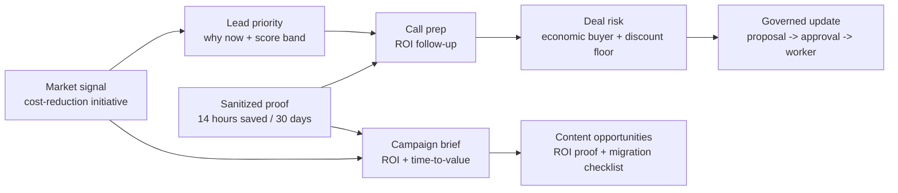
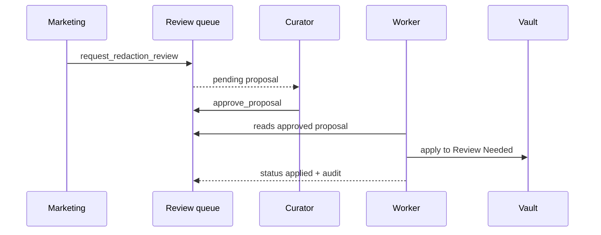
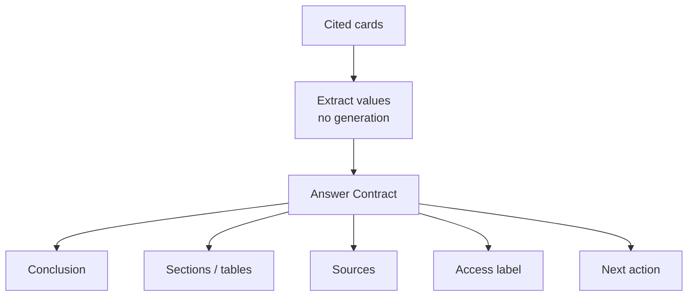

# Permissioned Knowledge - Demo Runbook

A short live-demo script for a sales/marketing audience. The full walkthrough
with roles, tables and commands is [[permissioned-knowledge-demo]].

## Which Track To Show

- **Track A - MCP personas (the public default):** per-persona MCP servers in
  a Claude Code / Claude Desktop / Cowork client. Shows the actual MCP protocol
  path and tool calls with no external chat server.
- **Track B - Rocket.Chat chat demo (optional audience track):** the same vault
  driven entirely from a chat channel. Use this only when you already have a
  reachable Rocket.Chat server, a normal user account and an existing channel.
  Credentials are environment variables and must never be committed. Section
  below.
- **Track C (optional) - Cowork / multi-MCP:** several per-persona MCP servers
  side by side from one generated config. Section below.

Rule of thumb: **MCP is the default public demo path; Rocket.Chat is an optional
presentation surface.** Use MCP for a repo-first user who wants to run the demo
from zero. Use Rocket.Chat only for a live room where chat interaction is worth
the extra external setup.

## Main Story

This is not a "chatbot with permissions" demo. It is a sales/marketing workflow:
an account signal becomes lead priority, call prep, deal risk, campaign/content
angles and a governed knowledge update.



## Before The Meeting

```bash
python3 scripts/health_check.py
.venv/bin/python -m unittest discover -s tests
python3 scripts/demo_dryrun.py
```

Expected result: health-check `Errors: 0 / Warnings: 0`, tests `OK`,
`DEMO DRY RUN: ALL CHECKS PASSED - ready to demo`.

## What To Show

### 0. Opening, 60 seconds

Suggested wording:

> "SalesWiki is not trying to replace CRM. It collects account intelligence,
> call/deal context, marketing proof and next actions into one governed layer,
> where every person sees exactly what they are allowed to see."

Open with BluePeak Energy as the hero account.

## Demo Questions

These questions land better with a sales/marketing audience than raw tool names.
The presenter can ask them naturally, while the MCP client or headless rehearsal
uses the matching tool call.

| Question to ask | Persona | Tool call | Why this question |
| --- | --- | --- | --- |
| "What should marketing know about BluePeak Energy before outreach?" | Marketing | `company_brief("BluePeak Energy")` | Shows the market signal, sanitized ROI proof and no pricing/deal secrets. |
| "What should the AE know before the next BluePeak step?" | AE / sales owner | `company_brief("BluePeak Energy")` | Same account, but sales sees deal economics, competitor context and next action. |
| "Which leads should we prioritize now, and why?" | Marketing or AE | `lead_priority("")` | Shows scoring, why-now and contact data staying as a `restricted://` handle. |
| "How should we prepare for the next BluePeak call?" | AE | `call_prep("BluePeak Energy")` | Shows call takeaway, ROI-focused follow-up and raw transcript protection. |
| "Which deals are at risk, and what should we do next?" | HoS / AE | `deal_risk("")` | Shows role-shaped pipeline detail: HoS sees all, AE sees own/team, Marketing gets aggregate. |
| "What should marketing create this week?" | Marketing | `content_opportunities()` | Shows pain points -> content angles -> suggested assets. |
| "How should we use the Q3 campaign for target accounts?" | Marketing / AE | `campaign_brief("Q3 ROI Push")` | Shows shared campaign angle and sales-only deal enrichment for allowed roles. |
| "What should I do today?" | AE | `my_day()` | Shows a working digest: leads + visible deal risks in one answer. |
| "What should the Head of Sales see before weekly review?" | HoS | `pipeline_risk_digest()` | Shows management view: at-risk deals + pending proposals. |
| "If marketing spots a possible PII issue, how does it get fixed?" | Marketing -> Curator | `request_redaction_review` -> `review_queue` -> `approve_proposal` -> worker | Shows governed update instead of direct editing. |

Recommended 12-15 minute order:

1. Marketing `company_brief("BluePeak Energy")`
2. AE `company_brief("BluePeak Energy")`
3. Marketing `content_opportunities()`
4. HoS `pipeline_risk_digest()`
5. Marketing/Curator governed write loop

Why this order works: business value first, role contrast second, marketing
outputs third, management view fourth, governance last.

### 1. Same Question, Safe Different Answers

Ask `company_brief("BluePeak Energy")` as Marketing, AE and HoS. Marketing sees
the broad summary; AE/HoS see authorized sales-confidential context.

What to say:

- Marketing sees the market signal and sanitized ROI proof.
- AE additionally sees pricing, discount floor and RivalCorp competitor context.
- Personal data remains a handle, not a transcript dump.

### 2. From Signal To Action

Show:

- `lead_priority("")`: why BluePeak is hot and what to do next.
- `call_prep("BluePeak Energy")`: sanitized takeaway + ROI-focused follow-up.
- `deal_risk("")`: who sees named deals and who only sees an aggregate.

Key message:

> "The system does not just store knowledge. It turns scattered signals into
> next action for sales."

### 3. What Marketing Gets

Show:

- `campaign_brief("Q3 ROI Push")`: target accounts + ROI/time-to-value angle.
- `content_opportunities()`: pain points, ROI proof gap, switching-cost angle,
  suggested assets.

Key message:

> "Marketing gets usable angles and proof points without private deal details."

### 4. HoS / RevOps View

Show:

- `pipeline_risk_digest()`: which deals are at risk and how many proposals are pending.
- `review_queue()` as Curator or RevOps.

Key message:

> "Leadership sees the operating picture: risk, change queue and next action,
> not folders and raw notes."

### 5. Governed Write Loop

Marketing creates `request_redaction_review`, Curator sees the queue and
approves, the worker applies only the approved proposal, and rollback restores
the card.



### 6. Answer Contract

Show that read tools return a conclusion, cited sections, confidence/freshness,
next action, access label and an honest `not-found` when the vault has no data.



## Data Points To Say Out Loud

| Data point | Where it appears | Why the audience cares |
| --- | --- | --- |
| Cost-reduction initiative | Marketing/AE `company_brief` | Fresh account trigger |
| 14 hours saved / 30 days | `company_brief`, campaign story | Reusable proof without sensitive details |
| RivalCorp incumbent | AE/HoS `company_brief` only | Sales-confidential competitor prep |
| Discount floor / ACV | AE/HoS only | Protected pricing context |
| ROI proof gap | `content_opportunities` | Concrete marketing content angle |
| Pending proposal count | `pipeline_risk_digest` | Governance as an operating workflow |

## Say This Honestly

- This is a demo MVP on synthetic data under `demo/permissioned/`, not the production vault.
- Identity is fixture-based today: one MCP server process = one persona.
- A real shared pilot needs Google OIDC/per-request identity and hosted transport.
- MCP protects data only if employees do not have direct git/Obsidian/shared-folder access to the protected vault.
- Production is empty today; the next step is a production-fidelity fixture or a limited real-data pilot after boundary/SSO decisions.

## Closing Line

The system is ready to show the approach: role-shaped answers, no-leak,
governed writes and recovery. The next go/no-go before pilot is identity,
deployment boundary and the first controlled real-data slice.

## Ten-Minute Version: 3 Questions, 2 Roles, 1 Edit

A self-contained scenario when you have one shot and ten minutes. Two MCP
server entries are pre-connected side by side: AE (`demo-ivan-ae`) and
Marketing (`demo-nina-marketing`); the Curator window is prepared but hidden.

| When | Step | What the audience sees | Say this |
| --- | --- | --- | --- |
| 0:00 | Opening | One sentence, no slides | "Everyone on the team asks the same assistant — and each person gets exactly what they are allowed to see. Watch." |
| 1:00 | Q1 — value: AE asks *"What should I do today?"* (`my_day`) | A working digest: hot leads with why-now, visible deal risks, next actions with dates | "This is the morning view. No folders, no searching — conclusion first, sources attached." |
| 3:00 | Q2 — trust: both roles ask *"Brief me on BluePeak Energy"* (`company_brief`) | Same question, two answers: AE sees pricing, discount floor, RivalCorp; Marketing sees signal + sanitized ROI proof only | "Marketing never sees deal economics. Contact data stays a `restricted://` handle, not a transcript dump. This is not prompt magic — access is enforced before the answer is built." |
| 5:30 | Q3 — honesty: ask *"Brief me on Acme Industrial"* (any company not in the vault) | An honest `not-found` with a proposed smallest research task — no invented facts | "When the wiki does not know, it says so and proposes the next research step. Every fact you saw earlier was extracted from a cited card, never generated." |
| 6:30 | 1 edit — governance: Marketing flags a possible PII issue (`request_redaction_review`); Curator opens `review_queue`, approves; worker applies to the card's Review Needed section | The change appears on the card only after approval; the audit chain records every step | "Nobody edits the knowledge base directly. Propose, review, apply — and any change can be rolled back." |
| 9:00 | Close | — | "Synthetic data today, same mechanics for real data. The pilot starts with one controlled data slice and SSO — that decision is yours." |

Rules of thumb: never type tool names on screen — ask the natural-language
question and let the client pick the tool; keep the Curator window hidden
until minute 6:30 so the governance reveal lands; if a step misfires, fall
back to the next row instead of debugging live.

## If Time Is Short

Show only four tool calls:

1. Marketing: `company_brief("BluePeak Energy")`
2. AE: `company_brief("BluePeak Energy")`
3. Marketing: `content_opportunities()`
4. HoS: `pipeline_risk_digest()`

Then show the governed write loop briefly and skip the optional injection demo.

## If Something Goes Wrong

- If a role sees the wrong answer: check the persona/server env
  `SALESWIKI_DEMO_ACTOR`.
- If the worker already applied a proposal: delete `demo/runtime/` and regenerate
  the demo vault.
- Fast reset:

```bash
rm -rf demo/runtime
python3 scripts/generate_demo_vault.py --reset
python3 scripts/health_check.py
```

## Track B - Rocket.Chat Chat Demo

Optional audience track: the same permissioned vault, driven entirely from a
Rocket.Chat channel when you already have a reachable server, a normal user
account and a channel. No Claude client, no visible tools — the audience watches
plain chat messages get role-shaped, cited answers. Command reference and the
full 15-step storyline:
[integrations/rocketchat/README.md](../../integrations/rocketchat/README.md);
grant design: [[permissioned-knowledge-access-requests]].

### Before The Meeting (Chat Track)

```bash
export RC_URL="https://your-rocketchat"
export RC_USER="your-login"
export RC_PASS="your-password"
export RC_CHANNEL="saleswiki-demo"   # channel name, no '#'; must already exist (or use a self-DM)
python3 integrations/rocketchat/smoke_test.py   # one-shot connectivity check
python3 integrations/rocketchat/bridge.py       # default in-process mode, no .venv
```

Decide the backend **before** the room:

- **In-process core (default):** standard library only, no `.venv`, instant
  answers. Proves the role-aware core and the governance loop.
- **`RC_USE_MCP=1` (run the bridge under `.venv`):** every read *and*
  governance command (`запросить доступ` / `очередь ревью` / `одобрить` /
  `отклонить` / `отозвать`) goes through the real MCP server; `одобрить <id>
  <дней>` passes the TTL over MCP too. Per-request server spawn adds ~1-2s per
  answer — authentic, fine for a demo. Proves the chat -> MCP -> core path.

Notes: behind a WAF the bridge already sends a browser `User-Agent`; on
startup it posts the `демо` cheat-sheet to the channel and generates a fresh
throwaway demo vault — nothing in the repository is touched.

Optional LLM layer (needs `ANTHROPIC_API_KEY` in the environment):
`RC_LLM_SUMMARY=1` — a live LLM summary headline on top of read answers;
`RC_LLM_RECS=1` — a closing `🧠 Recommendations` block that prioritizes
actions in digests (`my day` / `pipeline` / all-deals risk). Both are strictly
grounded on the cited envelope, explicitly labeled as generated, and silently
drop on any failure — the demo never breaks. Without a key, show the
deterministic mode and say so honestly.

### Presenter Script (10-12 Minutes)

| When | Beat | Type this | Say this |
| --- | --- | --- | --- |
| 0:00 | Opening | — | "Same governed vault — now from a plain chat channel. No AI client, no setup: employees just type a question." |
| 1:00 | Role contrast | `роль: marketing` -> `? дай бриф по BluePeak Energy`; then `роль: account-exec` -> the same question | "Same question, two safe answers. Marketing sees the market signal and sanitized ROI proof; the AE additionally sees pricing, discount floor and RivalCorp. And the `🤖 Summary (from card data):` line on top only rephrases the cited facts — deterministic by default, a real LLM only with `RC_LLM_SUMMARY=1`, and it never adds new facts." |
| 3:00 | Honest not-found | `? дай бриф по Acme Industrial` (any company not in the vault) | "The wiki does not know this company, so it says so and proposes the smallest research task. It never silently substitutes a similar-looking account." |
| 4:00 | Grant lifecycle - request | `роль: employee` -> `? риск по сделке BluePeak Energy` -> 🔒; `запросить доступ нужен риск по BluePeak` | "Locked — but not a dead end. The viewer files a real, audited access request; approvers get a 🔔 the moment they switch in." |
| 5:30 | Grant lifecycle - approve | `роль: curator` -> `очередь ревью` -> `одобрить 1 7` | "The curator reviews the queue and issues a **7-day, single-company grant** — not a role change, not an edit to the policy file." |
| 6:30 | Grant lifecycle - scope + revoke | `роль: employee` -> `? риск по сделке BluePeak Energy` (now visible) -> `? риск по сделке Atlas Foods` (still 🔒); `роль: curator` -> `отозвать 1 больше не нужно` -> viewer re-asks -> 🔒 again | "The grant is scoped to one company and time-boxed. Revoke it and access is gone immediately — grants survive worker applies and stay revocable in approved or applied status." |
| 8:00 | Reveal | `карточка BluePeak Energy`, then `как это работает` | "Behind the glass: the actual source-of-truth card by zones — 🔒 Controlled Profile, ✏️ Live Intelligence, ⏳ Review Needed, 📜 Change History — plus the closed-zone cards the gateway filtered out per role. Then the lifecycle explainer: card birth, immutability, the funnel and the governance write-loop." |
| 9:30 | Governed Drive ingest | `роль: account-exec` -> `драйв` -> `драйв Sales/Q3-Calls` -> `обработать gd-001`; `роль: curator` -> `очередь ревью` -> `одобрить 1` -> `применить` | "New material never writes a card directly: a connected file becomes an `ingest_resource` proposal that rides the same review -> approve -> apply loop and lands in the card's Review Needed. The Drive connector is synthetic — no OAuth, no network; real Drive is a pilot-phase concern alongside SSO." |
| 11:30 | Close | — | "One chat channel, every role, every answer cited — and access is checked before the answer is built, not after." |

If a beat misfires, fall back to the next row instead of debugging live; `демо`
re-posts the full cheat-sheet at any point.

### Chat-Track Reset

`очистить историю да` deletes the chat history (irreversible; the `да` suffix
is the required confirmation) — in a self-DM everything, in a shared channel
only the bot's own messages. Restarting the bridge regenerates a fresh
throwaway vault; the repository is never touched.

### Say This Honestly (Chat Track)

The chat role is **self-asserted** with the `роль:` command. This track
demonstrates the access *experience* — role-shaped answers, the grant
lifecycle, governed ingest — not production security. The pilot path is
server-resolved identity via SSO/OIDC: [[permissioned-knowledge-sso-design]].

## Track C (Optional) - Cowork / Multi-MCP

Several per-persona MCP servers from one generated config, side by side in
Claude Desktop / Cowork:

```bash
python3 scripts/generate_mcp_demo_config.py --personas ae,marketing,curator
```

The command regenerates a shared permissioned demo vault and emits a ready
`mcpServers` JSON with a per-persona `SALESWIKI_DEMO_ACTOR` env. All servers
share the vault and `proposals.jsonl`, so a grant approved in one chat unlocks
reads in another — the multi-user story without Rocket.Chat. Caveats:
Desktop/Cowork MCP config is machine-local, and **all connected servers' tools
are visible in every chat** — name the servers by role (e.g. `saleswiki-ae`)
or use separate projects so "who is asking" stays obvious on screen.
