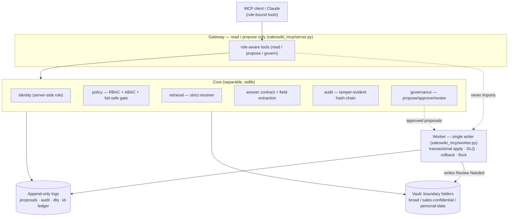
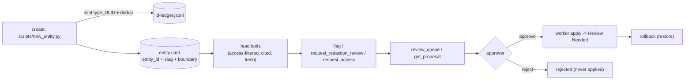
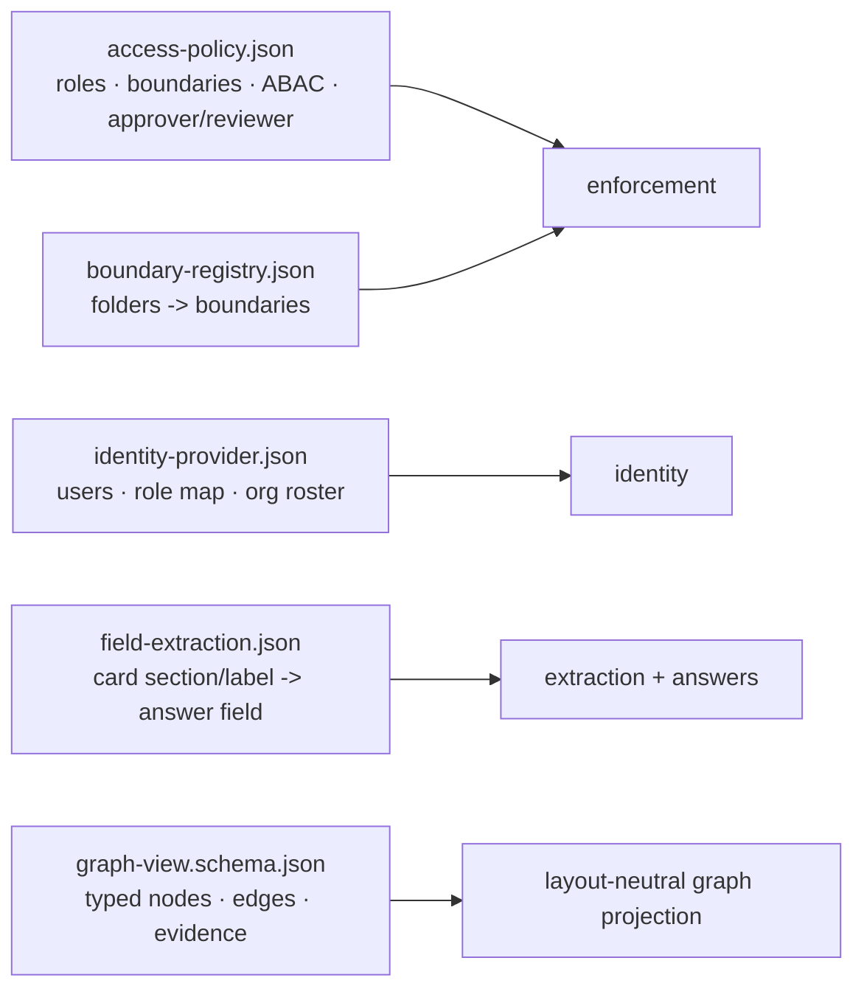

# Permissioned Knowledge - System Overview & Map

The single visual entry point: how the pieces fit, how an entity lives from
creation to a governed change, what makes it customizable, and where every
deeper doc is. For the runnable demo see [[permissioned-knowledge-demo]]; for
local and Docker setup see [[DEPLOYMENT.en]].

## Component architecture



Read and propose go through the gateway; **only the worker writes cards**, one at a time — and only into the card's Review Needed buffer. Identity is resolved server-side; the client never picks its role. The card-mutability contract itself (zones, `profile_lock`, the fix-workflow routes and who enforces what) is canonical in [[entity-card-governance]] — this page covers the software side only.

## Entity lifecycle (id is the spine)



Ids are minted once at creation (rename-safe, deduped, opaque ULID core with a readable slug); every later read/propose/apply/rollback references that stable id. See [[identifier-strategy]].

Access requests follow this same propose→review→approve path; who reviews/grants, how reviewers are notified, and what "grant" means today vs under SSO are designed in [[permissioned-knowledge-access-requests]].

## Customizable by data, not code (the contracts)



Changing roles, boundaries, ownership, or where answers read from is editing JSON (validated by `health_check`), not changing code.

## Guarantees at a glance

- **Access:** RBAC+ABAC enforced before output; fail-safe gate; no-leak regressions covered by tests.
- **Accuracy:** extract-not-generate, mandatory citations, honest `not-found`, data-derived freshness, one Answer Contract envelope.
- **Reliability/healing:** atomic validate-then-write apply (no revert window), dead-letter queue, `worker.rollback`, crash-safe flock lock, tamper-evident audit chain, `health_check` system test.
- **Identity of data:** mint-once opaque-ULID ids + readable slug, natural-key dedup ([[identifier-strategy]]).

## Doc map

| Topic | Doc |
| --- | --- |
| Run the demo (step by step) | [[permissioned-knowledge-demo]] |
| Live demo runbook | [[permissioned-knowledge-demo-runbook]] |
| Rocket.Chat chat demo (optional bridge) | [integrations/rocketchat/README.md](../../integrations/rocketchat/README.md) |
| Governance: access requests, flag-stale, redaction | [[permissioned-knowledge-access-requests]] |
| Architecture + risk register/status | [[permissioned-knowledge-architecture]] |
| Local and Docker deployment | [[DEPLOYMENT.en]] |
| SSO / per-request identity design | [[permissioned-knowledge-sso-design]] |
| Answer Contract (output shape, accuracy) | [[permissioned-knowledge-architecture]] (Answer Contract) |
| Knowledge Workbench GraphView contract | [[mcp-graph-adapter]] |
| Field-extraction (decoupled reads) | [[permissioned-knowledge-field-extraction]] |
| Identifier strategy + creation chokepoint | [[identifier-strategy]] |
| Public product rationale | [[RATIONALE.en]] |
| Public roadmap | [[ROADMAP.en]] |

## Verify everything (one block)

```bash
python3 scripts/health_check.py                  # Errors: 0  Warnings: 0
.venv/bin/python -m unittest discover -s tests   # all green
python3 scripts/demo_dryrun.py                   # end-to-end demo smoke test
```
