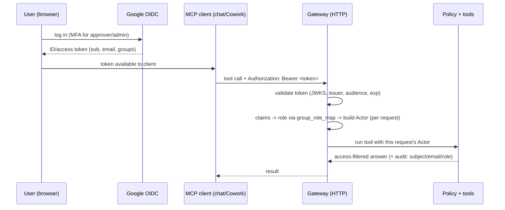

# Permissioned Knowledge - SSO / Per-Request Identity Design

The design for moving identity from a process-level env var to a
**per-request SSO token**, so one shared gateway can serve many people, each
with their own role-shaped access. This expands the "MVP SSO Decision" section
of [[permissioned-knowledge-architecture]].

> **Кратко (RU).** Сейчас роль берётся из переменной окружения один раз при старте
> сервера, поэтому **один запущенный сервер = одна личность**. Чтобы «один общий
> сервер давал разный доступ разным людям», нужно: (1) перейти со stdio на HTTP,
> чтобы каждый запрос нёс токен пользователя; (2) определять личность **на каждый
> запрос** из проверенного OIDC-токена (Google), а не из env; (3) маппить
> Google-группы в роли SalesWiki. Хорошая новость: **ядро уже готово** - каждый
> метод сервиса принимает `actor` аргументом. Менять надо только серверный слой,
> который сейчас «замораживает» одного актора. Клиент **никогда** не выбирает свою
> роль - только проверенный токен решает.

## The problem, precisely

The shipped gateway resolves one actor at startup and binds every tool to it:

- `build_default_runtime()` calls `FixtureIdentityProvider.from_env(...).resolve()`
  **once**, reading `SALESWIKI_DEMO_ACTOR` (`saleswiki_mcp/server.py`).
- `create_server(service, actor)` then calls `build_tools(service, actor)`, so
  each tool closure captures that single actor.
- Transport is **stdio** (`app.run()`), which has no notion of per-request auth -
  one client, one process, one identity.

Consequence: to demo nine roles, you run nine server entries, one env each. That
is fine for a demo and for a single operator, but it cannot serve real users who
share one endpoint and must each see only their own slice.

## What is already in place (the good news)

The core was built identity-agnostic, so this is a **server-layer** change, not a
rewrite:

- `IdentityProvider` is a `Protocol` with a single `resolve() -> Actor`
  (`saleswiki_mcp/identity.py`). A second implementation slots in cleanly.
- `Actor` already carries everything policy needs: `id`, `role`, `team`,
  `email`, `name`, `owns`.
- **Every** service method already takes `actor` as its first argument
  (`svc.company_brief(actor, ...)`, `svc.deal_risk(actor, ...)`, ...). The core
  is per-call ready; only the server freezes one actor.
- `schemas/identity-provider.json` already contains a `google-oidc` block
  (`active: false`) with a `group_role_map` from Google groups to SalesWiki roles.

So the work is: add an OIDC provider, switch transport, and resolve the actor
**per request** instead of once.

## Target flow

The key shift: **identity is resolved on every request from the token**, never
chosen by the client and never frozen at startup.

## How the client actually gets and sends the token (MCP OAuth mechanics)

The diagram above hand-waves "token available to client". Concretely, with
Anthropic clients (Claude Desktop / Cowork / claude.ai custom connectors) per-request identity rides only on
the **HTTP transports** (Streamable HTTP; the legacy SSE transport also
carries auth headers), and
the mechanism is the **MCP OAuth 2.1 authorization flow** built into the
protocol:

1. Our gateway is deployed as a **remote MCP server** (HTTP) and advertises
   itself as an OAuth resource server (protected-resource metadata, RFC 9728 /
   RFC 8414 discovery).
2. The user adds the connector by URL; the client discovers the authorization
   server, registers (RFC 7591 dynamic client registration is a SHOULD in the
   MCP spec — Anthropic clients vary by version, and claude.ai also accepts a
   pre-registered client id/secret) and opens the browser for Authorization
   Code + PKCE.
3. After login, the client attaches `Authorization: Bearer <token>` to **every
   HTTP request automatically** — i.e. effectively per tool call — and handles
   refresh itself. We never see credentials, only tokens.

Two Google-specific constraints shape the design:

- **Google cannot be the MCP authorization server directly** — and not mainly
  because of client registration (Google indeed offers no RFC 7591 DCR). The
  decisive reason: Google will never mint access tokens **audience-bound to
  our gateway** (RFC 8707 resource indicators), so accepting raw Google tokens
  would be token passthrough — a token minted for any other Google-login app
  would open our data. The pattern is a small **auth broker**
  (Keycloak / Auth0 / equivalent) in front: it handles MCP client
  registration, delegates login to Google OIDC, and issues tokens whose
  `iss` is the broker and `aud` is the gateway's canonical resource URI —
  the gateway rejects any other audience, fail-closed. Verify the chosen
  broker can actually emit audience-bound tokens (Keycloak needs explicit
  client-scope mappers for this). For the pilot, use an off-the-shelf
  broker — do not hand-roll one.
- **Google ID tokens do not carry group claims.** Group→role either goes
  through the Directory API (needs Workspace admin / domain-wide delegation)
  or — simpler for the pilot — an explicit email→role map maintained by the
  curator (the `group_role_map` block in `schemas/identity-provider.json`
  extends to this). Start with email→role; adopt Directory groups later.
  Hard rules for the map: require `email_verified: true` and a pinned `hd`
  (hosted-domain) claim before consulting it; normalize to the lowercase
  primary address (Workspace aliases and plus-addressing will not match —
  fail-closed); re-key each user to their immutable Google `sub` after first
  login so a re-issued email cannot inherit a role.

What stdio can and cannot do (today's Cowork multi-persona track): stdio has
**no auth slot at all** — identity is whatever the process was started with.
A local stdio server could run its own loopback OAuth (gcloud-style) and
resolve a real Google identity per session, but a local server next to local
vault files is **UX, not security**: the user already has the bytes. The
gateway only enforces anything when it is the sole path to the data. Real OIDC
value begins with the hosted HTTP gateway.

## Change points (where the code moves)

| # | Change | Where | Note |
| --- | --- | --- | --- |
| 1 | Add `OidcIdentityProvider` implementing `resolve()` | `saleswiki_mcp/identity.py` | Builds `Actor` from validated claims; reuses `group_role_map`. |
| 2 | Token validation (JWKS, issuer, audience, exp, signature) | new `saleswiki_mcp/oidc.py` | Reject on any failure; fail-closed. |
| 3 | Switch transport stdio -> HTTP | `saleswiki_mcp/server.py` (`main`) | FastMCP streamable-HTTP so requests carry auth. |
| 4 | Resolve actor **per request**, not once | `server.py` (`build_default_runtime`/`create_server`) | Tool handlers read the request's auth context and build the actor at call time, instead of `build_tools(service, fixed_actor)`. |
| 5 | Group -> role mapping + precedence | uses `identity-provider.json` `group_role_map` | Define order when a user is in several groups (most-privileged wins, or explicit precedence list). |
| 6 | MFA gate for approver/admin | policy / oidc | Require an MFA/`acr`/`amr` signal before approve/admin operations. |
| 7 | Audit the real subject | `saleswiki_mcp/audit.py` callers | Log Google `sub`/`email` + resolved role at decision time (also for approval records). |
| 8 | Keep fixtures for local dev | config `active_provider` | `fixture` for local/tests, `google-oidc` for shared. |

Note on #4: because the service is already actor-parameterized, the cleanest
shape is a thin per-request resolver the tool layer calls -
`actor = identity_provider_for(request).resolve()` - then `service.tool(actor, ...)`.
No service or policy code changes.

## Mapping Google groups to roles

Already declared in `schemas/identity-provider.json` (`providers.google-oidc.group_role_map`):

| Google group | SalesWiki role |
| --- | --- |
| `saleswiki-viewers` | `employee-viewer` |
| `saleswiki-sales` | `sales` |
| `saleswiki-sales-owners` | `sales-owner` |
| `saleswiki-hos` | `hos` |
| `saleswiki-revops` | `revops` |
| `saleswiki-marketing` | `marketing` |
| `saleswiki-curators` | `curator` |
| `saleswiki-legal-reviewers` | `legal-reviewer` |
| `saleswiki-admins` | `admin` |

Rules:
- Internal policy uses **SalesWiki roles**, never raw Google group names.
- Group membership change takes effect **without code changes** (re-read claims).
- ABAC attributes (`owns`, `team`) still apply on top of the role: a `sales-owner`
  resolved from SSO still only reaches owned/team deals. The `owns`/`team` for a
  real user come from the org roster / directory, not from the token's groups.

## Token validation (fail-closed)

The token the gateway validates is the **broker-issued** token, not a raw Google
token (accepting Google tokens directly would be token passthrough — see the auth
broker above). A request is rejected (no fallback, no default role) if any of these
fail:

- signature verifies against the **broker's** JWKS;
- `iss` matches the configured **broker** issuer (not Google's);
- `aud` matches the gateway's **canonical resource URI** (RFC 8707 resource
  indicator), rejecting any other audience — this is what prevents cross-service
  token reuse;
- token not expired (`exp`) / not before (`nbf`);
- required base claims present (`sub`, `email`);
- a role resolves for the user. **How** depends on the mapping mode, and the two
  are mutually exclusive:
  - *email→role map* (pilot default): require `email_verified: true` and a pinned
    `hd`, then map the lowercase-primary email (re-keyed to `sub` after first
    login) to a role. There is **no** `groups` claim in this mode — do not require
    one.
  - *Directory groups* (later): require a `groups` claim (surfaced by the broker
    via a Directory lookup / explicit mapper) with at least one group mapping to a
    role. Multi-group membership is a fail-closed error, not "most-privileged wins".

No token => no access. The client cannot assert a role; only validated claims
decide. This is the same fail-safe stance as the `_readable` gate in
[[permissioned-knowledge-architecture]].

## Security pitfalls to avoid

- **Client-asserted role.** Never read role from a client-supplied field; only
  from the validated token. (This is the whole point of "identity resolved
  server-side".)
- **Stale membership.** A user removed from a Google group must lose access on
  their next session/token, not "eventually". Keep token lifetimes short; do not
  cache the resolved actor across requests.
- **Confused deputy.** The gateway must act as the *user*, not as a powerful
  service account, when reading cards - the per-request actor is the authority.
- **Token replay / leakage.** HTTPS only; do not log raw tokens; audit the
  subject, not the bearer string.
- **MFA bypass.** Approver/admin operations must check the MFA signal at decision
  time, not just at login.

## Step-by-step

1. Configure a Google OIDC application; set the gateway client id.
2. Create the nine `saleswiki-*` Google groups.
3. Implement `oidc.py` (JWKS fetch + validate) and `OidcIdentityProvider`.
4. Switch the server to HTTP and resolve the actor per request.
5. Require MFA for approvers/admins when the tenant supports it.
6. Add sensitive-read / blocked / sanitized audit events with the real subject.
7. Tests with **mocked Google claims**: each role gets correct role-shaped output;
   a missing/invalid/expired token is denied; a group change flips behavior with
   no code change; a sales-owner from SSO still hits the ABAC owned/team limit.

## Acceptance

- A shared read-only gateway serves multiple test users over one endpoint.
- Google group changes alter role behavior **without code changes**.
- The same query returns safe, role-shaped output per user.
- Blocked / sanitized decisions are audited with the real subject and resolved
  role.
- `fixture` provider still works for local dev and tests.

## How this unlocks the "one shared server" scenario

Once this lands, a hosted deployment can run a **single** `saleswiki-mcp`
instance that many people connect to from their own chat/Cowork client; each
request carries that person's Google token, the gateway resolves their role per
call, and everyone sees only their slice - no per-persona server instances, no
env actor.

## See Also

- Overview / doc map: [[permissioned-knowledge-overview]]
- Architecture (MVP SSO Decision, authorization model): [[permissioned-knowledge-architecture]]
- Local and Docker starter path: [[DEPLOYMENT.en]]
- Public roadmap: [[ROADMAP.en]]
