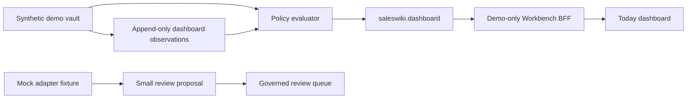

# Self-contained demo foundation

This foundation lets SalesWiki demonstrate the end-to-end product shape without
a customer system, production identity provider, API key or network connector.
Every record is synthetic and every browser write remains a review proposal.

## What runs locally

- `saleswiki.dashboard` is a server-side `saleswiki.dashboard-view` v1 read
  model. It checks RBAC+ABAC before projecting names, score history, coverage
  flags or source labels.
- `state/dashboard-observations.jsonl` in the synthetic permissioned demo is
  append-only fixture data. Its values are explicitly synthetic; it is neither
  a forecast nor an LLM result.
- A trend appears only with at least two dated observations. Otherwise the
  response returns `insufficient-history` rather than inventing a line.
- The existing controlled import remains the safe local-input path: raw pasted
  text is parsed in the browser, while only a small reviewed summary crosses to
  the BFF and becomes a proposal.

## Mock adapters

[`schemas/demo-adapter-contract.json`](../../schemas/demo-adapter-contract.json)
defines mock-only shapes for HubSpot, Slack, Telegram, Teams and Rocket.Chat.
They make it possible to test mapping, role boundaries and review UX without
calling a vendor or storing credentials. They do not impersonate a connector.

To move one adapter beyond mock mode, follow the vendor-first policy in
[`connector-contracts.md`](../../wiki/processes/connector-contracts.md): approve
the per-operation scope, use server-owned identity, stage reads first, audit the
run and keep writes behind proposal → approval → worker.

## Local demonstration checklist

1. Regenerate fixtures with `python3 scripts/generate_demo_vault.py --reset`.
2. Start the optional Workbench BFF against `demo/permissioned`.
3. Switch among synthetic personas; the server, not the browser, resolves the
   role.
4. Open **Today** to see policy-filtered dashboard cards and open an account to
   inspect citations.
5. Use a small pasted note or CSV only to create a review proposal.

## Deliberately not included

- customer or personal data;
- OAuth, SSO or any vendor token;
- scheduled collection, notification delivery or vendor writes;
- LLM-authored metrics, access decisions or invented history.

Production requires a separate, approved pilot vault and an OIDC identity
provider. The demo fixture identity is intentionally rejected for non-demo
vaults.
