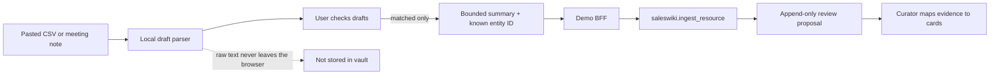

# Workbench controlled import

Status: implemented as a demo-only, review-first starter flow. It is a small adoption path for a CSV row or a note after a meeting — not a bulk importer, CRM sync or direct card editor.

## What a user does

1. Open an existing account and choose **Import**.
2. Paste a small CSV (`Company`, `Contact`, `Next step`) or a structured note (`Company:`, `Lead:`, `Next step:`).
3. Check the generated company, lead and next-step drafts.
4. Fix a company mismatch before continuing.
5. Send the selected summary to the review queue.

The result is a `draft` proposal. No card is created, changed or scored from the browser. A curator maps the proposal to cards through the normal governed workflow. This is intentional: it lets a team try the workflow before giving a browser a wider write surface.

## Boundary and data handling



- The parser limits text to 12,000 characters and previews at most five CSV rows.
- The BFF accepts JSON only, up to 1,024 bytes, with exactly `target` and `summary`; it rejects actor, role, raw text, files and extra fields.
- The MCP server resolves the actor server-side and captures an append-only `ingest_resource` proposal. It never writes a card.
- The prototype is only for the synthetic demo vault. A server-owned session
  may switch among allowlisted synthetic people for a role demo, but it is not
  SSO or a production upload service.

## Design decisions

| Step | User sees | Guardrail |
| --- | --- | --- |
| Paste | plain note/CSV field and format hint | no file upload or external transfer |
| Review | small typed drafts, `Ready` or `Needs match` | unmatched company cannot be sent |
| Submitted | confirmation and boundary explanation | proposal only; source vault unchanged |

## Tests and verification

```bash
python3 -m unittest tests.test_workbench_bff tests.test_mcp_server
(cd prototypes/knowledge-workbench && npm test -- --run)
python3 scripts/health_check.py
```

The tests cover CSV/note draft creation, a mismatched company, summary minimization, the BFF's strict request contract, and the role-bound MCP path.

## Not in this release

- files, attachments or full CRM exports;
- automatic company creation, deduplication or scoring;
- raw-text retention;
- direct card approval/apply from the browser (the narrow governed decision
  inbox is now available; see
  [`workbench-review-inbox.md`](workbench-review-inbox.md));
- live HubSpot, Slack, Teams, Telegram or Rocket.Chat connectors.

The next justified increment is mapping an approved proposal to existing card
templates through the worker and `scripts/new_entity.py`. A live read-only
HubSpot connector should be evaluated only after this CSV path is useful in the
real-data pilot.
