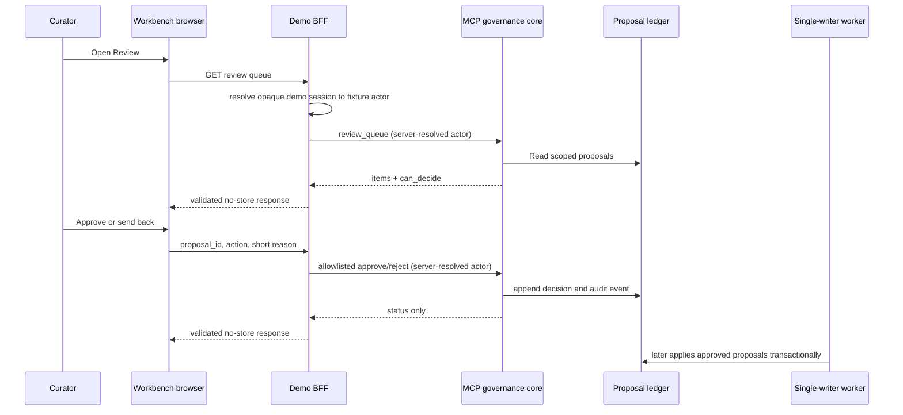

# Workbench review inbox

Status: implemented as a synthetic-demo, curator-facing review surface. It
makes existing governance visible; it is not a browser card editor, a workflow
engine or a production identity solution. Architectural rationale:
[ADR-0024](../adr/0024-workbench-review-actions-through-bff.md).

## User flow

1. Choose **Review** in the Workbench sidebar.
2. Read the pending proposal, affected account, requester and concise review
   summary.
3. Open the account to compare it with its role-visible evidence when needed.
4. An approver can choose **Approve for apply** or **Send back** with a short
   reason. A reviewer without approval rights can inspect the same queue but
   sees no decision buttons.
5. An approval enters the existing worker queue. It does not write a card in
   the browser request.

The summary is intentionally not raw imported text or a raw transcript. The
curator should open the governed original source through the normal evidence
workflow before deciding when more context is needed.

## Request and trust boundary



- The browser cannot send an actor, role, vault, MCP tool name or credentials.
- The BFF accepts JSON only, up to 768 bytes, with exactly `proposal_id`,
  `action` and `reason`.
- Only `approve` and `reject` are accepted. A rejection needs a non-empty
  reason capped at 240 characters.
- `can_decide` is calculated by the server policy and must not be recreated in
  JavaScript.
- The BFF validates queue and decision response shapes and returns generic
  failures without reflecting request content.

## Local demo roles

Run the BFF as `demo-marina-curator` to inspect and decide synthetic proposals.
When `allow_fixture_persona_switching = true`, the top bar can switch to a
different listed synthetic person without restarting. The browser sends only an
allowlisted fixture id; the BFF resolves its role in an opaque `HttpOnly`,
memory-only session. `demo-raj-revops` can inspect the queue but is not an
approver, which is useful for checking the read-only reviewer state. This is a
demo convenience only: a shared deployment replaces it with verified SSO and
has no role picker. See [ADR-0025](../adr/0025-demo-persona-switching-is-server-session-bound.md).

## Verification

```bash
python3 -m unittest discover -s tests -p 'test_workbench_bff.py'
python3 -m unittest discover -s tests -p 'test_governance_inbox.py'
(cd prototypes/knowledge-workbench && npm test -- --run)
```

The BFF test covers the role-bound queue, strict decision request and session
persona boundary. The
governance tests cover reviewer visibility and approval policy; the UI tests
cover client request shapes. A browser smoke check verifies the master-detail
layout without submitting a real decision.
