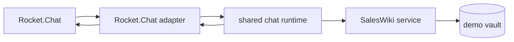

# Rocket.Chat → SalesWiki demo bridge

Talk to the SalesWiki permissioned-knowledge vault from a Rocket.Chat channel —
no Claude client, no tools. You type a question in chat, the bridge routes it to
a role-aware read tool in `saleswiki_mcp`, and posts a cited Markdown answer back.

This is an **optional demo track** — the primary interactive path to the
permissioned vault is a Claude MCP client (Claude Code / Claude Desktop /
Cowork) over the MCP gateway, see `docs/QUICKSTART.en.md`. The role here is
self-asserted with a chat command, so it demonstrates the access *experience*,
not production security. Real deployments resolve the role from SSO (see
`docs/engineering/permissioned-knowledge-sso-design.md`).

## How it works



- Logs in with a normal username/password (no admin, no Personal Access Token).
- Polls one channel every ~2s for new **triggered** messages.
- Generates a fresh throwaway permissioned demo vault on startup (nothing in the
  repo is touched), or reuses one via `SALESWIKI_DEMO_VAULT`.

`bridge.py` is the stable entry point. Normalized messages, per-user/per-thread
sessions, typed responses, bounded duplicate suppression and Markdown rendering
live in `integrations/chat/`. Rocket.Chat owns only its API calls, polling cursor
and provider capabilities. This is the reference custom adapter for a future
Telegram or other channel integration; Slack and Microsoft 365 should first use
the native MCP-client route described in the integration platform plan.

## Chat commands

| You type | Effect |
| --- | --- |
| `демо` (aliases `demo` / `?demo`) | Full cheat-sheet: every message you can try, grouped with explanations. Posted automatically on startup. Note: literal `/demo` is usually swallowed by Rocket.Chat's slash-command system, so use `демо` without the slash. |
| `роли` (or `help`) | List every role and what it unlocks |
| `роль: account-exec` | Switch role: `employee` / `sales-rep` / `account-exec` / `head-of-sales` / `revenue-ops` / `marketing` / `legal` / `curator` / `admin` (short aliases `viewer`/`ae`/`hos`/`sdr`/`revops` still work) |
| `? дай бриф по BluePeak Energy` | Company brief |
| `? риск по сделке BluePeak Energy` | Deal risk for one company |
| `? риск по всем сделкам` | Cross-company deal risk (aggregated count for roles without access) |
| `? приоритет лида BluePeak Energy` | Lead priority |
| `? бриф по событию Sales Tech Summit 2026` | Event brief |
| `? кампания Q3 ROI Push` | Campaign brief |
| `? контент-идеи` | Content opportunities |
| `? мой день` | My day |
| `? пайплайн` | Pipeline risk digest |
| `запросить доступ <причина>` | File a governance `request_access` proposal for the last-discussed company's restricted sources |
| `пометить устаревшим <заметка>` | File a `flag_stale_or_wrong` proposal on the last-discussed card (data is stale/wrong) |
| `запросить редактуру <причина>` | File a `request_redaction_review` proposal (review/redact personal data) on the last-discussed card |
| `применить` | Reviewer-only: spawn the single-writer worker (separate process) to apply approved proposals to their card's Review Needed section |
| `очередь ревью` | Reviewer inbox — pending proposals (only `curator`/`admin`/reviewer roles) |
| `одобрить <id> [дней]` | Approve a proposal (approver roles) — approving a `request_access` issues a live scoped grant (default 30-day expiry) |
| `отклонить <id> <причина>` | Reject a proposal (approver roles) |
| `отозвать <id> <причина>` | Revoke an active grant (approver roles) — requester loses access immediately |
| `диаграмма` (alias `diagram`) | ASCII bar chart of how the current role's access splits across the read tools |
| `график` (aliases `chart` / `graph`) | PNG bar chart of the role-visible pipeline uploaded to the chat: one bar per deal, the dark segment = weighted value (value × win%). Stdlib-rendered, built from the same role-gated `deal_risk` envelope as the text answer — the image can never show more than the role may read; roles without per-deal figures get an honest 🔒 refusal. |
| `график лиды` | PNG of lead-priority scores (0–100), bars colored by band on a one-hue ordinal ramp (hot = dark). Every role. |
| `график <компания>` | PNG client engagement panel: weekly site-visit trend (line) + calls held/planned this quarter, from the broad company card's Engagement Snapshot — safe for every role, cited. Solara's declining trend visualizes the renewal-risk story. |
| `файл <вопрос>` | Upload the role-gated answer as a `.md` file (add `csv` to export a table as `.csv`) |
| `карточка <компания>` (aliases `card` / `закулисье` / `xray`) | Presenter "behind the glass" reveal: the full source-of-truth card across all access zones, annotating the four governance sections (🔒 Controlled Profile / ✏️ Live Intelligence / ⏳ Review Needed / 📜 Change History) and listing the closed-zone cards (sales-confidential, personal-data) with their audience. Reads raw vault files — shows exactly what the gateway filters per role. |
| `как это работает` (aliases `жизненный цикл` / `lifecycle`) | Explainer: card birth (`new_entity` chokepoint → id-ledger), immutability (`profile_lock` / fail-safe), state transitions (prospect→MQL→SQL→deal, fresh→stale) and the governance write-loop. |
| `драйв` | Synthetic Google Drive connector (no OAuth/network): list connected folders + new-resource counts. Folders are gated by role (no-leak). |
| `драйв Sales/Q3-Calls` | List resources in one folder (🆕 new / ✅ processed); a folder in a closed zone shows 🔒 instead of contents. |
| `обработать gd-001` / `обработать всё` | Turn a connected file into an `ingest_resource` proposal — never writes the card directly; it rides the same `очередь ревью → одобрить → применить` loop and lands in the target card's Review Needed. |
| `демо старт [сек]` (alias `demo start`) | Hands-free autopilot: the bridge replays the full presenter script beat by beat — a 🎙️ narrator comment, the command (▶️-prefixed), then the answer — with a pause between beats (default 10 s, e.g. `демо старт 5`). Covers role contrast, honest not-found, the story accounts, the grant lifecycle, Drive ingest and the behind-the-glass reveal. The chat stays live: you can interject your own questions mid-run. |
| `демо стоп` (alias `demo stop`) | Halt the autopilot at the next beat. |
| `очистить историю да` | Demo reset: delete the chat history (irreversible; the `да` suffix is the required confirmation). In a self-DM it clears everything; in a shared channel only the bot's own messages (no admin/force-delete). |

If the current role lacks access, the bridge replies with a clear
"🔒 нет прав — запроси у админа / смени роль" message instead of an empty answer.

`запросить доступ` creates a real, audited `request_access` proposal (same
governance path as `flag_stale_or_wrong` / `request_redaction_review`): it lands
in the review queue, **notifies approvers**, and **on approval issues a live,
scoped, time-boxed grant** — the requester's role immediately gains read access to
that one company's restricted data (sales-confidential for any approver;
personal-data only if an admin approves), no role switch needed. Grants default to
a 30-day expiry and can be revoked with `отозвать`. See
[design + scope](../../docs/engineering/permissioned-knowledge-access-requests.md).

A `пометить устаревшим` → `одобрить` → `применить` cycle delivers the approved note
into the card's Review Needed buffer only — the actual card fix is a curated edit
afterwards. The card-mutability rules (which zones change directly vs only via
proposal, and the post-apply last mile) are canonical in
[`wiki/processes/entity-card-governance.md`](../../wiki/processes/entity-card-governance.md)
(Fix Workflow).

## Prerequisites

- A Rocket.Chat server you can reach and a **normal user account** (no admin, no
  Personal Access Token).
- The target channel must **already exist** — point `RC_CHANNEL` at it (or use a
  self-DM). A missing channel raises a `RuntimeError` at startup.
- Python 3 only. The **default in-process mode needs no `.venv`** (it imports the
  in-repo `saleswiki_mcp` core directly, standard-library only). The `.venv` +
  `mcp` SDK are required **only** for the optional `RC_USE_MCP=1` mode below.
- If you point at a Rocket.Chat instance behind a WAF, note the bridge already
  sends a browser `User-Agent` (some WAFs reset the default urllib UA).

## Run

Credentials come from the environment — never commit them.

Recommended config-first setup:

```bash
cp config/runtime.example.toml config/runtime.toml
export SALESWIKI_CONFIG=config/runtime.toml
export ROCKETCHAT_URL="https://your-rocketchat.example.com"
export ROCKETCHAT_USER="your-login"
export ROCKETCHAT_PASSWORD="your-password"
python3 -m saleswiki_runtime config validate
python3 -m saleswiki_runtime doctor
python3 integrations/rocketchat/bridge.py
```

`config/runtime.toml` is ignored by git. The tracked file contains secret names,
never secret values. `config show --redacted` is safe for diagnostics.

Legacy `RC_*` variables still work during migration:

```bash
export SALESWIKI_ALLOW_LEGACY_RC=1
export RC_URL="https://your-rocketchat.example.com"
export RC_USER="your-login"
export RC_PASS="your-password"
export RC_CHANNEL="saleswiki-demo"     # channel name, no leading '#'; must exist
python3 integrations/rocketchat/bridge.py
```

The explicit `SALESWIKI_ALLOW_LEGACY_RC=1` guard prevents a stray shell profile
from making an accidental network connection. Remove it after moving to TOML.

Optional: `RC_TRIGGER` (question prefix, default `?`), `RC_POLL` (seconds, default `2`),
`SALESWIKI_DEMO_VAULT` (reuse an existing permissioned vault).

To verify connectivity without starting the polling loop, run the one-shot live
smoke test (logs in, posts to the channel, reads it back):

```bash
python3 integrations/rocketchat/smoke_test.py
```

## Two backends: in-process core (default) vs real MCP

By default the bridge calls the permissioned **core** in-process (`build_default_service`)
— no MCP protocol involved. Set `RC_USE_MCP=1` to route every read question through
the **actual MCP server** (`saleswiki_mcp/server.py`) over stdio instead: the bridge
spawns the server per request, resolves the role via `SALESWIKI_DEMO_ACTOR`, calls the
tool over MCP and renders the result (tagged `· via MCP`). This proves the chat →
**MCP** → core path end-to-end.

MCP mode needs the `mcp` SDK, so run the bridge under the venv:

```bash
python3 -m venv .venv && .venv/bin/pip install -r requirements.txt   # once
export RC_USE_MCP=1
.venv/bin/python integrations/rocketchat/bridge.py
```

In MCP mode both **reads** (briefs, risk, my day, …) and **governance**
(`запросить доступ` / `очередь ревью` / `одобрить` / `отклонить` / `отозвать`) go
through the MCP server; grant state flows between per-request server spawns via the
shared `proposals.jsonl`, so a grant approved over MCP unblocks a later read over
MCP. File upload and the access chart still run in-process. `одобрить <id> <дней>`
passes the TTL override through the MCP tool's `ttl_days` parameter, same as
in-process (30 days when omitted). Per-request server spawn adds ~1–2s latency
(authentic, fine for a demo).

> **Runtime is ephemeral.** Unless you set `SALESWIKI_DEMO_VAULT`,
> the bridge mints a fresh temporary runtime dir on every start, so pending
> proposals and the audit chain do **not** survive a restart — only vault cards do.
> For a persistent demo, point `SALESWIKI_VAULT_ROOT`/`SALESWIKI_RUNTIME_DIR` at a
> stable location (and gitignore `runtime/` + `*.approval_key`).

## Model summary header (🤖 Сводка)

Read answers (briefs and digests) carry a one-line `🤖 Сводка (по данным
карточек): …` headline on top. It is the LLM **client's** job, not the gateway's:
the gateway stays deterministic (extract-only, no generation), and the summary is
built **strictly from the cited envelope** — it rephrases cited facts, never adds
new ones. Two modes:

- **Default (offline, deterministic):** composed from the envelope's conclusion +
  the top cited table row (highest Value / Score). No API key, fully reproducible.
- **Real LLM (opt-in):** `export RC_LLM_SUMMARY=1` with `ANTHROPIC_API_KEY` set —
  a model rephrases the same envelope text under a "use only these facts" prompt.
  Any failure falls back to the deterministic summary, so the demo never breaks.

## LLM recommendations block (🧠, opt-in)

Digest answers (`? мой день` / `? пайплайн` / `? риск по всем сделкам`) can end
with a `🧠 Recommendations (AI-generated from the cited data above):` block — a
prioritized "do this first" action list ranked by an LLM. Enable with
`export RC_LLM_RECS=1` plus `ANTHROPIC_API_KEY`. Grounding matches the summary
header: the model receives only the cited envelope under a "use only these
facts" prompt, the block is explicitly labeled as generated, and any failure
silently drops the block — the deterministic answer always stands on its own.
In-process mode only (like file upload and the access chart). This is the
demo's honest "where is the AI?" answer: facts come extracted from cards, the
LLM adds labeled prioritization on top.

## Demo storyline

1. `роль: employee` → `? бриф по BluePeak Energy` → public-safe brief.
2. `роль: marketing` → `? бриф по BluePeak Energy` → market signals + sanitized ROI proof.
3. `роль: account-exec` → `? риск по сделке` → full deal risk with pricing/competitor intel.
4. `роль: employee` → `? риск по сделке` → 🔒 "нет прав, запроси у админа".

### Governed access loop (request → approve → grant → revoke)

5. `роль: employee` → `запросить доступ нужен риск по BluePeak` → `proposal-0001` (approvers get a 🔔).
6. `роль: curator` → role entry shows `🔔 1 заявк(и) ждут` → `очередь ревью` → `одобрить 1 7` (7-day grant).
7. `роль: employee` → `? риск по сделке` → now **visible** (live scoped grant).
8. `? риск по сделке Atlas Foods` → still 🔒 — the grant is per-company.
9. `роль: curator` → `отозвать 1 больше не нужно` → `роль: employee` → `? риск по сделке` → 🔒 again.

For a personal-data grant, approve as `роль: admin` instead of curator — then the
viewer also sees that company's personal-data, not just sales-confidential.

### Reveal: behind the glass + how it works

After the role contrast, pull back the curtain:

10. `карточка BluePeak Energy` → the full card by zones (🔒 / ✏️ / ⏳ / 📜) plus the
    closed-zone cards — "this is the source of truth the gateway filtered from".
11. `как это работает` → card birth, immutability, the funnel and the governance loop.
    (You can alt-tab to Obsidian and open the same `.md` — it is literally the source.)

### Where data comes from: governed Drive ingest

12. `роль: account-exec` → `драйв` → connected folders + new-resource counts.
13. `драйв Sales/Q3-Calls` → resources, with 🔒 if the role can't see that zone.
14. `обработать gd-001` → an `ingest_resource` proposal (not a card write).
15. `роль: curator` → `очередь ревью` → `одобрить 1` → `применить` → the ingest task
    lands in the target card's Review Needed. The Drive connector is synthetic (no
    OAuth/network); real Drive OAuth is a pilot-phase concern alongside SSO.
