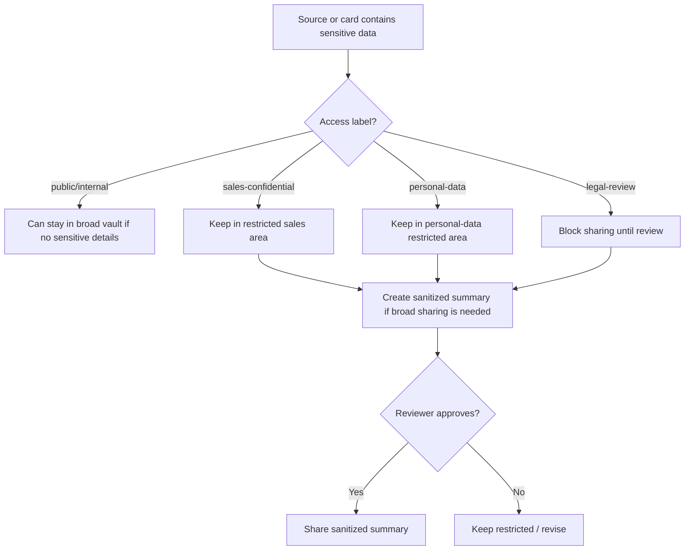

# Access, Sharing And Redaction Policy

This is the canonical policy for who may see what, how content is shared, and how
sensitive data is redacted before broad use. `access` labels are metadata, not
enforcement — Obsidian does not enforce permissions by itself. Sensitive data
must be handled through folder/vault access, role scope, review rules and
sanitized summaries.

The **physical** boundary model and the pre-ingest gate for real
transcripts/CRM/personal data live in [[permission-boundary-blueprint]]; the
permissioned MCP layer that enforces these labels in software is
[[permissioned-knowledge-architecture]].

## Access Labels

| Label | Meaning | Examples |
| --- | --- | --- |
| `public` | safe to share externally | approved public case study, public event summary |
| `internal` | safe for general internal team | company brief without sensitive CRM data |
| `sales-confidential` | sales-only or limited internal | deals, pricing, negotiation, account plans |
| `personal-data` | identifiable personal/contact data | call transcripts, emails, phone, personal profiles |
| `legal-review` | must be reviewed before use/export | customer claims, sensitive case details |

Labels are the machine-readable signal; `health_check` validates that every card
uses an allowed `access` value (see [[property-vocabularies]]). Humans/admins
still enforce the physical folder/vault permissions.

## Roles

- Viewer: can read public/internal summaries.
- Contributor: can add raw files and notes.
- Curator: can approve wiki page updates.
- Sales Owner: owns lead/deal pages.
- Marketing Owner: owns source lists, campaigns and market research.
- Legal/Reviewer: releases or rejects `legal-review` items.
- Admin: manages access, automations, indexes and audits.

## Role Access Matrix

This is the current operating policy. Actual enforcement happens through
folder/vault permissions, CRM/Drive permissions, or the permissioned app layer;
the `access` property is the machine-readable signal.

| Role | Default read scope | Can add | Can approve/share |
| --- | --- | --- | --- |
| Viewer | `public`, `internal` | no | no |
| Contributor | `public`, `internal` plus items they submit | raw files, notes, manual intake | no |
| Sales Owner | `public`, `internal`, assigned `sales-confidential` leads/deals/accounts | lead/deal notes, tasks, follow-ups | assigned lead/deal sanitized summaries |
| Marketing Owner | `public`, `internal`, campaign/content/source materials | campaigns, sources, briefs, assets | campaign/content outputs without restricted data |
| Curator | all wiki pages except restricted raw personal-data storage | reviewed entity updates | controlled-profile changes and sanitized summaries |
| Legal/Reviewer | items marked `legal-review` | review notes | release/reject legal-review items |
| Admin | full operational scope | system/config updates | access model, automations, audits |

## Folder/Vault Policy

Recommended access split (the physical boundaries are detailed in
[[permission-boundary-blueprint]]):

- Broad vault: sanitized summaries, general market intelligence, approved assets.
- Sales-confidential area: deals, leads, account plans, private cases.
- Personal-data area: raw transcripts, contact data, recordings.
- Raw restricted files: keep original sensitive files in controlled storage and link by reference when possible.

## Immediate Implementation

Until SalesWiki's permissioned app layer is fully rolled out, use this operating
model:

| Access label | Where it can live now | Sharing rule |
| --- | --- | --- |
| `public` | broad vault / approved asset folders | can be shared externally when source rights allow it |
| `internal` | broad vault | can be shared internally |
| `sales-confidential` | restricted sales folder/vault, or broad vault only as a sanitized summary | sales/HoS/RevOps only unless sanitized |
| `personal-data` | restricted personal-data storage; broad vault stores references or sanitized summaries only | no export/share without explicit approval |
| `legal-review` | review queue plus restricted storage | blocked until reviewer approves |

Operating rules that apply now, even before a dedicated app or IAM layer exists:

- Record approvals, redaction requests and label downgrades in `state/access-review.md`.
- `sales-confidential`, `personal-data` and `legal-review` content is not copied into broad summaries; use a `Sanitized Summary` section instead.
- Raw recordings, transcripts, emails and contact exports are linked by reference, not duplicated into broad pages.
- Curator approval is required before lowering an access label or publishing a sanitized customer/client summary.

Default labels by card type:

- `public`: public sources and approved source cards.
- `internal`: company, person, topic, campaign, asset and report summaries without sensitive CRM/call details.
- `sales-confidential`: leads, deals, account plans, private cases, enrichment records and sales call cards.
- `personal-data`: transcripts, recordings, email/contact exports and person/contact details containing identifiable personal data.
- `legal-review`: customer claims, publishable case-study proof, sensitive private-case promotion and any uncertain export.

## Redaction Rules

Redact or summarize before broad sharing:

- personal contact data
- direct transcript excerpts
- pricing/negotiation details
- customer confidential project details
- internal delivery problems
- non-public deal information
- sensitive legal/compliance information

## Sanitized Summary Requirements

A sanitized summary should include:

- entity
- business context
- reusable lesson
- allowed proof level
- what was removed
- access label
- reviewer
- review date

## Collaboration Model

- Default interface should be a simple chat or command palette.
- Most employees ask questions, upload files and request briefs.
- Curators review high-impact updates before they become canonical.
- Sensitive pages can have short sanitized summaries for broad use.

Allowed shared outputs (each should include freshness and source dates):

- account brief
- call prep
- lead list
- deal risk summary
- campaign research summary
- weekly news digest

## Agent Behavior

Agents must:

1. Preserve sensitive raw evidence in restricted locations.
2. Avoid copying sensitive excerpts into broad cards.
3. Use sanitized summaries for broad sharing.
4. Add `legal-review` when unsure.
5. Put redaction needs in `Review Needed`.
6. Never publish or export `personal-data` without explicit approval recorded in `state/access-review.md`.
