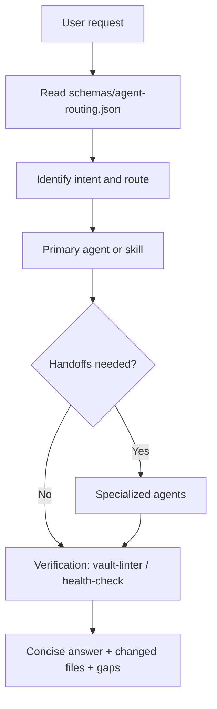

# Agent Orchestration

Agent routing and orchestration are config-first. The canonical machine-readable source is `schemas/agent-routing.json`.

The orchestration layer decides which skill/subagent should handle a request, what approval gates apply, and which verification steps run before work is considered complete.

## Request Routing

## Core Roles

| Role | Status | Purpose |
| --- | --- | --- |
| `research-orchestrator` | active | routes complex requests, coordinates handoffs, runs verification |
| `lead-monitor` | active | lead scoring, prioritization and tasks |
| `call-analyst` | active | call transcript analysis and propagation |
| `deal-risk` | active | deal risk review and next-step tasks |
| `external-vault-import-assistant` | active | external vault audit, scope, mapping and staged import |
| `connector-sync-planner` | active | connector/MCP/plugin planning and approval checks |
| `privacy-redaction-reviewer` | active | sensitive data, sanitized summaries and sharing review |
| `vault-linter` | active | structural verification |
| `event-research` | active supervised pilot | event intelligence, conference prospecting and event ROI research |

## Shared Output Schema

Every agent should return:

- `conclusion` - one-line answer
- `items[]` - entity, evidence, confidence, recommended action, owner, due
- `gaps[]` - missing data or decisions
- `cards_changed[]` - files created/updated
- `verification` - health/index/snapshot checks or why not run

## Approval Gates

Approval is required before:

- changing scoring config
- importing or copying sensitive raw files
- lowering access labels
- publishing or sending `personal-data` / `legal-review` content
- writing to CRM outside configured rules
- deleting, archiving or merging entity cards

## Verification

After changes:

1. Run `python3 scripts/health_check.py`.
2. Rebuild indexes if real entity cards changed.
3. Rebuild dashboard snapshots if reports should change.
4. Report warnings, skipped checks or approvals still needed.
