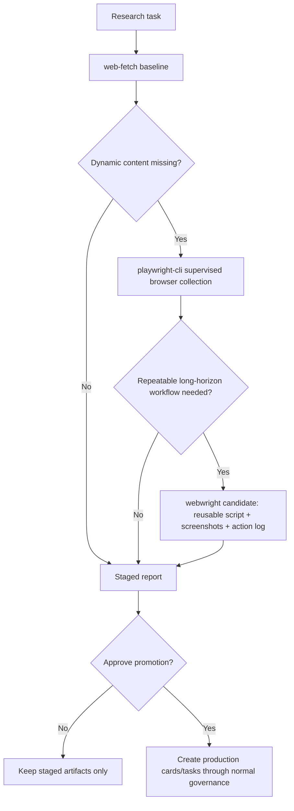

# Browser Research Method Comparison

Use this process when comparing `web-fetch`, `playwright-cli` and `webwright` for event or public-web research.

The comparison is staged-only. It must not create production entity cards, outreach tasks, CRM writes or dashboard rows unless the user separately approves promotion after review.

> Canonical policy: the web-research collection-method policy (web-fetch / playwright-cli / webwright scopes and write modes) and the Webwright backend-key policy (`OPENAI_API_KEY`, `ANTHROPIC_API_KEY`, `OPENROUTER_API_KEY` stored outside the repository) live in `wiki/processes/connector-contracts.md` and `schemas/connector-contracts.json`. This document restates them for the comparison workflow.

## Method Ladder

## Comparison Criteria

| Criterion | What To Check |
| --- | --- |
| Coverage | agenda sessions, speakers, sponsors, companies, topics |
| Evidence | source URLs, collection date, screenshots, action logs |
| Reliability | repeatability, selector stability, blocked pages, cookie/consent issues |
| Governance | source access, licensing, personal-data risk, production-write boundary |
| Effort | manual work, setup cost, debugging cost |
| Reusability | whether the result can be rerun on the next event |

## Method Rules

### web-fetch

Use first. It is best when public page text is directly accessible and the task is mostly source discovery or citation capture.

### playwright-cli

Use when public pages are dynamic: JavaScript-rendered agenda, filters, tabs, pagination, expandable session cards or screenshot/PDF evidence. Keep it human-supervised and record the exact page state used.

### webwright

Treat as proposed until installed and approved in the local runtime. Use for long-horizon, repeatable browser tasks where the desired artifact is a reusable script plus screenshots/action logs. Run only in an isolated output workspace. Do not let generated scripts write production SalesWiki cards.

There are two acceptable staged modes:

- **Full harness** - the installed `webwright` CLI runs its model-backed loop. This requires backend credentials such as `OPENAI_API_KEY`, `ANTHROPIC_API_KEY` or `OPENROUTER_API_KEY`. Store credentials outside the repository.
- **Skill-style artifact run** - an agent follows Webwright's workspace contract directly: `plan.md`, `final_script.py`, `final_runs/run_<id>/`, screenshots, action log and structured output. This is acceptable for SalesWiki pilots when the full harness is not credentialed, but the report must label it clearly.

## Required Output

Every method comparison should produce, outside the public repo until accepted:

- staged comparison report
- source notes
- processed-source ledger entries
- ingest-run ledger entry
- explicit recommendation: which method should be default for this event type

## Promotion Boundary

The staged report may recommend production cards, tasks or content briefs. Promotion requires a separate user approval and then follows normal Event, Event Participation, Task and Content Brief governance.
