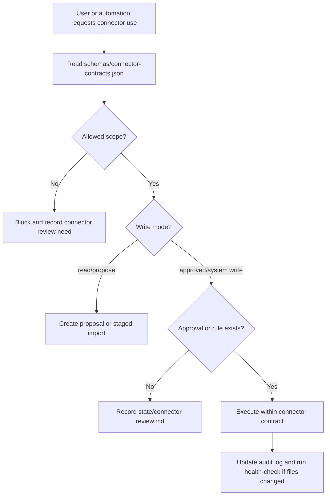

# Connector Contracts

Connector and MCP/plugin use is config-first. The canonical machine-readable source is `schemas/connector-contracts.json`.

This document explains how SalesWiki should treat external systems such as HubSpot, Google Drive/Meet, Slack/email digests and web research tools.

## Connector Flow

## Supported Connector Contracts

| Connector | Status | Primary use | Contract |
| --- | --- | --- | --- |
| HubSpot | planned | CRM read/propose/writeback boundaries | `schemas/connector-contracts.json` |
| Google Drive/Meet | planned | call recordings/transcripts and file references | `schemas/connector-contracts.json` |
| Slack/email digest | proposed | approved notifications and dashboard digests | `schemas/connector-contracts.json` |
| Web research | manual-first | public/source research intake | `schemas/connector-contracts.json` |

## Rules

1. Follow ADR-0020's vendor-first path: official vendor MCP, then official
   API/webhook or managed connector, then custom code for a documented gap.
2. A connector must have a config entry before agents use it for real data.
3. Config must define `implementation_strategy`, `read_scopes`, `write_modes`, `approval_required_for`, `forbidden_operations`, `audit_log` and `failure_mode` for planned external systems.
4. Any writeback outside the configured mode is blocked and moved to `Review Needed` or `state/connector-review.md`.
5. Personal data and legal-review content must follow `access-and-redaction-policy.md`.
6. Connector failures must be safe: create a proposal, staged package or coverage gap rather than silently dropping data.
7. A vendor MCP used for interactive reads is not automatically approved for
   scheduled sync or writeback. Evaluate each operation separately.

## MCP And Plugin Support

SalesWiki can use MCP servers, app connectors or local plugins, but the repo remains the durable source of truth. MCP/plugin availability is environment-specific, so every real connector must be treated as optional until configured and approved.

When a runtime provides a connector:

- map it to one config entry in `schemas/connector-contracts.json`
- verify the requested operation is allowed
- record approvals in `state/connector-review.md`
- record ingest/sync results in the connector's configured audit log

SalesWiki has two MCP directions. AI clients call the SalesWiki MCP server to
read or propose against the vault. An approved orchestrator may separately call
a vendor MCP server to stage external evidence. Vendor write tools must not be
placed next to ordinary SalesWiki tools in a way that bypasses proposal,
approval and the single-writer/action-runner boundary.

The maintained implementation sequence and provider matrix are in
`docs/engineering/integration-platform-plan.md`.

## Example

HubSpot enrichment request:

1. Read the HubSpot contract.
2. Read current CRM fields.
3. Create proposed updates in SalesWiki.
4. Do not write stage/owner/company identity changes unless field matrix and approval allow it.
5. Log the sync/proposal result.

HubSpot card fill request:

1. Check `hubspot-field-matrix.md`.
2. Create a proposal in `state/hubspot-writeback-proposals.md`.
3. Include current value, proposed value, source, confidence and approver/rule.
4. Write only after approval or an explicit `system-writeback` rule.
5. Audit the result in the configured run log.

## Web Research Collection Methods

The `web-research` connector also defines collection methods:

| Method | Default role | Use when |
| --- | --- | --- |
| `web-fetch` | default | public page content is available as text and can be cited by URL |
| `defuddle` | optional cleanup | public web page or article needs clean Markdown extraction |
| `playwright-cli` | manual-first | JavaScript rendering, filters, pagination, tabs, screenshots or PDF evidence are needed |
| `webwright` | proposed repeatable browser agent | long-horizon browser task should become a reusable script with screenshots/action logs |

`playwright-cli` is useful for event pages and dynamic agendas, but it is not a bulk crawler. It must not be used to bypass logins, paywalls, rate limits, access controls, LinkedIn restrictions or source licensing limits.

`webwright` is useful when repeatability matters more than one-off browsing. It must run in an isolated workspace and produce staged artifacts only until a human approves promotion into SalesWiki production cards.

Full Webwright harness mode requires one configured backend credential: `OPENAI_API_KEY`, `ANTHROPIC_API_KEY` or `OPENROUTER_API_KEY`. Store keys outside the repository. Without a backend key, use Webwright only as an artifact contract: `plan.md`, `final_script.py`, screenshots, logs and structured output produced by the active coding agent.
