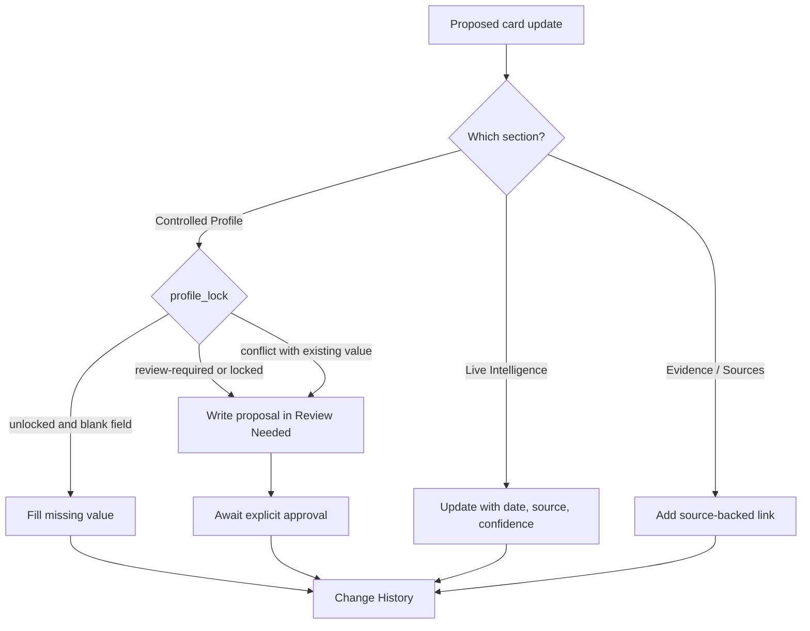

# Entity Card Governance

Entity cards should have two layers:

1. Controlled profile - stable facts that should not change casually.
2. Live intelligence - updates, signals, notes and research that can change during normal monitoring.

This prevents agents from rewriting core company/person/event records every time they process new material.

> **Canonical.** This page owns the card-mutability contract: the zones, `profile_lock`,
> the Fix Workflow and the Enforcement Map below. Other docs (`docs/USER_GUIDE.en.md`,
> `integrations/rocketchat/README.md`, `docs/engineering/permissioned-knowledge-overview.md`,
> the `AGENTS.md` summary) link here instead of restating the rules — change the rules
> here and keep those summaries in sync. The *why* behind each rule is recorded in ADRs
> 0002, 0003, 0005, 0007, 0011 and 0015 (see the Enforcement Map).



## Controlled Profile

Controlled profile is the fixed part of a card.

Examples:

- legal/company name
- primary website
- canonical page name
- entity type
- ownership
- access label
- core identifiers
- canonical relationship links
- deletion/archive status
- monitoring status

Rules:

- Agents may create controlled profile fields when a new entity is created.
- Agents may fill missing controlled fields when the source is strong.
- Agents must not overwrite existing controlled fields unless the user explicitly asks, the current value is blank, or a curator/review process approves it.
- If new evidence conflicts with controlled profile, add it to `Review Needed` instead of overwriting.

## Live Intelligence

Live intelligence is the mutable part of a card.

Examples:

- recent signals
- news
- event participation
- calls and meetings
- current hypotheses
- open questions
- recommended next action
- source-backed updates

Rules:

- Agents can update live intelligence during normal ingest, research and monitoring.
- Every important update needs a source, confidence and date.
- Old updates should be preserved when they remain relevant; stale updates can be moved to history or summarized.

## Suggested Card Layout

Use this structure for all major entity cards:

```md
---
type:
status:
owner:
access:
created:
last_reviewed:
profile_lock: unlocked
deletion_status: active
tags:
---

# <Entity Type>: <Name>

## Controlled Profile

Stable fields.

## Live Intelligence

Mutable current knowledge.

## Evidence And Sources

Source-backed facts and links.

## Review Needed

Conflicts, proposed controlled-field changes, sensitive updates.

## Change History

Short human-readable log of important card-level changes.
```

## Profile Lock

Use `profile_lock`:

- `unlocked` - agents can fill missing controlled profile fields but should not overwrite non-empty fields.
- `review-required` - proposed controlled changes must go to `Review Needed`.
- `locked` - only explicit user request or curator approval can change controlled profile.

## Deletion Status

Use `deletion_status`:

- `active` - normal entity.
- `duplicate` - duplicate of another entity; keep redirect/link.
- `archived` - no longer active, retained for history.
- `delete-requested` - deletion proposed, awaiting approval.
- `deleted-log-only` - content removed from wiki, tracking record retained.

Default action should be archive, not delete.

## Agent Behavior

Before editing a card:

1. Read the YAML properties.
2. Identify controlled profile versus live intelligence.
3. Update live intelligence normally.
4. For controlled profile changes, check `profile_lock`.
5. If locked or ambiguous, write a proposal in `Review Needed`.
6. Update `Change History` only for meaningful changes.

## Fix Workflow

How a correction actually happens depends on **which zone** changes and **who** is
fixing. The core distinction: **a proposal is not an edit** — the governed loop only
delivers an approved request into the card's buffer; the material change is always a
curated edit under the routes below. The closer to the core, the more ceremony.

### Route 1 — Live Intelligence: edit directly

The normal working path for an agent or a human with vault access. Edit the section;
every important update carries a date, source and confidence. Add a `Change History`
line for meaningful changes, then run `python3 scripts/health_check.py` (and
`python3 scripts/build_indexes.py` when the change is material) and commit.

### Route 2 — Controlled Profile: fill, never overwrite

| Situation | Action |
| --- | --- |
| Field is blank + strong source | Fill it directly (allowed even at `unlocked`). |
| Field is non-empty and the user explicitly asks | Edit directly, record it in `Change History`. |
| Field is non-empty; agent initiative or conflicting evidence | Do **not** overwrite — add a proposal bullet to `Review Needed` with the source. |
| `profile_lock: locked` | Only an explicit user request or curator approval changes the profile. |

### Route 3 — from chat/MCP: the governed loop

A non-technical employee (or any MCP client) never edits cards:

1. `flag_stale_or_wrong` (bridge command: `пометить устаревшим <note>`) captures an
   append-only draft proposal; production is unchanged.
2. A reviewer inspects `review_queue`; an approver approves — the approval is signed.
3. The single-writer worker applies the approved proposal **as one sanitized bullet in
   the card's `## Review Needed` section only** — never into Controlled Profile or
   Live Intelligence.
4. **Last mile (human):** the curator — or an agent on explicit instruction — makes the
   actual fix in the right zone per Routes 1–2, records it in `Change History` and
   removes the resolved bullet from `Review Needed`. A wrongly *applied* note is
   reverted with `worker.rollback`, not a hand edit, so the audit trail stays whole.

### Special cases

- Wrong `raw/` evidence — never rewrite the source; add a correction note linking the
  original and the correction (ADR-0002).
- Personal data surfaced in a card — `request_redaction_review` via
  [[access-and-redaction-policy]], not a plain flag.
- Card should not exist / duplicate — [[deletion-and-archiving]] via
  `state/deletion-requests.md`; the default is archive, not delete.

## Enforcement Map

Who actually holds each rule — convention is the weakest layer, so the teeth are made
explicit:

| Rule | Enforced by | Decision record |
| --- | --- | --- |
| Every card has the required zones and `profile_lock`/`access` keys | `scripts/health_check.py` — failing gate | `docs/adr/0005-typed-cards-and-health-check-linter.md` |
| `entity_id` is stable, minted once | `scripts/new_entity.py` chokepoint + append-only id ledger | `docs/adr/0007-opaque-ulid-identifiers-via-chokepoint.md` |
| Chat/MCP users cannot write cards | the gateway is read/propose-only and never imports the worker | `docs/adr/0011-read-propose-gateway-single-writer-worker.md` |
| Approved changes land only in `Review Needed` | `saleswiki_mcp/worker.py`: single handler set appends one sanitized bullet; HMAC-signed approval, payload/base-hash checks, transactional revert + dead-letter queue, single-writer lock | `docs/adr/0011-read-propose-gateway-single-writer-worker.md` |
| Every governance step is recorded tamper-evidently | append-only audit hash-chain | `docs/adr/0015-append-only-tamper-evident-audit-chain.md` |
| `raw/` is immutable | convention + git history; corrections are appended notes | `docs/adr/0002-raw-evidence-is-immutable.md` |
| Non-empty Controlled Profile values are not overwritten | **convention + git review only** — there is no programmatic diff-guard; Markdown is the knowledge layer, not the security layer (file-level access is the real boundary) | `docs/adr/0003-controlled-profile-vs-live-intelligence.md` |
