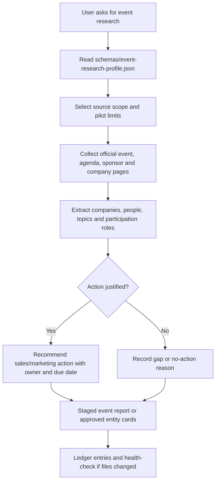

# Event Research Profile

Event research is config-first. The canonical machine-readable profile is `schemas/event-research-profile.json`.

Use this profile when turning public conference, summit, webinar or exhibition pages into sales and marketing intelligence.

## Research Flow

## What Matters For Sales And Marketing

The event-research agent should not stop at "list of sponsors". It should answer:

- who is present and in what role
- which companies are likely target accounts, partners, competitors or market signals
- which executives or operators are speaking
- which topics repeat across sessions, sponsors and company positioning
- what sales can do before, during or after the event
- what marketing can turn into content, campaigns, assets or post-event follow-up
- what evidence is weak, missing, stale or restricted

## Default Outputs

For a supervised pilot, produce a staged report before writing production cards:

- event brief
- company participation map
- speaker and executive map
- topic signal summary
- target-account candidates
- sales actions
- marketing actions
- coverage gaps

Production Event / Event Participation / Company / Person cards require explicit approval unless the user already asked for production card creation.

## Source Rules

Prefer sources in this order:

1. official event page
2. official agenda
3. official sponsor or exhibitor page
4. official company site
5. organizer news or blog
6. trusted news
7. public social post, only when relevant and allowed

Do not use attendee-list vendor pages as proof of attendance or participation. Treat them as low-confidence sales data vendors unless independently verified.

## Playwright CLI Use

Use `playwright-cli` only as a manual-first browser collection method under `schemas/connector-contracts.json`.

Good uses:

- JavaScript-rendered agenda or sponsor pages
- filters, tabs, pagination or expandable session details
- screenshots/PDFs for review
- human-supervised source inspection

Blocked uses:

- mass scraping
- bypassing login, paywalls, rate limits or access controls
- automating LinkedIn or restricted social sources
- submitting forms or sending outreach without explicit approval
- copying paid, licensed or restricted content into broad pages

## Webwright Use

Treat `webwright` as a proposed repeatable browser-agent method under `schemas/connector-contracts.json`.

Use it only when:

- the task is long-horizon or multi-step
- a reusable script, screenshots and action log are useful
- the run stays in an isolated output workspace
- the result is a staged report, not a production write

Do not use Webwright-generated scripts to create production cards, CRM updates or outreach tasks without a separate promotion approval.

For side-by-side method tests, follow `browser-research-method-comparison.md`.

## Action Thresholds

> Canonical: `schemas/event-research-profile.json` (`action_rules`, `pilot_limits`) is the source of truth for these thresholds and limits. This section restates them for readability.

Create an outreach task only when (`action_rules.create_outreach_task_only_when`):

- participation evidence is official or corroborated
- the company is a target account, competitor, partner candidate or strong ICP fit
- the action has a specific reason, owner and due date
- the source confidence is medium or high

Treat a topic as a marketing content/campaign candidate only when (`action_rules.marketing_content_candidate_when`):

- the topic appears across at least two companies or sessions
- the topic maps to a campaign, content brief, use case or objection
- the source confidence is medium or high

Otherwise, record a gap or monitoring recommendation instead of creating work for sales.

## Pilot Limits

Default pilot limits are intentionally small:

- no more than 8 event sources
- no more than 8 companies
- no more than 12 people
- no more than 2 company sources per company
- output as staged report first

Raise limits only after the pilot output proves useful and the team agrees on target-account criteria.
