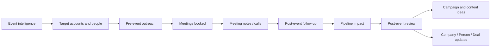

# Event ROI And Action Loop

Event intelligence should lead to action and measurable outcomes, not just lists of exhibitors and speakers.

## Event Action Stages

- pre-event target selection
- pre-event outreach
- meeting booking
- live-event notes
- post-event follow-up
- pipeline attribution
- post-event review

## Metrics To Track

- target accounts identified
- contacts identified
- outreach sent
- replies
- meetings booked
- meetings completed
- opportunities created
- pipeline influenced
- content/campaign ideas created
- competitor insights captured

## Event Outreach Rules

Before outreach:

- confirm participation evidence
- check relationship status
- choose relevant trigger/topic
- avoid generic event spam
- create task/sequence only when action is justified

## Post-Event Review

Within 5 business days after important events:

- summarize meetings and signals
- update companies/people/deals/leads
- update campaign/content ideas
- record pipeline impact
- retire stale event tasks
- capture competitor and topic intelligence

## Agent Behavior

Agents should connect Event cards to:

- target accounts
- people
- tasks
- outreach sequences
- campaigns
- meetings/calls
- deals/pipeline impact
- post-event report
