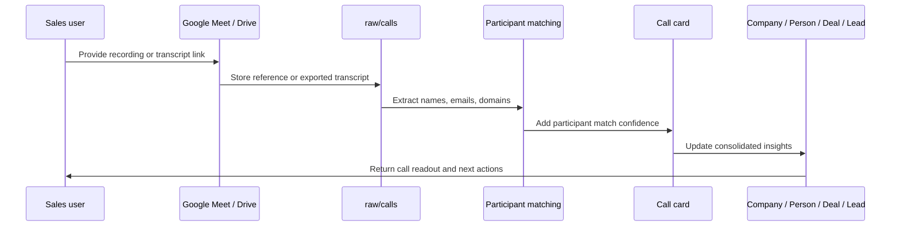

# Google Meet Call Import

This workflow is executed by the `call-analyst` subagent (`.claude/agents/call-analyst.md`).

Sales uses Google Meet in the corporate workspace. SalesWiki should support Google Meet recordings and transcripts as call sources.

## Supported Inputs

- Google Meet recording link
- Google Drive recording file
- Google Meet transcript when available
- manually uploaded transcript
- manual meeting notes when transcript is unavailable

## Import Steps

1. Add recording/transcript reference to `raw/calls/`.
2. Create or update a `Call` card.
3. Match participants using `google-meet-participant-matching.md`.
4. Link company, people, deal and lead.
5. Run call analysis.
6. Update deal, company, person, lead and task cards with consolidated insights.
7. Track source in `tracking/processed-sources.md`.

## Required Metadata

- meeting date
- owner
- company
- deal/lead
- participants
- language
- transcript status
- recording URL/path
- access label

## Transcript Status

- `available`
- `recording-only`
- `needs-transcript`
- `manual-notes`
- `not-available`

## Notes

- English client calls are the primary expected automated transcript path.
- Internal meetings may not be reliably transcribed; use `manual-notes` when needed.
- Call recordings and transcripts should be treated as `sales-confidential` and often `personal-data`.
