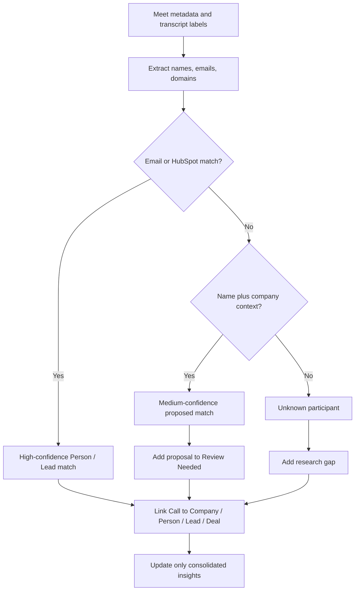

# Google Meet Participant Matching

This workflow is executed by the `call-analyst` subagent (`.claude/agents/call-analyst.md`).

Call analysis is only useful when participants are linked to the right Company, Person, Lead and Deal cards.

## Matching Inputs

- Google Meet participant name
- email/domain
- calendar invite
- HubSpot contact/company
- transcript speaker labels
- meeting title
- owner-provided notes

## Match Confidence

- `high` - email/domain or HubSpot contact confirms identity.
- `medium` - name plus company/domain context matches.
- `low` - inferred from meeting title or transcript only.
- `unknown` - no reliable match.

## Matching Workflow

1. Extract participant names/emails from meeting metadata.
2. Match email domain to Company.
3. Match email/contact to Person or Lead.
4. If no match exists, create a proposed Person/Lead in `Review Needed`.
5. Assign confidence for each participant.
6. Do not create new CRM records without HubSpot writeback rules.
7. Add unknown participants to call card and research gaps.

## Unknown Participants

For unknown participants, record:

- display name
- email/domain if available
- possible company
- possible role
- confidence
- action needed

## Privacy And Consent

- Treat recordings/transcripts as `sales-confidential` and often `personal-data`.
- Do not broadly share participant-identifiable transcript excerpts.
- Use sanitized summaries for broad sharing.
- Follow `access-and-redaction-policy.md`.

## Agent Behavior

Agents should:

- link confirmed participants
- avoid inventing identities
- flag uncertain matches
- propose new Person/Lead cards when useful
- update Company/Deal only with consolidated insights
