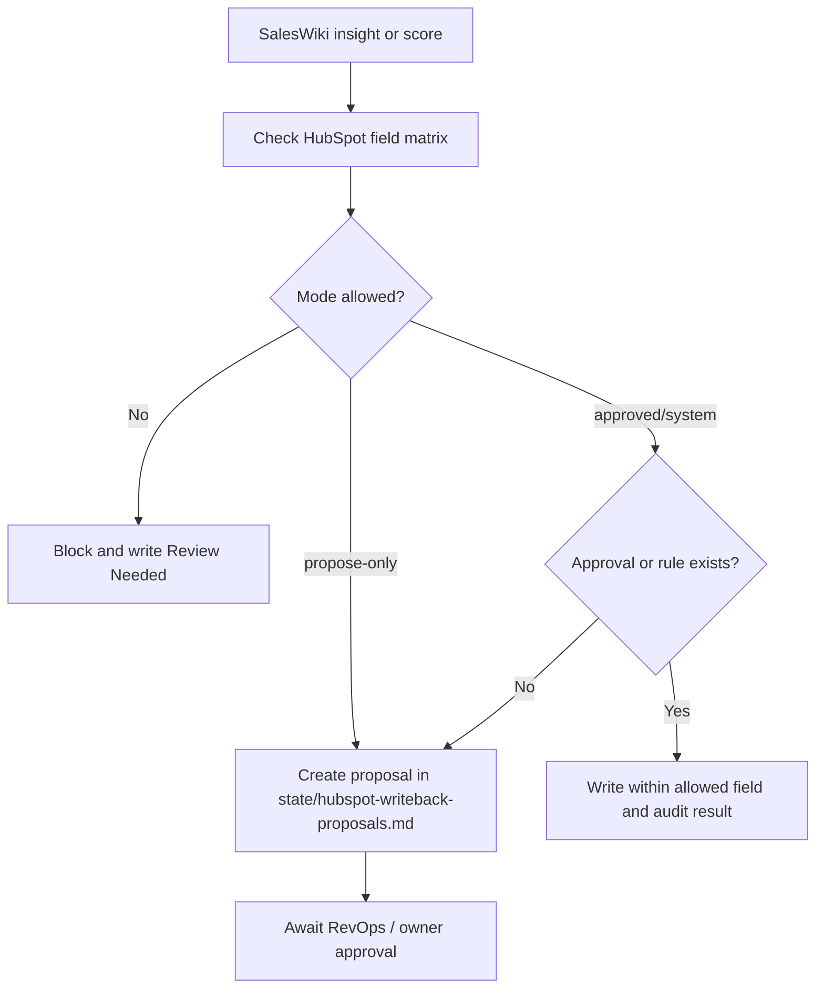

# HubSpot Field Matrix

HubSpot is the operational CRM source of truth. SalesWiki can read CRM data, enrich it and propose updates, but writeback must be controlled.

## Writeback Modes

- `read-only` - SalesWiki may read and reference.
- `propose-only` - SalesWiki may create an update proposal.
- `approved-writeback` - writeback allowed after owner approval.
- `system-writeback` - writeback allowed by a defined automation rule.

## Company Fields

| Field | Mode | Notes |
| --- | --- | --- |
| Company name | propose-only | Do not overwrite legal/common name without approval. |
| Domain | approved-writeback | High impact for dedupe. |
| Industry | approved-writeback | Can be enriched from website/Apollo/Crunchbase. |
| Size | approved-writeback | Include source/confidence. |
| LinkedIn URL | approved-writeback | Verify canonical profile. |
| Owner | read-only | CRM owner is authoritative. |
| Lifecycle stage | read-only | CRM workflow owns this. |
| AI summary | system-writeback | If a dedicated field exists. |
| AI score | system-writeback | If a dedicated field exists and model version is stored. |

## Contact Fields

| Field | Mode | Notes |
| --- | --- | --- |
| Email | propose-only | Personal data; avoid unsafe overwrite. |
| Phone | propose-only | Personal data; source required. |
| Job title | approved-writeback | Requires recent source. |
| LinkedIn URL | approved-writeback | Verify canonical profile. |
| Company association | propose-only | Dedupe risk. |
| Owner | read-only | CRM owner is authoritative. |
| Lead status | approved-writeback | Sales owner approval recommended. |
| AI summary | system-writeback | If a dedicated field exists. |
| AI score | system-writeback | If a dedicated field exists and model version is stored. |

## Deal Fields

| Field | Mode | Notes |
| --- | --- | --- |
| Deal stage | read-only | Pipeline workflow owns this. |
| Amount | read-only | Sales owner/CRM owns this. |
| Close date | propose-only | Suggest if evidence indicates stale date. |
| Owner | read-only | CRM owner is authoritative. |
| Next activity | approved-writeback | Can be created from agreed task workflow. |
| AI risk summary | system-writeback | If a dedicated field exists. |
| AI deal score | system-writeback | If a dedicated field exists and model version is stored. |

## Required Audit Trail

Every proposed or written CRM update needs:

- source
- confidence
- proposed value
- previous value
- approver or automation rule
- timestamp
- related enrichment record

## Card Fill And Writeback Proposal Flow

Use `state/hubspot-writeback-proposals.md` before any HubSpot fill/writeback action.

Allowed first card-fill targets:

- company AI summary
- company AI score
- contact AI summary
- contact AI score
- deal AI risk summary
- deal AI deal score
- task or next activity from an approved SalesWiki task

Never write owner, lifecycle stage, deal stage, amount, email, phone or company association without explicit approval and a field-matrix rule.
