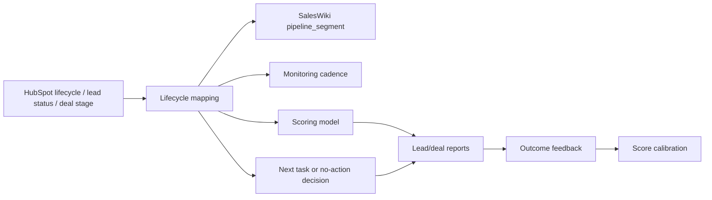

# HubSpot Lifecycle Mapping

This mapping keeps HubSpot stages, SalesWiki lead/deal segments, monitoring cadence and agent actions consistent.

HubSpot remains the operational source of truth. SalesWiki adds interpretation, scoring, monitoring and recommendations.

Staleness, score-decay and reminder-SLA thresholds referenced below are canonical in `freshness-and-decay.md`; this doc applies them to HubSpot stages.

## Object Mapping

| HubSpot object | SalesWiki card | Notes |
| --- | --- | --- |
| Company | Company | CRM company facts plus wiki intelligence. |
| Contact | Person and/or Lead | Person stores durable profile; Lead stores sales motion. |
| Deal | Deal | Deal stage and amount remain CRM-owned. |
| Activity/Meeting | Call or Task | Calls are analyzed; tasks/reminders may be proposed. |

## Lead Pipeline Segment Mapping

| HubSpot state | SalesWiki `pipeline_segment` | Monitoring cadence | Default action |
| --- | --- | --- | --- |
| No active deal, promising contact/account | `outside-pipeline` | monthly or trigger-based | Monitor for credible trigger; avoid noisy pings. |
| New inbound lead, not qualified | `qualification-mql` | weekly | Score, fill missing qualification fields, suggest next step. |
| MQL | `qualification-mql` | weekly | Warm up, monitor triggers, recommend outreach. |
| SQL | `sql` | weekly or per owner | Ensure next step and buying committee clarity. |
| Active deal exists | `active-deal` | deal-driven | Deal card owns primary cadence. |
| Disqualified/unfit | `disqualified` | paused | Keep reason; do not monitor unless strategic. |

## Deal Stage Mapping

| HubSpot Deal Stage | SalesWiki focus | Monitoring cadence | Agent checks |
| --- | --- | --- | --- |
| Qualification | qualification quality | weekly | ICP, pain, buyer, next step, score. |
| Discovery | learning quality | after every call | pains, buying signals, objections, stakeholders. |
| Proposal | risk and proof | weekly | champion, economic buyer, competitor, proof gaps. |
| Negotiation | blockers | weekly or owner-driven | risks, decision criteria, legal/procurement. |
| Closed Won | handoff and expansion | post-close then AM cadence | private case, account plan, upsell triggers. |
| Closed Lost | learning | one-time review | loss reason, competitor, objection, scoring feedback. |

## Lifecycle Stage Mapping

| HubSpot Lifecycle Stage | SalesWiki interpretation | Notes |
| --- | --- | --- |
| Subscriber/Lead | early lead | Usually Lead card only if sales-relevant. |
| MQL | marketing-qualified | Needs score and nurture/next action. |
| SQL | sales-qualified | Requires owner, next step and qualification evidence. |
| Opportunity | active commercial motion | Deal should exist. |
| Customer | customer/account | Account Plan and AM assistance may apply. |
| Evangelist/Other | relationship asset | Person/Company intelligence, not necessarily active pipeline. |

## Staleness Rules

| Segment/stage | Stale when |
| --- | --- |
| outside-pipeline | no review in 30 days and no reminder date |
| qualification-mql | no review in 7 days |
| sql | no next step or no review in 7 days |
| active-deal | no activity after expected next step or no update in 7 days |
| proposal/negotiation | no owner action in 5 business days |
| closed lost | no loss review |

## Required Sync Fields

SalesWiki cards should capture:

- `hubspot_object_type`
- `hubspot_id`
- `crm_owner`
- `crm_stage`
- `crm_last_synced`
- `pipeline_segment`
- `score`
- `score_band`
- `score_model`
- `scored_at`
- `next_review`

## Agent Behavior

When HubSpot data is present:

1. Respect CRM-owned fields.
2. Map lifecycle/stage to SalesWiki segment.
3. Update monitoring cadence and next review.
4. Re-score when stage changes.
5. Create or update Task when next action is missing.
6. Propose CRM writeback only according to `hubspot-field-matrix.md`.
