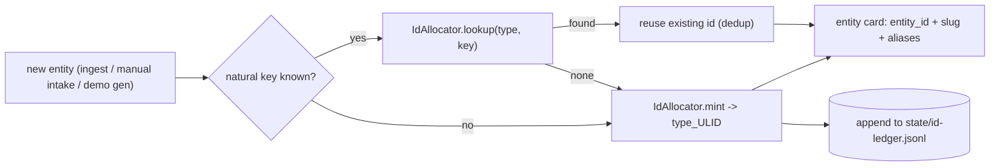

# Identifier Strategy

How, when and where entity ids are assigned, so identity stays consistent and reliable as the wiki grows and as vaults merge. Variant C: a stable **opaque typed core id** plus a readable **slug/aliases** surface.

## Principles

1. **Mint once, at creation.** An id is assigned the first time an entity is created (ingest, manual intake, demo generation) and **never re-derived from mutable data** (name/title) - so renames never break it.
2. **Opaque, typed, sortable core.** `entity_id = <type>_<ULID>` (e.g. `company_01HRX…`). The ULID is a 48-bit ms timestamp + 80-bit randomness in Crockford base32: globally unique **without coordination** (no central lock), lexicographically **time-sortable**, collision-free across processes and vaults.
3. **Readable surface stays separate.** A human `slug` (and the filename) and an `aliases` list live alongside the id. References resolve **by id first, then slug/alias** (same precedence as the strict retriever `find`).
4. **Idempotent by natural key.** Re-ingesting the same real object reuses its id: look up by a natural key - company -> primary domain, person -> email, deal -> CRM id - before minting. No silent duplicates.
5. **Single mint chokepoint + append-only ledger.** Ids are minted only through `saleswiki_mcp/ids.py` (`IdAllocator.mint`), which records every allocation in an append-only ledger (`state/id-ledger.jsonl`) for provenance and uniqueness - mirroring the proposal/audit pattern.
6. **Stability + merge.** The id sits in `Controlled Profile` under `profile_lock`; it is never rewritten. On a duplicate-merge the loser's id becomes an `alias` of the canonical id, so old references keep resolving (see `deletion-and-archiving.md`).

## When / where ids are assigned

The allocator is the *only* place ids are minted; callers never hand-craft ids. Because the core is collision-free opaque, minting needs no global lock; the ledger gives provenance and a uniqueness backstop.

## Id schemes in the system

| Thing | Scheme | Notes |
| --- | --- | --- |
| Entity card | `<type>_<ULID>` (new) | rename-safe; slug/alias for readability |
| Proposal | `proposal-NNNN` sequential per proposal | governance log |
| Ingest run | `ingest-YYYYMMDD-<scope>-<seq>` | run ledger |
| Demo card | `demo-…` prefix | synthetic, never production |

## What is built now (groundwork)

- `saleswiki_mcp/ids.py` - `ulid()` and `IdAllocator.mint(type, natural_key="")` + `lookup` over an append-only ledger; deterministic clock/randomness injection for tests.
- `health_check.check_id_ledger` - validates the ledger **if present** (typed-ULID format, unique ids, idempotent natural keys); a no-op while no ledger exists, so it is non-breaking.
- Tests: `tests/test_ids.py` (ULID encoding/sorting, mint, dedup, type-scoping, ledger provenance, and the health-check guard).

## Adoption status

- **Creation chokepoint (done):** `scripts/new_entity.py` (`create_entity`) is the canonical way to create a production entity card. It mints `<type>_<ULID>` via `IdAllocator` (idempotent by natural key), instantiates the type's `_template.md`, and writes the card with `entity_id` + a readable `slug` + the template-derived filename. `mint(..., explicit_id=...)` routes curated/migration/human ids through the same chokepoint + ledger.
- **Demo generator (curated exception, by design):** the permissioned demo uses deterministic, readable slug ids (`demo-company-bluepeak-energy`, ...). For a closed, curated fixture set the readable slug *is* the stable id - it must stay referenceable by demo scripts, fixtures and tests. This is variant C with the slug serving as the id; forcing opaque ULIDs there would break referenceability for no benefit. Production/dynamic creation uses `new_entity.py`.

## Transition path (remaining, no big-bang)

Current production cards use readable slug `entity_id`s; they stay valid and become the `slug`/`alias`.

1. **Done:** new entities mint `<type>_<ULID>` via `new_entity.py` (chokepoint); slug kept readable.
2. Adopt `new_entity.py` in the manual-intake / external-import flows that create cards.
3. Optional backfill: mint ids for existing real cards, record slug -> id as aliases.
4. Extend referential-integrity checks (already enforced for permissioned `company:` refs) to all `[[wikilinks]]` and id refs.

## See Also

- `data-engineering-contract.md` (id requirement, ingest-run ids)
- `deletion-and-archiving.md` (duplicate-merge / alias)
- `docs/engineering/permissioned-knowledge-architecture.md` (retrieval `find` resolution precedence)
