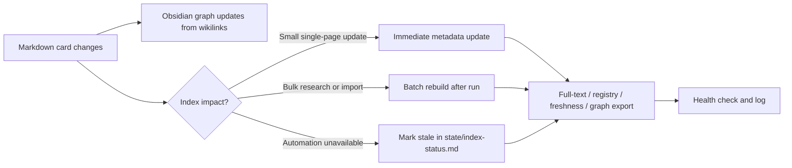

# Index And Graph Maintenance

See also: `graph-index.md` (graph design and node/edge catalog) and `relationship-model.md` (required links per entity type). This page is the operational when/how to rebuild.

Obsidian graph and derived indexes serve different purposes.



## Obsidian Graph

Obsidian graph is updated by Obsidian itself when Markdown files and `[[wikilinks]]` change.

To keep graph useful:

- use stable page names
- add links in both controlled relationships and body sections
- avoid creating duplicate pages for the same entity
- mark duplicates instead of deleting them immediately
- keep aliases in YAML when an entity has name variants

Agents do not need to rebuild Obsidian graph. They need to maintain links correctly.

## Derived Indexes

Files under `indexes/` are rebuildable acceleration layers:

- `indexes/fulltext/documents.jsonl`
- `indexes/entities/entity-registry.csv`
- `indexes/entities/entities.jsonl`
- `indexes/freshness/freshness.jsonl`
- `indexes/temporal/events.jsonl`
- `indexes/graph/edges.jsonl`
- optional vector index

Rebuild the generated baseline indexes with:

```bash
python3 scripts/build_indexes.py
```

## When To Update Indexes

Update or mark indexes stale when:

- a new entity page is created
- a page is renamed
- a controlled profile field changes
- a `[[wikilink]]` relationship changes
- a page is archived, merged or deletion-requested
- a research run updates several pages
- a scheduled monitoring analysis completes
- tracking ledgers add accepted or duplicate items

## Update Modes

- `immediate` - small change, run `python3 scripts/build_indexes.py` after the card edit.
- `batch` - scheduled monitoring or large import; rebuild after all changes.
- `stale-mark` - if rebuild is unavailable, mark index stale in `state/index-status.md`.

## Minimum Index Status

Always record:

- last rebuild time
- index type
- source scope
- status
- known stale reason
- next rebuild due

## Recommended Sequence After Research

1. Finish wiki page updates.
2. Update tracking ledgers.
3. Update `wiki/index.md` if pages were created, renamed, archived or merged.
4. Run `python3 scripts/build_indexes.py` when real entity cards changed; this updates `state/index-status.md`.
5. If the rebuild cannot run, mark affected indexes stale in `state/index-status.md`.
6. Append summary to `wiki/log.md`.
