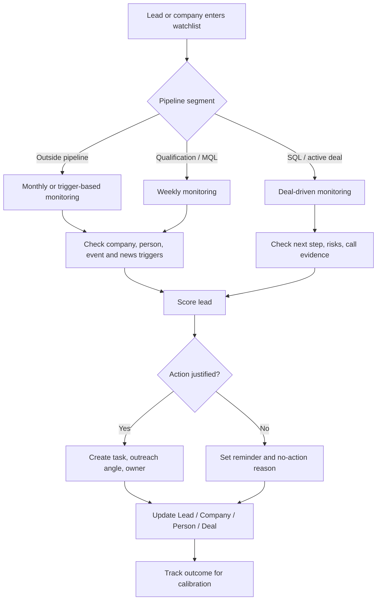

# Lead Monitoring And Scoring

Lead monitoring should focus on action timing. The system should avoid noisy pings and surface leads when there is a reason to act.

## Lead Segments

## Promising Outside Pipeline

Definition:

- no active HubSpot Deal
- contact or company looks promising
- not ready for frequent sales activity

Cadence:

- monthly
- event/news-trigger based
- manual reminder date

Agent goal:

- find credible trigger
- suggest light-touch follow-up only when justified
- keep memory of why the lead is still worth watching

## Active Qualification / MQL

Definition:

- deal or lead exists in HubSpot qualification/MQL stage
- not yet SQL
- may require several months of warming

Cadence:

- weekly
- faster after high-intent trigger

Agent goal:

- update score
- identify next best action
- find missing qualification data
- create reminders/tasks

## Scoring Dimensions

> Non-authoritative glossary. This is a general vocabulary of dimensions, not the live model spec. The real per-model dimensions and weights differ per scoring model and are canonical in `schemas/scoring-models.json` (explained in `wiki/processes/scoring-models-v1.md`).

| Dimension | Meaning |
| --- | --- |
| ICP fit | industry, size, geography, use-case fit |
| Persona fit | role seniority and relevance |
| Trigger strength | recent news, event, hiring, funding, product, leadership signal |
| Intent strength | website lead, reply, meeting, content engagement, explicit need |
| Pain evidence | confirmed or inferred business pain |
| Timing | urgency or buying window |
| Access | ability to reach buyer/champion |
| Relationship | prior interaction, referral, warm contact |
| Deal potential | expected value, strategic fit |
| Risk/noise | poor fit, stale, low evidence, blocked access |

## Score Bands

Band ranges (hot/warm/nurture/low) are canonical in `schemas/scoring-models.json` and explained in `wiki/processes/scoring-models-v1.md`; they are not restated here.

## Required Score Output

- score
- band
- top positive factors
- top negative factors
- evidence links
- confidence
- recommended next action
- owner
- next review date

## Update Triggers

Re-score when:

- new lead arrives
- HubSpot stage changes
- new call happens
- company/person trigger appears
- event participation appears
- important news is found
- reminder date arrives
- deal becomes stale

## HubSpot Alignment

HubSpot remains the operational source for:

- deal stage
- owner
- next activity
- contact/company IDs
- pipeline status

SalesWiki can compute and explain:

- lead score
- deal score
- trigger summary
- next best action
- missing data
