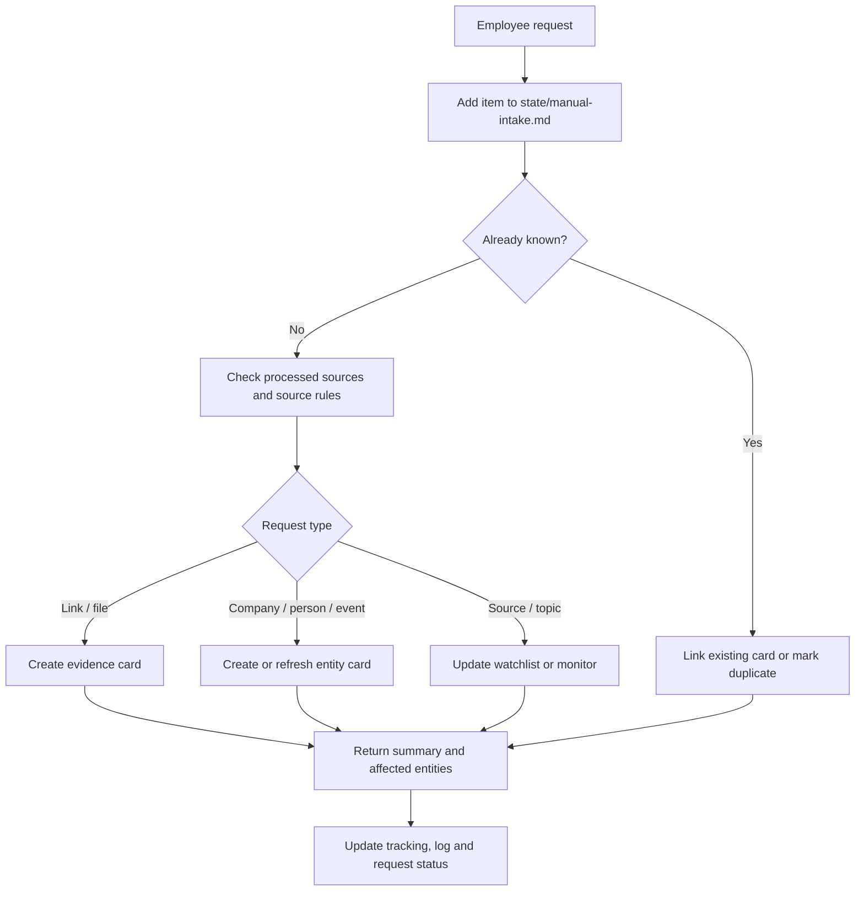

# Manual Intake

Manual intake is for employee requests like:

- `Посмотри эту ссылку`
- `Вот человек, найди все важное`
- `Вот компания и сайт, начинаем мониторить`
- `Добавь этот ресурс в регулярный мониторинг`
- `Разбери эту статью/заметку/отчет`

## Intake Types

- `link-review` - inspect one URL and decide whether it updates the wiki.
- `person-research` - create or refresh a person profile and monitoring patterns.
- `company-onboarding` - create a company page from name and website.
- `source-addition` - add a news, event, industry or company source to monitoring.
- `event-onboarding` - create an event page and start event monitoring.
- `material-analysis` - analyze an uploaded file, article, transcript or report.
- `topic-monitoring` - start recurring research for a theme or keyword set.

## Quick Drop Conversion

Non-technical employees do not fill the structured table. They paste free text
into the `Quick Drop` section of `state/manual-intake.md` (optionally using the
`LINK:` / `COMPANY:` / `AFTER CALL:` starters). An agent then:

1. Reads each entry under `### Drop here`.
2. Infers `intake_type` from the content (`LINK:` → `link-review`,
   `COMPANY:` → `company-onboarding`, `AFTER CALL:` → `material-analysis`;
   otherwise best match from the Intake Types list).
3. Fills a structured row in the queue table with defaults: `request_id`
   `mi-YYYYMMDD-NN`, `date` today, `urgency` `normal`, `access` `internal`,
   `monitor_after` `no`. If the text contains contact details, transcripts or
   anything personal, set `access` to `personal-data` and request a
   privacy/redaction review before creating cards.
4. Processes the row through the normal steps below.
5. Replaces the free-text entry with one line:
   `processed as <request_id> -> <result link>` so the Quick Drop section
   stays short.

The requester never needs to know YAML, properties or card taxonomy; the agent
owns the conversion and the governance.

## Required Fields

Every manual intake request should record:

- request date
- requester
- input text
- URL/file/person/company/topic
- desired output
- urgency
- access label
- monitor after processing: `yes/no`
- owner

## Processing Steps

1. Add the request to `state/manual-intake.md`.
2. Check whether the URL, file, company, person or topic already exists.
3. Check `tracking/processed-sources.md` before processing a URL or file.
4. Create or update the relevant entity page.
5. If recurring monitoring is requested, update the relevant source/watchlist file.
6. Update tracking ledgers.
7. Append a short result to `wiki/log.md`.
8. Move request status to `done`, `monitoring`, `duplicate`, `rejected` or `needs-review`.

## Outputs

For a link:

- accepted/rejected/duplicate decision
- summary
- affected entities
- wiki pages updated
- whether it corroborates an existing claim

For a person:

- person page
- company links
- article/interview/public appearance table
- monitoring patterns
- open questions

For a company:

- company page
- website source entry
- key people to monitor
- initial search patterns
- monitoring cadence

For a topic:

- topic scope
- source list
- search patterns
- cadence
- expected report format
