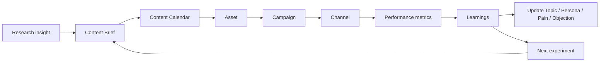

# Marketing Attribution And Content Workflow

Marketing needs a loop from research insight to content/campaign execution to measurable funnel impact.

## Core Objects

- Campaign
- Channel
- Content Brief
- Content Calendar Item
- Asset
- Experiment
- Report

## Attribution Fields

Track where possible:

- channel
- source
- medium
- campaign
- UTM parameters
- target ICP/persona
- offer/CTA
- landing page
- MQLs influenced
- SQLs influenced
- opportunities influenced
- pipeline influenced
- revenue influenced when available

## Content Workflow

1. Research identifies a topic, pain, objection, event or market trigger.
2. Marketing creates a Content Brief.
3. Content Brief links to ICP/persona/use case/proof.
4. Content Calendar schedules production/publishing.
5. Asset is created or updated.
6. Campaign uses asset/channel/sequence.
7. Performance is reviewed.
8. Learnings update Topic, Persona, Pain Point, Objection, Campaign and Asset cards.

## Campaign Performance Review

Every campaign review should answer:

- which audience was targeted?
- which message/offer was tested?
- which channels were used?
- what changed in funnel metrics?
- what sales feedback came back?
- which assets should be reused or retired?
- what should be tested next?

## Agent Behavior

Agents should connect campaign ideas to:

- evidence
- target ICP/persona
- pain point or trigger
- asset
- channel
- expected sales handoff
- performance report
