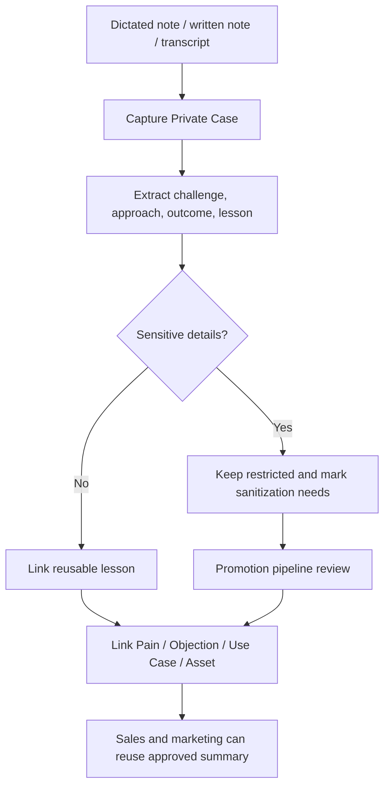

# Private Case Capture

Private cases are reusable sales and marketing knowledge from presales, delivery and unusual client work that cannot necessarily be published publicly.

## Intake Methods

- dictated case note
- written note
- call transcript
- presales summary
- delivery/project summary

## Required Structure

- context
- challenge
- approach
- outcome
- reusable lesson
- related pain point
- related objection
- related use case
- access/sanitization status

## Capture Prompt

Use these questions for dictated or written intake:

1. What was the client situation?
2. What was unusual or difficult?
3. What did we do?
4. What was the outcome?
5. What lesson can sales reuse?
6. What can marketing reuse?
7. What must stay private?

## Promotion Rules

- Keep sensitive details in `Private Case`.
- Create a sanitized `Case Study` only after review.
- Link private cases to use cases, objections, pain points and assets when useful.

Capture ends at the `private-draft` stage; sanitization and approval are then owned by `private-case-promotion-pipeline.md`.
