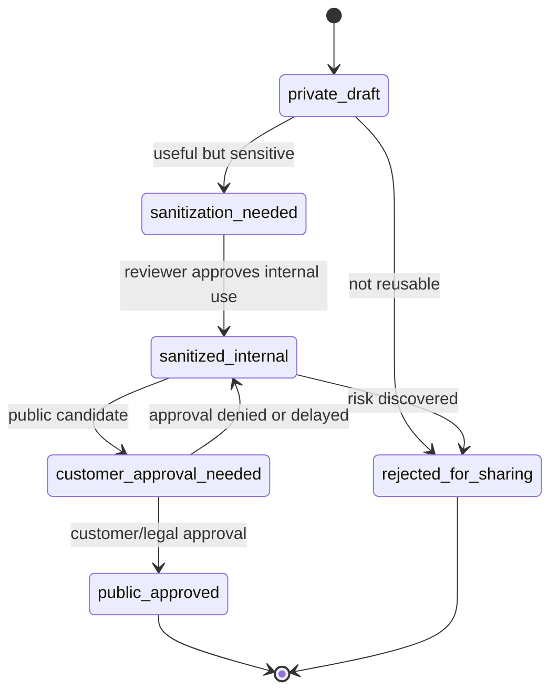

# Private Case Promotion Pipeline

Private cases can become reusable sales assets only after sanitization and review.

## Promotion Stages

- `private-draft` - raw/internal case captured.
- `sanitization-needed` - useful but contains sensitive details.
- `sanitized-internal` - safe for internal sales/marketing use.
- `customer-approval-needed` - could become public but needs approval.
- `public-approved` - safe for public case study/asset.
- `rejected-for-sharing` - keep private only.

## Promotion Workflow

1. Capture Private Case.
2. Identify reusable lesson.
3. Mark sensitive details.
4. Create sanitized summary.
5. Review by owner/data/privacy/legal as needed.
6. If internal-only, link to Use Case, Objection, Pain Point and Asset.
7. If public candidate, create Case Study draft.
8. Track approval status and allowed proof level.

## Allowed Proof Levels

- `anonymous-pattern` - no company/person details.
- `industry-only` - industry and problem, no name.
- `named-internal` - customer name allowed internally only.
- `named-public` - customer name allowed publicly.
- `metric-approved` - approved quantitative outcome.

## Agent Behavior

Agents can propose promotion, but must not mark a private case public-approved without explicit review.
