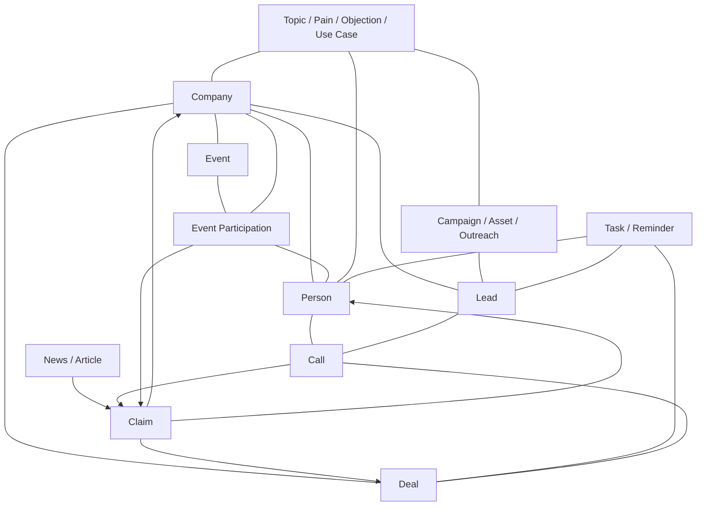

# Relationship Model

See also: `graph-index.md` (graph design and node/edge catalog) and `index-and-graph-maintenance.md` (operational when/how to rebuild). This page is the required links per entity type.

Relationships make the wiki useful. Every entity card should link to the other cards that explain context, evidence and action.

## Core Rule

Store detailed evidence in the source-like card. Store current consolidated conclusions in the main entity card.

Examples:

- Call details live in `Call - ...`.
- Article details live in `Article - ...`.
- News details live in `News - ...`.
- Event participation details live in `Event Participation - ...`.
- Company-level conclusions live in `Company - ...`.
- Person-level conclusions live in `Person - ...`.

## Required Links

## Company

Company cards should link to:

- key people: CEO, CTO, CMO, CRO, founders, champions, buyers
- leads
- deals
- calls
- news
- articles
- events and event participation
- campaigns
- ICP segments
- competitors
- topics
- sources

## Person

Person cards should link to:

- current company
- previous relevant companies when useful
- articles, interviews, talks and posts
- events where they speak or participate
- calls where they were present
- deals/leads where they are buyer, champion, blocker or influencer
- topics they care about

## Deal

Deal cards should link to:

- company
- people in buying committee
- leads
- calls
- relevant news/events
- competitor mentions
- proposals/files

## Call

Call cards should link to:

- company
- deal
- participants/person cards
- leads
- topics
- follow-up tasks

Call cards should update company/person/deal cards only with consolidated insights, not full transcript detail.

## Article / News

Article and news cards should link to:

- companies mentioned
- people mentioned/authors
- topics
- events if relevant
- claims they support

## Event

Event cards should link to:

- exhibitors
- sponsors
- speakers
- target accounts
- competitors
- topics
- campaigns
- event participation cards

## Additional Entities Worth Tracking

Add these when the workflow needs them:

- `Topic` - recurring themes like AI sales, compliance, retail media, RevOps.
- `Claim` - important factual assertion supported by evidence.
- `Competitor` - can be a company card with competitor status, or separate competitor intelligence page.
- `Product` - our product, competitor product or target-company product.
- `Asset` - sales deck, case study, landing page, webinar, report.
- `Task` - follow-up action for sales/marketing owner.
- `Source` - news site, event site, company page, database, CRM, transcript system.

Do not create every possible entity upfront. Create a separate card when it needs its own lifecycle, monitoring, ownership or repeated references.

## Where Conclusions Live

Use this rule:

- Company conclusions: in the company card, section `Strategic Conclusions`.
- Person conclusions: in the person card, section `Relationship And Messaging Conclusions`.
- Deal conclusions: in the deal card, section `Deal Readout`.
- Event conclusions: in the event card, section `Event Intelligence`.
- Topic conclusions: in a topic card when a theme becomes recurring.

Every conclusion should link back to evidence cards or tracking claims.

## Relationship Quality

A useful relationship should answer:

- what is connected?
- why does the connection matter?
- what is the evidence?
- how fresh is it?
- what action does it suggest?
