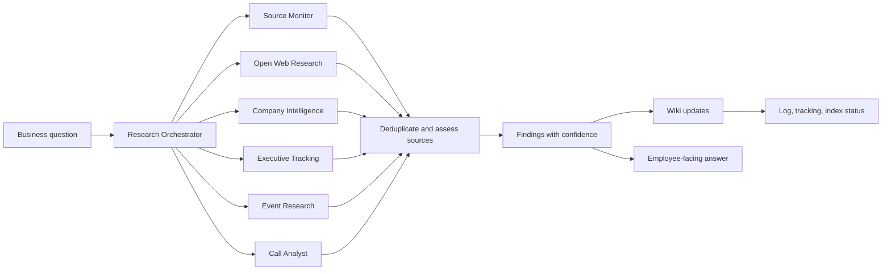

# Research Agents

Research should be split into a small set of specialized agents coordinated by one orchestrator. This keeps outputs consistent while allowing different collection strategies for websites, news, events, executives and calls.

> **Conceptual capability model, not the runtime roster.** The roles below describe research *capabilities*, not the actual deployed agents. The canonical, executable subagents are defined in `.claude/agents/README.md` and `schemas/agent-routing.json` (`research-orchestrator`, `lead-monitor`, `call-analyst`, `deal-risk`, `vault-linter`, `external-vault-import-assistant`, `connector-sync-planner`, `privacy-redaction-reviewer`, `event-research`). The capability roles here map onto those agents — Source Monitor / Open Web Research / Company Intelligence / Executive Tracking are delegations performed by `research-orchestrator`. For routing and handoffs, use `agent-orchestration.md` and `schemas/agent-routing.json` as the source of truth.

## Recommended Agents

### 1. Research Orchestrator

Purpose: receives the business question and turns it into a research plan.

Responsibilities:

- define scope
- choose sources
- assign specialized agents
- check tracking ledgers before work begins
- protect controlled profile fields unless review or explicit request allows changes
- deduplicate findings
- resolve conflicts
- produce final cited answer
- update wiki/log/index checklist

### 2. Source Monitor Agent

Purpose: checks a known list of sources on a schedule.

Inputs:

- `sources/news-resources.md`
- `sources/event-resources.md`
- company websites
- event websites
- approved industry media

Outputs:

- fresh news items
- changed pages
- source failures
- candidate wiki updates
- processed-source ledger updates

### 3. Open Web Research Agent

Purpose: performs free-form web searches for companies, people, themes, competitors and market signals.

Outputs:

- search queries used
- relevant results
- discarded duplicates/noise
- source credibility notes
- summary with citations
- tracking entries for accepted, rejected and duplicate results

### 4. Company Intelligence Agent

Purpose: builds and refreshes account intelligence.

Outputs:

- company profile updates
- website intelligence
- key people
- news and trigger events
- ICP match
- recommended sales/marketing action

### 5. Executive Tracking Agent

Purpose: monitors CEO, CTO, CMO, CRO, founders, buyers and champions.

Outputs:

- role/title changes
- interviews, talks, posts and quotes
- event appearances
- likely priorities
- outreach angles

### 6. Event Research Agent

Purpose: tracks exhibitions, conferences, sponsors, exhibitors, speakers and themes.

Outputs:

- event page updates
- event participation notes
- target account matches
- competitor presence
- pre-event and post-event outreach recommendations

### 7. Call Analyst Agent

Purpose: turns transcripts into actionable sales knowledge.

Outputs:

- call summaries
- pains, objections and buying signals
- commitments
- lead/deal/company updates
- follow-up drafts

## What We Should Build First

Start with three practical workflows:

1. `Company brief` - company website, managed news sources, open web search, people, deals and calls.
2. `Event brief` - event website, exhibitors, sponsors, speakers, agenda topics and target-account matches.
3. `Freshness audit` - stale company pages, stale active deals, hot leads without next action and source failures.

## Research Run Contract

Every research run should produce:

- question
- scope
- sources checked
- already processed items
- new items
- duplicate items
- search queries used
- findings
- corroborated claims
- confidence
- wiki pages updated
- controlled-profile change proposals
- follow-up tasks
- log entry

## When To Use Multiple Agents

Use multiple agents when:

- the task touches more than one source family
- the answer must compare companies, people, events and deals
- research needs deduplication and source quality checks
- results will update several wiki pages

Use one agent when:

- the task is narrow
- the source is already known
- the output is a single wiki page update
