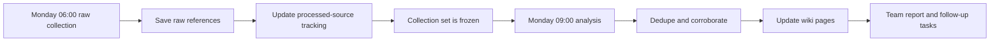

# Scheduled Monitoring

Recurring-monitoring source lists live in `sources/topic-monitors.md`, `sources/news-resources.md` and `sources/event-resources.md`.

Scheduled monitoring separates raw collection from analysis.

Recommended pattern:

1. Early collection run gathers raw data and updates tracking ledgers.
2. Later analysis run reads the collection results, deduplicates, updates wiki pages and creates a short report.

This keeps the morning report grounded in a stable collection set instead of mixing collection and interpretation in one step.



## Example Weekly Schedule

Monday 06:00:

- collect raw data from managed news sources
- check event watchlist pages
- check company websites for active accounts
- run open search patterns for watched topics and people
- add all reviewed items to `tracking/processed-sources.md`
- save raw references under `raw/`
- update `state/monitoring-runs.md`

Monday 09:00:

- analyze the 06:00 collection
- deduplicate sources
- update corroboration register
- update wiki pages
- produce short team report
- list follow-up tasks

## Cadence Options

- Daily: active deals, hot leads, live events, urgent topics.
- Weekly: target companies, executives, event watchlist, market themes.
- Monthly: watchlist companies, source quality, stale pages, duplicate cleanup.
- Post-event: within 5 business days after important events.

## Monitoring Scope

Each scheduled monitoring job should define:

- topics
- companies
- people
- events
- source lists
- open search patterns
- expected output
- access level
- owner
- cadence

## Raw Collection Output

The collection run should produce:

- sources checked
- new items found
- already processed items
- rejected/noisy items
- failed sources
- queued items for analysis

## Analysis Report Output

The analysis run should produce:

- executive summary
- important new facts
- corroborated claims
- duplicate clusters
- company/person/event updates
- recommended actions
- open gaps
- source failures

## Report Template

Use this structure for scheduled reports:

```md
# Monitoring Report: <Scope> / <Date>

## Summary

- 

## New Items

- 

## Confirmed Or Strengthened Claims

- 

## Duplicates And Noise

- 

## Wiki Updates

- 

## Recommended Actions

- 

## Gaps And Failures

- 
```
