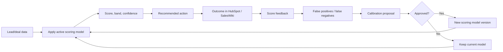

# Score Calibration And Outcome Feedback

Scoring is useful only if it improves decisions over time. Every score should be explainable, versioned and compared against outcomes.

## What To Track

For every lead/deal score:

- score
- score band
- model name/version
- score date
- confidence
- top positive factors
- top negative factors
- recommended action
- expected outcome
- actual outcome when known

## Outcome Labels

- `converted-to-sql`
- `meeting-booked`
- `opportunity-created`
- `closed-won`
- `closed-lost`
- `no-response`
- `bad-fit`
- `stale`
- `nurture-continues`

## Calibration Metrics

Track monthly:

- hot score precision
- warm score conversion
- false positives
- false negatives
- average score by source/channel
- score decay accuracy
- top factor correlation with outcomes

## Score Decay

Scores should decay when evidence gets stale. These decay rules are mirrored in the canonical table in `freshness-and-decay.md`; keep them in sync.

Default rules:

- no activity for 14 days in MQL/qualification: reduce confidence
- no activity for 30 days outside pipeline: reduce trigger strength
- no next step in active deal: cap deal score at `60`
- stale public trigger older than 60 days: remove trigger boost

## Recalibration Workflow

1. Collect outcomes from HubSpot and SalesWiki reports.
2. Compare predicted bands with actual outcomes.
3. Identify false positives and false negatives.
4. Propose model changes in Scoring Model `Review Needed`.
5. Update model version only after approval.
6. Keep old score history for auditability.

## Agent Behavior

Agents should not silently change scoring weights. They can:

- apply the active model
- explain score factors
- flag bad predictions
- propose recalibration
- add outcome feedback
