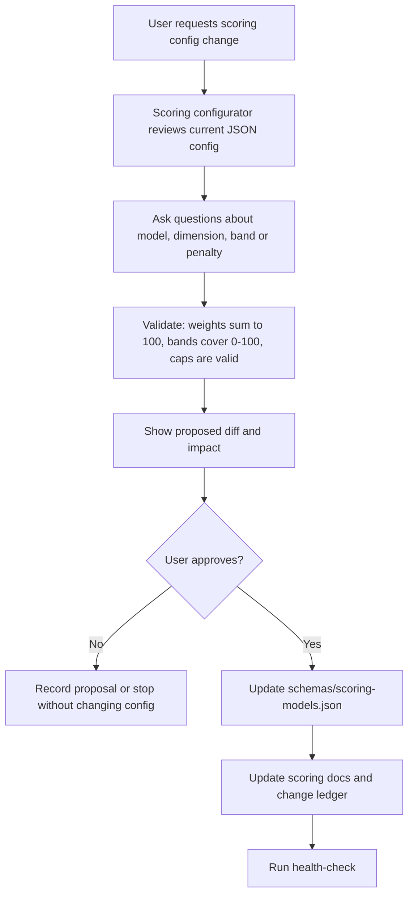

# Scoring Configuration

SalesWiki scoring is config-first. The canonical source of truth for lead and deal scoring weights, bands, penalties and default actions is `schemas/scoring-models.json`.

`wiki/processes/scoring-models-v1.md` is the human-readable explanation of the same starter model. If the config changes, update the docs and log the decision in `state/scoring-change-requests.md`.

## Control Flow

## Editable Areas

User-approved changes may alter:

- model dimension weights
- dimension descriptions
- score band ranges and actions
- penalties, caps and disqualification rules
- default next actions
- model status/version

Agents must not change these values during ordinary scoring. Ordinary scoring may only apply the active model, explain the result and propose calibration.

## Required Validation

Every scoring config change must satisfy:

- each model's dimension weights sum to `100`
- score bands cover `0-100` with no gaps or overlaps
- band IDs match `score_band` allowed values in `schemas/property-vocabularies.json`
- confidence IDs match `score_confidence` / `confidence` allowed values
- cap values are between `0` and `100`
- every active model has a `model_ref`, `owner`, `applies_to`, dimensions and a default next action

`scripts/health_check.py` enforces these rules.

## Change Request Ledger

Use `state/scoring-change-requests.md` for:

- proposed changes from sales/marketing feedback
- approved config changes
- rejected changes and why
- notes from score calibration reviews

## Example Request

User:

`Outbound trigger strength is too influential. Lower it from 20 to 15 and move 5 points to account priority.`

Expected configurator behavior:

1. Read `schemas/scoring-models.json`.
2. Confirm target model: `outbound-lead`.
3. Show old and new weights.
4. Confirm total remains `100`.
5. Ask for approval.
6. Update JSON and docs only after approval.
7. Add a ledger row.
8. Run health-check.
