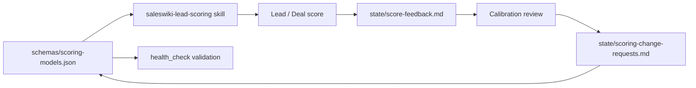

# Scoring Models V1

These are starter scoring models. They should be reviewed after real usage and false-positive/false-negative feedback.

The canonical machine-readable source is `schemas/scoring-models.json`. This document is the human-readable explanation of that config. Configuration changes require explicit user approval and must follow `wiki/processes/scoring-configuration.md`.

> **Mirror, not source of truth.** The tables below (score bands, per-model weights, penalties) MIRROR `schemas/scoring-models.json`, which is canonical. Do not edit these values here. Change them in the JSON via `wiki/processes/scoring-configuration.md` plus an entry in `state/scoring-change-requests.md`; this document is then updated to match.

## Shared Score Bands

| Band | Range | Meaning | Action |
| --- | --- | --- | --- |
| Hot | 85-100 | Act now | Immediate owner action. |
| Warm | 70-84 | Prioritize | Act when trigger/message is clear. |
| Nurture | 50-69 | Monitor | Keep warm, wait for stronger signal. |
| Low | 0-49 | Low priority | Pause, disqualify or monitor only if strategic. |

## Inbound Lead Score

Config model ID: `inbound-lead`.

| Dimension | Weight |
| --- | --- |
| ICP fit | 20 |
| Persona fit | 10 |
| Intent strength | 25 |
| Pain evidence | 15 |
| Timing | 10 |
| Access/contact quality | 10 |
| Deal potential | 10 |

Hard penalties:

- fake or invalid contact: `-40`
- non-ICP geography/industry unless strategic: `-25`
- student/vendor/spam: disqualify

## Outbound Lead Score

Config model ID: `outbound-lead`.

| Dimension | Weight |
| --- | --- |
| ICP fit | 25 |
| Persona fit | 15 |
| Trigger strength | 20 |
| Pain hypothesis | 10 |
| Account priority | 10 |
| Reachability | 10 |
| Relationship/warm path | 10 |

Hard penalties:

- no relevant trigger and no strategic account reason: cap at `65`
- unclear buyer role: cap at `70`

## Qualification / MQL Score

Config model ID: `qualification-mql`.

| Dimension | Weight |
| --- | --- |
| ICP fit | 15 |
| Intent strength | 20 |
| Pain evidence | 15 |
| Timing | 15 |
| Stakeholder quality | 10 |
| Engagement history | 10 |
| Next step clarity | 10 |
| Risk/noise | 5 |

Hard penalties:

- no next step for 30+ days: cap at `65`
- no confirmed pain: cap at `75`

## Deal Score

Config model ID: `deal`.

| Dimension | Weight |
| --- | --- |
| ICP fit | 10 |
| Pain/business case | 20 |
| Champion strength | 15 |
| Economic buyer access | 15 |
| Timing/urgency | 10 |
| Next step clarity | 10 |
| Competitive position | 10 |
| Commercial fit | 10 |

Hard penalties:

- no next step: cap at `60`
- no buyer access: cap at `70`
- active competitor preferred: cap at `75` unless differentiation evidence exists

## Confidence Rules

- `high` - CRM data plus recent call/source evidence.
- `medium` - good public/source evidence but limited direct interaction.
- `low` - weak inference, stale data or missing key fields.

Every score must include evidence, model name/version and score date.
