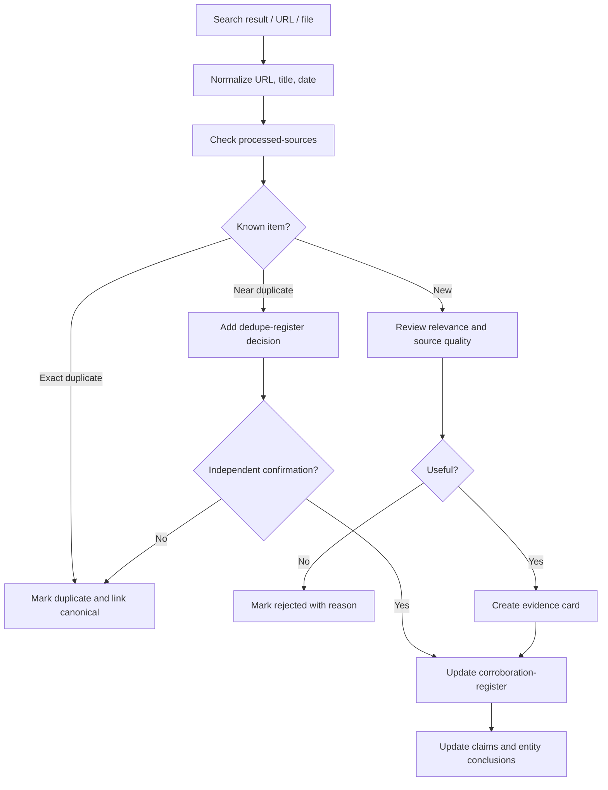

# Tracking, Dedupe And Corroboration

Research must track both what was found and what was already checked. This prevents repeated work, supports freshness audits and turns repeated information into evidence rather than noise.

## Core Principle

Every reviewed item gets a tracking entry, even if it is rejected or duplicate.

Track:

- URL or raw file path
- canonical URL
- normalized title
- source type
- entities mentioned
- first seen
- last checked
- processing status
- duplicate relationship
- claims supported
- wiki pages updated
- decision notes

## Processed Status

Use these statuses:

- `queued` - discovered but not reviewed.
- `accepted` - processed and used in wiki.
- `rejected` - reviewed but not useful; include reason.
- `duplicate` - same or substantially same as another item.
- `superseded` - older version replaced by newer source.
- `needs-review` - ambiguous, sensitive or low-confidence.

## URL And File Normalization

Before deciding whether something is new:

1. Normalize URL by removing tracking parameters when safe.
2. Prefer canonical URL if the page exposes one.
3. Normalize title casing and whitespace.
4. Record publication date and collection date separately.
5. For files, record raw path and checksum when tooling is available.

## Duplicate Handling

Duplicates are not always useless.

- Exact duplicates reduce noise.
- Syndicated duplicates show reach but not independent confirmation.
- Independent sources repeating the same claim increase confidence.
- Same event across organizer page, company blog and speaker bio is a strong signal.
- Conflicting duplicates should be flagged for human review.

## Corroboration Model

Use `tracking/corroboration-register.md` for important claims:

- leadership changes
- funding/acquisition/layoffs
- event participation
- sponsorship
- product launch
- hiring or expansion signal
- major customer or partnership claim
- deal-relevant risk

Evidence strength:

- `single-source`
- `repeated-source`
- `multi-source`
- `primary-confirmed`
- `conflicting`

## People Article Monitoring

For CEO, CTO, CMO, CRO, founders, buyers and champions, track:

- authored articles
- interviews
- podcasts
- conference talks
- guest posts
- analyst quotes
- social/public posts when relevant and allowed
- company blog posts

Each person page should include monitored source patterns and recent authored/quoted content. Create a separate article page when the item contains reusable claims, strong positioning, event relevance, or outreach value.

## Research Run Steps

1. Check `tracking/processed-sources.md` before processing a result.
2. If unseen, add it as `queued`.
3. Review source quality and relevance.
4. Update status to `accepted`, `rejected`, `duplicate`, `superseded` or `needs-review`.
5. If accepted, update wiki pages and log output pages.
6. If duplicate, update `tracking/dedupe-register.md`.
7. If it supports an important claim, update `tracking/corroboration-register.md`.
8. If something could not be checked, update `tracking/coverage-gaps.md`.

## Agent Behavior

Agents should say:

- what they checked
- what was new
- what was already processed
- what was duplicate
- what claims became stronger
- what still needs checking
